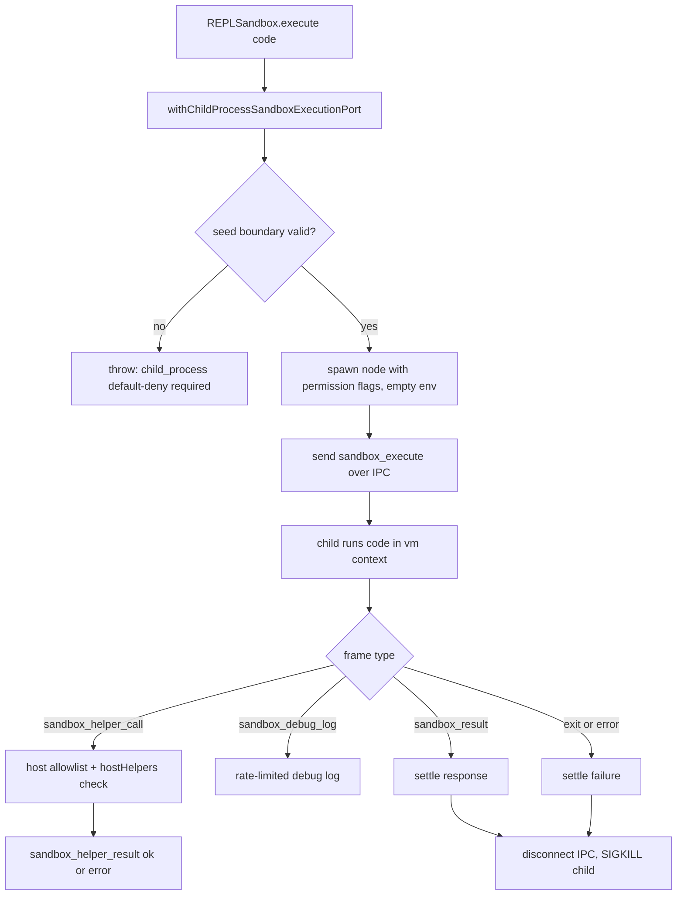
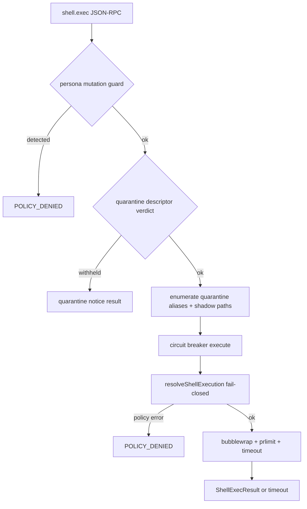

# Sandbox Boundary

The **sandbox boundary** (`src/boundary/sandbox/`) is the runtime's single seam for executing **untrusted or derived work outside the gateway process**: the analysis workbench's out-of-process REPL code and the `shell.exec` command surface. It owns the execution-port contract, the child-process code sandbox, the bubblewrap shell sandbox, the host-helper capability factories, and the fail-closed policy that decides what may run at all. The rule of the module is: **when evidence is missing, deny**. A missing sandbox binary, an empty allowlist, a disabled policy, an unnormalized boundary, or a malformed IPC payload each produce an error or a withheld result — never a silent fallback to running in the gateway process.

## Responsibilities

| Area | Responsibility |
| --- | --- |
| Execution port contract | `SandboxExecutionPort` plus its `boundary` / `codeExecutionBoundary` / `shellExec` / `executeCode` surface and the minimal `SandboxExecutionPortSeed` (`src/shared/contracts/sandbox-analysis-contracts.ts`) |
| Code execution sandbox | Short-lived out-of-process child that runs analysis-workbench code in `node:vm` with default-deny capabilities and an IPC helper allowlist (`sandbox-execution-port.ts`, `execution/analysis-workbench-child-source.ts`) |
| Shell sandbox | Policy-resolved bubblewrap (`bwrap`) execution of `shell.exec` with namespace isolation, `prlimit` resource ceilings, a kernel-enforced deadline, and physical masking of quarantined artifacts (`execution/shell-execution-policy.ts`, `execution/bubblewrap-runner.ts`, `execution/shell-runner.ts`) |
| Capability gating | Host-helper factories for the sandbox code's IPC surface (llm, memory, modules, repo, scheduler, shell, analysis, toolchain, web) with shared budget enforcement (`capabilities/`) |
| Fail-closed normalization | Every supplied boundary, allowlist, path, env var, and mount is re-validated at the boundary; anything not exactly right is an error |
| Runtime verification | `verifyShellSandboxRuntime` probes the shipped image toolset inside the sandbox and asserts isolation, limits, and mount behavior (`src/app/maintenance/verify-shell-sandbox-runtime.ts`) |

## The execution port contract

`SandboxExecutionPort` (`src/shared/contracts/sandbox-analysis-contracts.ts`) is the seam a runtime supplies to the analysis workbench:

- `boundary: SandboxExecutionBoundary` — either `sandbox_broker` (`isolatedFromGatewaySecrets: true`, optional `brokerId`) or `gateway_process` (`isolatedFromGatewaySecrets: false` plus a reason). Only a `sandbox_broker` boundary can carry a usable `shellExec`.
- `codeExecutionBoundary: SandboxCodeExecutionBoundary` — a single allowed shape today: `child_process` + `isolatedFromGatewaySecrets: true` + `securityPosture: 'out_of_process_default_deny'` + protocol `analysis-workbench-child-v1` + a `deniedCapabilities` list + a human reason.
- `shellExec(command, args?, options?)` — returns a structured `ShellExecView` (command, args, cwd, exitCode, stdout, stderr, timedOut, truncated, durationMs).
- `executeCode(request)` — takes `SandboxCodeExecutionRequest` (code, timeoutMs, memoryCeilingBytes, initialLocals, helperNames, hostHelpers) and returns `SandboxCodeExecutionResponse` (output lines, error, finalAnswer, locals).

`SandboxExecutionPortSeed` is the minimal form a runtime must supply: `boundary` + `shellExec`, with `codeExecutionBoundary`/`executeCode` optional. `withChildProcessSandboxExecutionPort(seed)` (`src/boundary/sandbox/sandbox-execution-port.ts`) completes the port: code execution **defaults to the local child-process sandbox** unless the seed overrides it, while `shellExec` defaults to a function that always throws `shell_exec unavailable: requires sandbox broker boundary and audit path`. The default shell boundary is `gateway_process` with `isolatedFromGatewaySecrets: false` — so a derived shell executor can never appear out of thin air, and the LLM provider alone carries no shell authority.

## Code execution: the child-process sandbox (parent side)

`REPLSandbox` (the analysis workbench) constructs its port through `withChildProcessSandboxExecutionPort` and forwards wrapped code plus `initialLocals`, helper names, and the host-helper table. On each `executeCode` call the parent:

1. **Normalizes the boundary fail-closed.** If the seed supplied a code-execution boundary, it must be exactly `child_process`, `isolatedFromGatewaySecrets: true`, `out_of_process_default_deny`, protocol `analysis-workbench-child-v1`, and deny **all seven** capabilities — `filesystem`, `network`, `process`, `module_import`, `global_escape`, `child_process`, `environment`. Anything else throws (`analysis_workbench code execution requires an out-of-process child_process sandbox boundary`).
2. **Spawns a short-lived child** of `process.execPath` with `--permission`, `--no-experimental-websocket`, `--disable-proto=throw`, `--disallow-code-generation-from-strings`, `--no-global-search-paths`, and `--eval <child source>`; an **empty environment** (`env: {}`), `stdio: ['ignore', 'pipe', 'pipe', 'ipc']`, and `serialization: 'advanced'`.
3. **Sends one `sandbox_execute` message** carrying code, timeoutMs, memoryCeilingBytes, sanitized initialLocals, and helperNames, then waits for `sandbox_result`, `sandbox_helper_call`, or `sandbox_debug_log` frames on IPC (any other frame is ignored).
4. **Settles exactly once.** `sandbox_result` settles with the response; child `error` settles with a failure; child `exit` before a result settles with a failure that includes stderr; and a parent wall-clock timer (`max(timeoutMs + 1000, timeoutMs * 2)`) settles with `Execution timed out after Nms`. On settle the parent disconnects IPC and `SIGKILL`s the child if it is still alive.

*The analysis-workbench code execution flow: every frame crosses a sanitized IPC channel, and the run settles exactly once — result, failure, or parent timeout.*

**IPC sanitization** applies in both directions (`sanitizeForIpc` on the parent and a verbatim copy in the child): depth capped at 20, arrays at 10 000 entries, plain-object keys at 2 000; `__proto__` / `constructor` / `prototype` keys are dropped; `bigint` and `symbol` stringify; functions render as `[Function: name]`; circular references render as `[Circular]`; and depth overflow renders as `[MaxDepth]`. Helper results are also sanitized before they cross back to the child.

**Host helper calls are allowlisted by the parent.** `handleHelperCall` only invokes `request.hostHelpers[name]` when `name` is in `request.helperNames` and the host actually has the function; unknown names receive `sandbox helper unavailable: <name>`. Exceptions inside a helper are converted to a failed helper result, never a parent crash.

**Untrusted debug logs are rate-limited with bounded keys.** The child may emit `sandbox_debug_log` frames; the parent collapses non-string/empty keys into one `sandbox_debug_log:invalid-key` bucket and truncates oversized keys to 128 characters, so a malformed or unbounded key cannot grow the rate-limiter key map.

## Code execution: the child runtime

`ANALYSIS_WORKBENCH_CHILD_SOURCE` (`src/boundary/sandbox/execution/analysis-workbench-child-source.ts`) is a self-contained Node program embedded as a string and executed with `--eval`. It implements:

- **A restricted VM context.** `node:vm` with `codeGeneration: { strings: false, wasm: false }`. The context exposes `print` and `console.log/warn/error` (all routed to the output buffer), `FINAL`, the standard built-ins, `setTimeout`, the pure text helpers, and one IPC stub per helper name. `process`, `require`, `module`, `exports`, `Buffer`, `fetch`, `WebSocket`, `XMLHttpRequest`, `navigator`, `Deno`, `Bun`, `Worker`, `SharedWorker`, `MessageChannel`, `MessagePort`, and `importScripts` are explicitly set to `undefined`; `eval` and `Function` are `undefined`; and Node's own permission model plus `--disallow-code-generation-from-strings` back this up at the process level.
- **Pure text helpers without host IPC.** `search`, `grep`, `grep_v`, `between`, `head`, `tail`, `word_frequency`, `diff`, `text_similarity`, `dedupe`, `group_by`, `partition` are injected directly so text analysis works offline; `word_frequency` filters a built-in stopword list.
- **Host-helper stubs.** `createHostHelper(name)` returns a function that sends `sandbox_helper_call` with a monotonically increasing id and resolves/rejects on the matching `sandbox_helper_result`; rejected helper promises emit a rate-limited debug log.
- **`FINAL(answer)`.** Throws the `__analysisWorkbenchFinalAnswer` sentinel; the child reports it as `finalAnswer` with `error: null` — a successful final answer, not an error.
- **Locals persistence.** `restoreLocals` copies `initialLocals` into the context (skipping builtin and dangerous keys); `collectLocals` returns own property names minus builtins and helper names, sanitized. The parent keeps this map across iterations so variables persist between `execute` calls.
- **Memory ceiling and timeout.** A best-effort heap check runs up front and every 20 ms while a configured `memoryCeilingBytes` is set; execution, the timeout promise, and the memory promise race, with the timeout and memory timers `unref`'d so they never hold the event loop open. After the race the child waits for pending host calls and pending prints, then sends `sandbox_result` and exits.

## Shell execution: the gateway seam

`shell.exec` (`src/boundary/gateway/methods/shell.ts`) is a gated gateway method. Before any process launches, the handler runs, in order:

1. **Persona-mutation pre-guard** — `inspectShellMutation` on the persona mutation attempt guard; a detected mutation is rejected `POLICY_DENIED` with `Direct persona mutation is blocked; use the governed identity tool.`
2. **Quarantined-artifact descriptor check** — `checkShellQuarantinedArtifacts` collects path candidates from the resolved cwd and every argv token (whitespace-split too, so `bash -lc "cat ./doc.pdf"` surfaces `./doc.pdf`), and asks the quarantined-artifact guard for a verdict. A withheld verdict returns the fixed quarantine notice as a failed exec result; the sandbox never launches.
3. **Alias enumeration and physical masking** — every held artifact inode reachable inside the workspace (and the repository root when mounted) is found by scanning with `bigint` stat identities (`dev:ino:birthtimeNs`), bounded and fail-closed; the resulting path set becomes `shadowReadPaths`.
4. **Circuit-broken policy execution** — `executeShellCommandWithPolicy` runs inside a sliding-window circuit breaker keyed `shell.exec::<command>::<cwd>` (threshold 3 failures / 60 s window / 30 s cooldown). `ShellExecPolicyError` maps to `POLICY_DENIED`; a quarantine revision landing while a long shell is active discards the result and conservatively audits the current deny set.

*The governed shell.exec path: every request passes persona, quarantine, policy, and circuit layers before bubblewrap launches a single command.*

## Shell execution: policy resolution

`resolveShellExecution` (`src/boundary/sandbox/execution/shell-execution-policy.ts`) turns the raw request plus `ShellExecPolicyConfig` into a fully resolved `ResolvedShellExecution` — and **throws `ShellExecPolicyError` on the first deviation**. The invariants:

- **Policy enabled.** `policy.enabled !== true` throws `shell.exec policy is disabled`.
- **Command allowlist.** The command must be a bare allowlisted name or an absolute path; it is resolved through the curated sandbox PATH (`/usr/local/bin:/usr/bin:/bin`) to a canonical `realpath` that must be **executable and live under `/usr` or `/usr/local`** (read-only image executables only), and must match the allowlist either by canonical path or by basename. Commands over 256 chars, args over 64 entries or 4096 chars, and any NUL byte are rejected.
- **Working directory.** `cwd` must resolve to an existing directory inside the allowed roots — `allowedCwd` when the runtime derives it, otherwise the Personal Workspace itself; every allowed root must itself stay inside the workspace.
- **Environment.** The child env is built fresh (PATH, HOME `/workspace`, PWD `/workspace`, SHELL `/usr/bin/bash`, USER/LOGNAME `companion`, TMPDIR `/tmp`, LANG/LC_ALL `C.UTF-8`). Requested `envVars` must be allowlisted names and may not be reserved (`PATH`, `HOME`, `PWD`, `NODE_OPTIONS`, `BASH_ENV`, `ENV`, `SHELLOPTS`, or any `LD_`/`DYLD_` prefix); values come only from the gateway process env.
- **Limits.** Requested timeout and output caps are clamped to policy ceilings; defaults come from `createDefaultShellExecSettings`.
- **Runtime binaries.** `bwrap`, `prlimit`, and `timeout` must resolve as executable realpaths (`/usr/bin/bwrap`, `/usr/bin/prlimit`, `/usr/bin/timeout`); a missing binary fails the resolution, never skips the sandbox.
- **Read-only repository mount.** When `mountRepositoryReadOnly` is true the deployment checkout (`PSFN_REPOSITORY_DIR`) is canonicalized and must be a real directory **disjoint from the workspace and both data roots**; a missing checkout throws (fail-closed, never a silent skip). When mounted, the copy is advertised to the sandbox as `PSFN_REPO=/repo`.
- **Shadow reads.** Quarantined artifact host paths (plus their realpaths) are mapped into sandbox-absolute paths for `/dev/null` masking; paths outside every sandbox mount are invisible anyway and need no mask.

## Shell execution: the bubblewrap runtime

`runBubblewrapCommand` (`src/boundary/sandbox/execution/bubblewrap-runner.ts`) spawns `bwrap` with:

- **Namespace isolation** — `--die-with-parent`, `--new-session`, `--unshare-user`, `--unshare-pid`, `--unshare-ipc`, `--unshare-uts`, `--unshare-cgroup`, `--unshare-net`, `--cap-drop ALL`, `--clearenv`.
- **Minimal mounts** — `/usr` and `/usr/local` read-only, `/bin` `/lib` `/lib64` `/sbin` as symlinks, an allowlisted set of read-only `/etc` paths (alternatives, ca-certificates, group, hosts, ld.so.cache, nsswitch.conf, passwd, resolv.conf, ssl), `--proc /proc`, `--dev /dev`, `--tmpfs /tmp`, and the **Personal Workspace writable at `/workspace`**. When configured, the repository checkout is `--ro-bind` at `/repo` **after** the workspace bind.
- **Physical quarantine masking** — every resolved shadow path is `--ro-bind /dev/null <sandbox-path>` layered **after** the workspace/repo binds, so the real bytes are physically unreadable regardless of argv shape (`cat`, pipes, globs, here-docs). The ordering is load-bearing and tested.
- **Resource ceilings** — the command runs under `prlimit` with `--nproc`, `--as`, `--fsize`, `--cpu`, `--nofile` (soft and hard equal) and `--core=0:0`.
- **A kernel-enforced deadline** — `timeout --signal=KILL <seconds> <executable> <args>` runs **inside** the namespace; the kernel delivers the alarm and tears down the PID namespace when it exits, so the deadline holds even when the agent process's event loop is starved. The host-side JS timer is only a best-effort escalation (`killSandboxProcessGroup`), guarded so it never signals after the host is reaped (PID recycling).
- **Bounded settling** — output accumulates up to `maxOutputChars` (truncation flagged); the run settles on `close` or, at most, 500 ms after `exit` (`STREAM_DRAIN_GRACE_MS`), so a pipe-holding straggler cannot hang the run promise. A deadline kill is detected as `timedOut` with `exitCode: null` when the JS timer fired or the exit is `124`/`137`/`SIGKILL` after the deadline elapsed.

The result is a structured `ShellExecResult`; non-policy runtime failures are wrapped as `ShellExecPolicyError` (`shell.exec sandbox failed: ...`) by `executeShellCommandWithPolicy` (`src/boundary/sandbox/execution/shell-runner.ts`).

## Capability gating: the host-helper surface

`src/boundary/sandbox/capabilities/` contains the eight factories that produce the helpers a sandbox run may call over IPC: `createLLMCapabilities` (`llm_query`, `llm_query_strict`, `llm_query_json`), `createMemoryCapabilities` (`memory_search`, `episode_search`, `memory_count`, `memory_get_by_id`, `session_messages`, `session_search`), `createModuleCapabilities` (`module_list`, `module_install` via an approval queue, `module_enable`/`module_disable`, `module_health`), `createRepoCapabilities` (`repo_status`, `repo_diff`, `repo_apply_patch`, `repo_commit`), `createSchedulerCapabilities` (`schedule_list`, `schedule_add_every`, `schedule_add_once`, `schedule_update`, `event_emit` with an event allowlist), `createShellCapabilities` (`shell_exec`), `createAnalysisCapabilities` (`nested_analysis`), `createToolchainCapabilities` (`read_file`, `write_file`, `list_files`), and `createWebCapabilities` (`web`, `web_fetch`, `crawler_fetch`, `web_research`).

Every helper class consumes the shared `SandboxBudgetRef` (`subQueries` / `maxSubQueries`, `toolCalls` / `maxToolCalls`) through `consumeToolCallBudget` and returns the fixed `[Budget exceeded: max sub-queries reached]` / `[Budget exceeded: max tool calls reached]` strings instead of executing once exhausted. File reads route through the governed `SandboxFileRead` paging seam (bounded pages with `offsetBytes`/`nextOffsetBytes`/`eof`/`truncated`), web fetches route through gateway `webFetch` lanes with SSRF defenses, and memory helpers run against a subject-authorized store.

`shell_exec` is gated twice: the factory only exposes the helper when the execution port's boundary is `sandbox_broker` with a real `shellExec` (never a `gateway_process` boundary), and the analysis workbench only wires it into `hostHelpers` for autonomous/custom capability tiers. The exact wiring of these factories into `REPLSandbox` is documented on the [Analysis Workbench](/openwiki/runtime/analysis-workbench.md) page.

## Configuration and operations

- **`shellExec` settings** (`src/system/config/shell-exec-config.ts`) are operator-owned `settings.json` fields normalized with strict ranges: `enabled`, `allowlist` (≤ 32 entries; each a bare name like `jq` or a `/usr/...` path), `envAllowlist` (≤ 16 names), `mountRepositoryReadOnly`, `defaultTimeoutMs`/`maxTimeoutMs` (100 ms – 3 600 000 ms), `defaultMaxOutputChars`/`maxOutputChars` (256 – 1 000 000), `maxProcesses` (8–256), `maxAddressSpaceBytes` (128 MiB – 4 GiB), `maxFileBytes` (1 KiB – 1 GiB), `maxCpuSeconds` (1–3600), `maxOpenFiles` (16–4096). **Enabling requires a non-empty allowlist**; defaults keep the policy **disabled** with `maxTimeoutMs` 3 600 000, `maxOutputChars` 100 000, `maxProcesses` 64, `maxAddressSpaceBytes` 2 GiB, `maxFileBytes` 256 MiB, `maxCpuSeconds` 1800, `maxOpenFiles` 512.
- **Runtime derivations, never operator-configurable** — `repositoryMountSource` comes from `PSFN_REPOSITORY_DIR` and `systemDataRoot`/`companionDataRoot` are added at bootstrap (`src/boundary/gateway/bootstrap-input.ts`); in multi-companion mode the gateway binds `shellExec.allowedCwd` to each connection's Personal Workspace (`src/boundary/gateway/server.ts`).
- **Maintenance probe** — `verifyShellSandboxRuntime` (run directly as `src/app/maintenance/verify-shell-sandbox-runtime.ts`) creates a throwaway workspace and asserts: document inspection works (`wc`, `rg`, `git`, `node`) with exact byte counts; the sandbox has no inherited secrets, cannot read a file outside the workspace, and sees only the `lo` network interface; `ulimit` reports exactly `nproc=64 as=2097152 fsize=262144 cpu=1800 nofile=512`; every promised image tool (`jq`, `file`, `unzip`, `zip`, `sqlite3`, `pdftotext`, `pandoc`, `python3`, `uv`) runs inside the sandbox and identifies itself; the repository mounts read-only at `/repo` with `PSFN_REPO` advertised, is never writable, and is absent under the default policy; enabling the mount without a checkout fails closed; and a 128-child fork bomb is blocked by the process ceiling with `Resource temporarily unavailable`.

## Fail-closed invariants (quick reference)

- Any supplied code-execution boundary that is not exactly `child_process` + `out_of_process_default_deny` + `analysis-workbench-child-v1` + all seven denied capabilities → throw.
- No seed → `shellExec` throws (`gateway_process`, not isolated); a `sandbox_broker` boundary is the only way a real shell executor exists.
- `shell.exec` policy disabled, allowlist empty, command not allowlisted/executable/under `/usr`, cwd outside allowed roots, reserved or non-allowlisted env var, missing `bwrap`/`prlimit`/`timeout`, repository mount enabled without a checkout or overlapping a data root → `ShellExecPolicyError` → `POLICY_DENIED`.
- Quarantined artifact referenced in argv → withheld with the quarantine notice; held inodes reachable in the workspace → `/dev/null` masked; quarantine revision races → output discarded.
- Code execution never falls back to in-process: `--permission`, empty env, blocked globals, denied capabilities, sanitized IPC, single-settle timeouts.

## Related pages

- [Analysis Workbench](/openwiki/runtime/analysis-workbench.md) — the RLM loop and the sandboxed execution it drives through this boundary
<!-- openwiki: broken internal link [/openwiki/tool-surface.md] file "/openwiki/tool-surface.md" does not exist. Fix the href or restore the target, then delete this comment. -->
- [Tool surface](/openwiki/tool-surface.md) — canonical tool registry, capability requirements, and safeguard classification
<!-- openwiki: broken internal link [/openwiki/approval-envelope.md] file "/openwiki/approval-envelope.md" does not exist. Fix the href or restore the target, then delete this comment. -->
- [Approval envelope](/openwiki/approval-envelope.md) — the approval/audit context around tool execution
<!-- openwiki: broken internal link [/openwiki/cognitive-security.md] file "/openwiki/cognitive-security.md" does not exist. Fix the href or restore the target, then delete this comment. -->
- [Cognitive security](/openwiki/cognitive-security.md) — policy framing for tool escalation surfaces such as `shell.exec`
