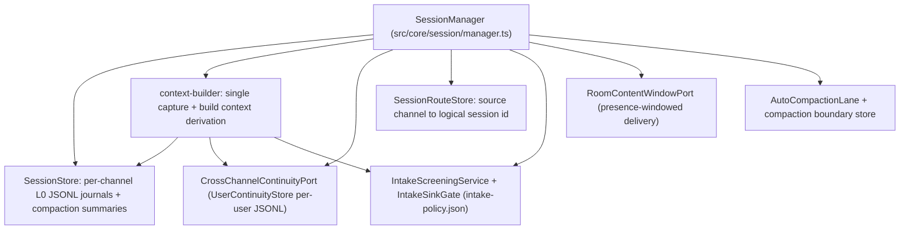
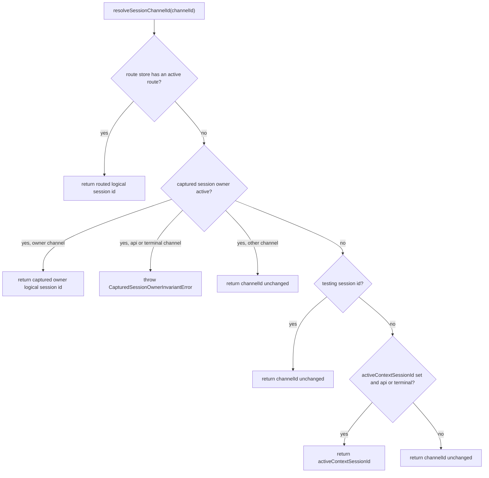

# Session Runtime

The session runtime (`src/core/session/`) owns everything between "a message
arrives on a channel" and "a turn's context is assembled": per-channel append-only
L0 journals, the mapping from physical channels to logical sessions, turn
recording with authorship and intake-firewall integrity, cross-channel continuity,
and the single context-derivation path that feeds prompt assembly. `SessionManager`
(`src/core/session/manager.ts`) is the facade the agent loop, scheduler, tools, and
memory faculties call; the narrower `SessionManagerTypeSurface` contract
(`src/core/session/manager/session-manager-type-surface.ts`) is what captured-turn
code may see.

## 1. Session identity and channel-type inference

Session ids are strings. `src/core/session/session-id.ts` is the single source of
truth for classifying them:

- `internal:` (including `subagent:` and `shard:`) ids are internal sessions
  (`isInternalSessionId`); they are not ordinary partner surfaces.
- `internal:reflection:` ids are reflection sessions; `internal:free-time:` is the
  canonical prefix for free-time continuity sessions, shared by every free-time
  call site (identity classification, retrieval access scope, ICP candidate
  source, scheduler channel resolution) so the scheduler trigger lane (quiet-hours
  vs idle) can never determine transcript identity (bible §10.4).
- `isExperientialSelfDirectedSessionId` treats free-time and reflection streams as
  evidence of the companion's own lived activity, while operational
  heartbeat/maintenance streams stay excluded.
- `isTestingSessionId` recognizes a `testing` namespace segment after the channel
  prefix (for example `api:<principal>:testing:<name>`), composing with routing
  prefixes without matching ordinary names that merely contain the word
  "testing".
- `inferSessionChannelType` maps a session id to a `ChannelType` ('discord',
  'telegram', 'api', …) from its prefix, from `discord-voice:`, or from a bare
  15–22 digit Discord snowflake-shaped id, and returns `'subagent'` for
  `subagent:` ids.

## 2. Logical session routing and lifecycle resets

A physical source channel maps to exactly one active logical session id through
`SessionRouteStore` (`src/core/session/session-routes.ts`), persisted as a
versioned atomic JSON snapshot (`SESSION_ROUTE_STATE_VERSION = 1`).

- **Refresh-on-read.** Gateway, agent, and Garden are separate processes over the
  same owner file, so every route read reloads the atomic snapshot instead of
  trusting the constructor-time copy; otherwise Garden could append released
  intake to a session the agent already retired (`session-routes.ts#L260-L268`).
- **Strict parse.** Route state with unknown fields, key mismatches, invalid
  versions, or malformed retired entries throws; the store fails closed on any
  shape it does not understand (`session-routes.ts#L191-L211`).
- **Reset.** `resetSourceChannel` retires the current logical session and creates
  a fresh id (`<sourceChannelId>:session:<compact-time>-<uuid8>`), increments the
  route generation, and records a `RetiredSessionRoute` with the reason, actor,
  mode (`fresh_split` or `break_glass_quarantine`, default
  `break_glass_quarantine`), and the fixed `SESSION_QUARANTINE_EXCLUDED_CONTEXT_CLASSES`
  list (recent entries, compaction summaries, focus knowledge, cross-channel
  continuity, session mirrors, memory retrieval, and others) — the classes a
  quarantined session may no longer contribute to context (`session-routes.ts#L329-L384`).
- **Manager-side effect.** `SessionManager.resetSourceChannelSession` clears focus
  session state and pending auto-compactions for both old and new ids and emits a
  `session.route.reset` event on the event bus (`manager.ts#L586-L605`).

`SessionManager.resolveSessionChannelId` resolves in a fixed order
(`manager.ts#L449-L484`): the route store first (deterministic and
scope-independent), then under an admitted turn the captured owner is the only
authoritative logical session — applying the mutable active context there would
mis-attribute the owner's work (the 9syj.9 wrong-session bug), so override-eligible
channels throw `CapturedSessionOwnerInvariantError` instead. Testing ids pass
through, and outside a captured turn `api:`/`terminal:` channels resolve to the
mutable `activeContextSessionId`.

**Captured session owner.** During an admitted turn the runtime stores an owner
identity (logical session id + source channel) in `AsyncLocalStorage` and hands
admitted work a `CapturedSessionReads` object whose operations are bound to that
owner (`manager/captured-session-owner.ts`). Mutable resolution entry points
(`resolveSessionForIngress`, `getActiveContextSession`, `buildContext`, …) assert
no captured owner is present and throw the invariant error otherwise; tool-time
`getActiveContextSessionForTool` is the owner-aware exception that returns the
owner's session mid-turn (`manager.ts#L439-L447`, `L617-L630`).

## 3. Write path: recording turns

All recording funnels through `resolveSessionWriteTarget` (`manager.ts#L404-L433`),
which splits the logical owner (`channelId`) from the immutable physical source
(`sourceChannelId`). An explicit `sourceChannelId` means the caller has already
captured both halves of the write identity — that logical owner is never sent back
through mutable route/active-context resolution, so a live route reset cannot
rebind an in-flight row.

- **`recordUserMessage`** (`manager.ts#L803-L957`): builds turn metadata
  (turnId, requestId, sourceMessageId, replyToMessageId, actorKind) and the
  optional role-envelope preview, classifies channel visibility from the source
  channel envelope, persists the entry (role `user` or, when the authorship guard
  fires, `system`), appends to cross-channel continuity, and mirrors to active
  sessions unless the authorship guard re-tagged the message.
- **Authorship integrity guard.** `detectInternalOriginForUserAttribution`
  (`entry-attribution.ts#L382-L408`) refuses user attribution at append time for
  internal-origin entries: `scheduler` author, `system:`/`internal:` author
  prefixes, intention-appraisal artifacts, and internal reflection requests.
  `recordUserMessage` re-tags the entry to role `system`, logs, and emits
  `session.authorship_guard.retagged` — internal messages can never persist as if
  the partner authored them (`manager.ts#L861-L890`).
- **`recordAssistantMessage` / `recordSystemMessage`** mirror the same shape with
  `actorKind: 'machine_intelligence'` / `'system'`; system recording also accepts
  intake envelope snapshots (`manager.ts#L959-L1126`).
- **`recordToolObservation`** (`manager.ts#L1138-L1230`): screens the RAW tool
  output through `intakeScreening` before persistence (htm9.2). Enforce-mode
  quarantine persists only the fixed withheld-content placeholder, so hostile tool
  output never reaches context assembly, memory extraction, or the
  emotion-appraisal feed; shadow mode persists the original text plus the envelope
  snapshot. A precomputed screening from the scheduler seam is reused instead of
  re-running the side-effecting `screenSync` (which would double the quarantine
  hold). Returns `{ entryId, intakeSnapshot }` so the outbound disclosure seam can
  gate a tool result without re-screening.
- **Fail-closed wiring.** Recording entries that carry intake envelope snapshots
  while `intakeScreening` is off throws — persisting unattributable screening
  state is refused (`manager.ts#L843-L857`, `L1078-L1093`).
- **Persistence boundary.** `shouldPersistSessionChannel`
  (`session-channel-persistence.ts`) excludes `internal:reflection:` channels:
  they never write an L0 journal. User/assistant messages on non-persistent
  channels still append to cross-channel continuity with
  `sourcePersistence: 'non_persistent'`; persisted channels append with the L0
  `sourceEntryId` (`manager.ts#L892-L941`, `L989-L1006`).
- **System lanes.** `appendSystemNote` writes an internal lane
  (`sessionLane.kind 'internal'`) hidden from ordinary context builds, while
  `appendContextSystemNote` writes a context-visible attributed system note
  (`sessionLane.kind 'system_note'`) rendered as `[SYSTEM: ...]`
  (`manager.ts#L1663-L1748`).

## 4. Cross-channel continuity store

`UserContinuityStore` (`src/core/session/continuity.ts`) is a per-user secondary
index over recent messages from ALL channels: one JSONL file `user_<id>.jsonl`
under the sessions directory, with an in-memory cache capped at `maxEntries`
(default 20; the JSONL keeps every row for audit). Each appended row carries a
`continuity` provenance envelope — `continuityUserId`, `sourceChannelId`,
`sourceVisibility`, `sourceRole`, `recordedAt`, optional `sourcePersistence`
(`l0` | `non_persistent`) and immutable L0 `sourceEntryId`
(`continuity-provenance.ts`). `getRecent` filters by disclosure continuity with
the current channel, and `getActiveChannels` returns channels seen within a time
window (default 30 minutes) for mirror fan-out.

The port abstraction (`cross-channel-continuity-port.ts`) has three states:
`wired` (`createUserContinuityPort`), `disabled` (intentionally off), and
`missing_wiring` (store not provided); health reporting distinguishes them. The
wired port:

- merges canonical + fallback user ids chronologically, deduped by content key,
  filtered by channel eligibility, and capped at the request limit
  (`getMergedContinuity`, `manager/context-support.ts#L297-L341`);
- validates each entry's provenance against the current channel
  (`resolveValidatedCrossChannelContinuityProvenance`): the persisted
  sourceChannelId, role, timestamp, and visibility must match the entry, and a
  source channel that conflicts within the same session family (different thread
  of the same `api:`/`telegram:`/`discord:` base) is rejected
  (`cross-channel-continuity-port.ts#L88-L153`);
- resolves frozen continuity copies against their immutable L0 origin rows:
  `resolveContinuityEntryContent` (`continuity-redaction.ts#L94-L160`) re-reads
  the exact source entries by id range and serves the LIVE content; every
  unprovable state — missing source ref, resolver error, absent source, identity
  mismatch, or a redacted source — heals to the `[redacted: source entry removed
  from the session journal]` notice, never the secondary-index plaintext.

## 5. Context assembly (read path)

Context derivation has a single path (E2.2, `manager/context-builder.ts`):
`captureTurnSessionContext` derives the `TurnSessionContextSnapshot` once,
pre-turn (the turn pipeline persists it in the PromptPlan snapshot); `buildSessionContext`
is a pure consumer of that snapshot — there is no parallel live re-derivation
branch. `SessionManager.buildContext` captures inline for direct callers
(`manager.ts#L1536-L1660`). The derivation pipeline:

1. Collect recent entries within the configured history span, through the
   compaction-boundary store and (when enabled) the shared session tail cache.
2. Apply the room content window gate (see §7).
3. Apply the temporal session history window: same-day/recent-hours narrowing with
   a 12-conversational-entry floor and up-to-24-hour backfill so a casual temporal
   cue ("today", "just now") never severs the live conversation
   (`manager-primitives.ts#L241-L277`).
4. Apply focus compaction ranges and observation masking (masked tool
   observations window).
5. Interleave the bonded channel timeline when a channel bond is active (§6).
6. Merge cross-channel continuity entries (provenance-validated, L0-resolved),
   gating room-origin continuity on the presence window.
7. Assemble history to the token budget, render messages with attribution and
   provenance stamps, and let the prompt-assembly sink gate withhold or mark
   entries (§8).

`entriesToMessages` (`manager/context-support.ts#L343-L469`) renders entries as
context messages: minute-resolution `[Weekday MM-DD-YY HH:MM]` stamps wrap
user/system content (never the companion's own assistant turns, which would make
the model mimic the prefix — psfn-framework-2x37.10), mirror notes render as
`[Mirror note from <channel>]`, bonded foreign entries render as
`[via <sourceChannelId>]` (suppressed when the intake gate has withheld the
content, and never on assistant turns), and public-visibility content is wrapped
as structurally untrusted context. Leading assistant responses without preceding
user/system context are dropped.

## 6. Channel bonding

Channel bonding (`src/core/session/channel-bond.ts`) makes explicitly opted-in
contact identities operate as ONE logical conversation while physical session
logs stay split per channel: the bond is a read-time interleave of bonded member
channels' conversational entries into the current channel's context timeline,
ordered by timestamp and annotated with the source channel.

- **Activation.** The current turn's identity must itself carry the `bonded`
  flag; member discovery scans the continuity Partner's active channels (default
  7-day window, per-member cap 40 entries). A physical channel joins only when
  every Partner speaker in its retained history is one of the exact bonded
  identities for that platform — same-platform alternate accounts and mixed group
  logs are rejected, and an assistant-only log cannot prove ownership.
- **Privacy.** Member privacy is determined STRICTLY from the member's own
  persisted visibility labels; no label means the member's privacy is
  undeterminable and the whole bond stays down. The effective disclosure is the
  lowest-common (most restrictive) member under the active trust policy, and a
  foreign entry crosses only when its source disclosure flows into BOTH the
  bond's effective disclosure and the current channel's disclosure, with the
  trust/memory policy allowing it (`channel-bond.ts#L301-L372`).
- **Foreign entry identity.** Merged foreign entries get namespaced negative ids
  (`-Math.abs(id) - 1`, so the "foreign ids are always negative" contract holds
  even for a source id of 0) so id-keyed machinery — current-turn exclusion, leak
  guard, compaction coverage — can never bind them to own-channel entries. They
  carry a `channelBond` metadata marker (source channel + parsed source
  visibility); entries whose metadata envelope cannot be preserved never cross.
- **Mirror suppression.** Own-log mirror notes whose source conversation is now
  interleaved directly are dropped — the originals supersede the truncated mirror
  copies (`channel-bond.ts#L375-L392`).
- **Ordering.** `sortBondedTimelineEntries` orders by timestamp, own-before-foreign
  at the same instant, then id, then source channel — also used to re-interleave
  after compaction.
- **Compaction isolation.** The compaction trigger and compactor run on
  own-channel entries only; bonded foreign entries are excluded (they would
  inflate the token total, force foreground compaction, and summarize away the
  Partner's own history while bypassing compaction) and are re-interleaved afterward
  (`manager/context-builder.ts#L507-L601`).

## 7. Presence-windowed room content

Privacy for PRIVATE rooms is enforced at delivery time, never by filtering memory
extraction (`src/core/session/room-content-window.ts`, bead s10rm): an occupant
receives room chat only from their join until their exit. `RoomContentWindowPort`
resolves one of three windows per resolved channel:

- `unwindowed` — serve everything (public rooms and every non-room channel; the
  default when no port is wired is byte-identical behavior);
- `windowed` — serve only content with `timestamp >= floorMs`, the recipient's
  current presence window start (their `companion_presence.since`). Rejoining
  opens a NEW window; earlier-window content is not served (it lives on in
  extracted memory, not the live room context);
- `closed` — serve nothing when not present or unresolvable; fail closed.

`composeRoomContentWindowPorts` lets one manager slot serve multiple disjoint
channel families (companion-room + Discord-voice): the FIRST non-`unwindowed`
verdict wins, and each port must own a disjoint family so one owner's verdict is
never overridden. The gate is applied to EVERY served room surface — history
entries, compaction summaries (by creation time), wake-return artifacts, and
room-origin continuity — while focus knowledge/ranges (untimestamped) are dropped
wholesale on windowed channels. Presence-windowed rooms never channel-bond, since
the bond is a 1:1 continuity surface that must not be widened by foreign timelines
(`manager/context-builder.ts#L205-L297`). `SessionManager.setRoomContentWindowPort`
wires the port (composition sets it only in multi-companion mode;
`manager.ts#L1868-L1881`).

## 8. Intake firewall gating at record and read time

The intake firewall has two session-layer halves:

- **Record time (htm9.2).** Screened surfaces persist the screening's
  `effectiveText` as entry content — enforce-mode quarantine means the hostile
  text itself never lands in the entry — and the `intakeScreening` metadata key
  (`src/core/session/intake-screening-metadata.ts`) carries the envelope
  snapshots (labels, state, decision context) plus mode, withheld flag, and the
  read-time data-marking plan. Downstream consumers (emotion appraisal, memory
  extraction) read WHAT was decided without re-screening.
- **Read time (htm9.3).** `applyPromptAssemblySinkGate`
  (`src/core/session/intake-sink-gating.ts`) checks every entry carrying
  `intakeScreening` metadata against the `prompt_assembly` sink before context
  assembly. In enforce mode a denied entry renders as the fixed, operator-reviewed
  withheld-content placeholder; shadow mode evaluates and audits without altering.
  Malformed intake metadata fails closed in enforce mode (content withheld, error
  logged, never swallowed). Data marking (htm9.13) is applied at READ time so
  markers never exist in persisted content and inbound re-scans only ever see
  forged markers, within a 256 KiB prompt-assembly marking work budget
  (`intake-sink-gating.ts#L224-L318`).

`screenSelfAuthoredMutation` extends the gate to model-authored mutations
(persona, wiki, trust): every string leaf gets its own envelope, the active
turn's envelopes join the proposed-content envelopes (a clean-looking derivative
cannot shed hostile provenance), and a partially wired runtime fails loudly —
empty envelope lists and unscreened sink paths are refused. Persona mutations are
audit-only: CogSec evaluates and audits the exact proposed text but is not an
independent persona authority and must not replace a companion-authored value
(`intake-sink-gating.ts#L84-L205`).

## 9. Entry attribution and turn provenance

- **Read-time normalization.** `normalizeSessionEntryAttribution`
  (`entry-attribution.ts#L309-L370`) re-tags entries when building context:
  explicit `speakerRole` from the turn envelope wins; intention-appraisal
  artifacts classify as system; scheduler authors and internal reflection
  requests classify as system; everything else falls back to the persisted role.
- **Group speaker contract (charter Laws 17–19).** In multi-speaker conversation a
  Partner turn renders with the canonical prefix
  `DisplayName (stableId): <content>` — `formatGroupUserMessageContent` is the
  ONLY code allowed to construct it and `parseGroupUserMessageContent` the only
  code allowed to interpret it (tooling/tests only; runtime trust never parses a
  rendered string back). `stableId` is the trustworthy identity anchor;
  `DisplayName` is cosmetic and sanitized (parentheses, colons, control/format
  chars stripped) but never trusted for identity decisions. Prefix-shaped text
  inside Partner content is neutralized by `escapeAttributionForgery` so a speaker
  can never masquerade as another (`entry-attribution.ts#L22-L198`).
- **Turn provenance.** `buildSessionMetadataWithTurn`
  (`turn-provenance.ts#L70-L106`) persists a `turn` envelope (schemaVersion 1)
  with turnId (UUIDv7), requestId, sourceMessageId, replyToMessageId, role,
  speakerRole, and actorKind (`human` | `machine_intelligence` | `system` |
  `unknown`). `resolveSessionEntryTurnContext` returns the persisted turnId or a
  deterministic backfilled legacy seed and reports `turnRecordExpectation`
  (`not_expected` for `observed_message` entries); malformed JSON or invalid
  field types THROW rather than degrade provenance, and `resolveSessionEntryActorKind`
  throws on unknown actor kinds. `resolveLatestTurnContext` finds the latest
  user/assistant turn's context (`turn-provenance.ts#L149-L212`).

## 10. Session mirroring

`mirrorMessageToActiveSessions` (`manager/mirroring.ts#L50-L128`) fans lightweight
mirror notes into recently active sessions of the same continuity user: after a
user or assistant message lands, every other channel active within the mirror
window (default 30 minutes) receives a truncated (`[Speaker from <source>]:
<text>` capped at 220 chars) system entry with `type: 'mirror'` metadata. Each
target is gated by disclosure continuity between source and target visibility and
by the trust/memory policy (a public-source note never leaks into a private
target). Mirroring is configurable per channel family via
`sessionMirrorChannelOverrides` (exact ids, prefixes, `discord` bare-id matching,
and `*` glob prefixes) and globally via `sessionMirrorEnabled`
(`manager/mirroring.ts#L19-L48`).

## 11. Compaction and the between-turns lane

- **Compaction boundary store.** `createCompactionBoundaryStore`
  (`manager/compaction-boundary-store.ts`) proxies the L0 store so context reads
  see only entries after the latest compaction summary's `coveredUpTo`;
  `insertCompaction` marks summaries as untrusted records and
  `getCompactionSummaries` wraps them as untrusted context, tagging the
  addressable latest summary.
- **Auto-compaction lane.** Between-turns compaction runs on a durable
  `AutoCompactionLane` that foreground turns do not await: the foreground turn
  builds on the last-committed revision and surfaces
  `compactionManifest.pending` plus the `compaction_wait` telemetry marker
  (`manager.ts#L632-L646`). The durable job commits atomically regardless of
  foreground turns (never abandoned). Foreground compaction remains available for
  callers that opt in.
- **Partner-activity wake targets.** `listRecentlyActiveChannels`
  (`manager.ts#L692-L749`) returns channels whose most recent genuine partner
  (role 'user') message falls within the lookback, for temporal wake-note
  fan-out; the store's last-activity-descending order breaks the loop at the
  lookback edge, and each candidate is confirmed by a partner-activity scan that
  grows geometrically (128 → hard ceiling 8192) so a partner turn behind a long
  companion/system tail is not missed.
- **Rolled-out boundaries and artifacts.** `createRolledOutSessionBoundary`
  (`rolled-out-session-boundary.ts`) pairs a logical session id with a cutoff
  timestamp so a time-only lookup can never widen into other logical sessions
  sharing a physical channel; `SessionContinuityArtifactStore`
  (`continuity-artifacts.ts`) persists `checkpoint`/`wake_return` artifacts with
  `task`/`relational`/`life` facets and `wake`/`return` occasions.

## 12. Fail-closed invariants

- A bond never widens anything it cannot prove safe: undeterminable member
  privacy, an unmatchable channel, or no lowest-common disclosure resolves
  nothing.
- A `closed` or undeterminable room window serves nothing; windowed channels drop
  untimestamped derived content wholesale.
- Malformed `intakeScreening` metadata withholds content in enforce mode and logs
  — never silently serves the raw text.
- Continuity content whose L0 origin cannot be proven renders as the redaction
  notice, never the secondary-index plaintext.
- Recording intake envelope snapshots with the screening service unwired throws.
- Internal-origin user submissions are re-tagged to system at append time; they
  can never persist as partner speech.
- Mutable session resolution under a captured turn owner throws
  `CapturedSessionOwnerInvariantError` instead of silently attributing work to the
  wrong session.
- Session route state that fails strict parsing throws; reads always refresh the
  cross-process snapshot.
- Malformed turn provenance throws rather than backfilling an untrustworthy id.

## 13. Configuration and wiring

- **Continuity.** Composition enables the store only when `enableContinuity` is on
  AND `continuityChannelIds` (channels.json) is provided; the port's eligibility
  filter is the configured channel set. Without a store the port reports
  `missing_wiring` (`src/app/startup/composition/composition.ts#L270-L284`).
- **Intake firewall.** `intake-policy.json` builds one `IntakeSinkGate` per agent
  process (`maybeCreateIntakeSinkGate`) wired into the SessionManager
  (`sessionManager.intakeSinkGate` / `sessionManager.intakeScreening`) and
  threaded to every consequential sink: prompt assembly, memory write, wiki
  write, skill write, persona mutation, trust mutation, and the egress tool guard
  (`src/app/agent/core-runtime.ts#L470-L513`).
- **Room windows.** `setRoomContentWindowPort` (multi-companion mode only); unset
  means every channel is unwindowed.
- **Mirroring / history budgets.** `sessionMirrorEnabled`,
  `sessionMirrorChannelOverrides`, `sessionMirrorMaxChars` (default 220),
  `sessionMirrorActiveWindowMs` (default 30 min); context budgets come from the
  shared adaptive budget profile (`sessionHistoryTokens`, `continuityMessageLimit`
  default 10, `maxHistorySpanMs` default 36 h) and the active temporal frame
  (`configureActiveTemporalFrame`).

## Related pages

- `/openwiki/runtime/chat-turn-lifecycle.md` — where the session write and
  context paths sit inside one end-to-end turn
- `/openwiki/channels/overview.md` — channel adapters that feed
  `recordUserMessage` / `recordToolObservation`
- `/openwiki/runtime/scheduler.md` — scheduler lanes that write through the same
  manager and read continuity / free-time identity
- `/openwiki/memory/overview.md` — L0 archives (the SessionStore) and extraction
  that reads persisted session entries
- `/openwiki/security/attribution.md` — the authorship and attribution trust model
- `/openwiki/faculties/contacts.md` — where bonded contact identities and trust
  levels come from
