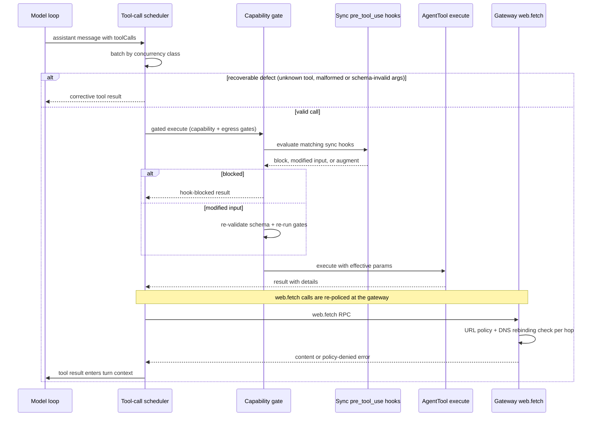

# Tool Surface

The **tool surface** is the complete machinery that decides **which tools a model can call, how their descriptions and schemas reach the model, how calls are validated and executed, and how the runtime stays honest about what actually ran**. It spans four layers:

1. **Declaration** — the canonical first-party registry (`src/core/agent/tool-surface/registry.ts`) fixes the audited tool names, domains, exposures, action contracts, and retired aliases; structured descriptions (`descriptions.ts`) render every description from one source.
2. **Tool implementations** — the core `src/core/tools/` modules build the actual `SubstrateAgentTool`s: `session` (list/new/resume/search/grep/wake_return/focus), `self_status` (snapshot/diagnose/logs/conformance/availability), `system` (read/restart/rebuild), and `notify` (brief/send/approval_request/clarify/consider), plus the shared results contracts in `results.ts`.
3. **Validation & cataloging** — startup wiring checks (`tool-wiring-validator.ts`) prove runtime dependencies exist; the catalog (`tool-catalog.ts`) turns live tools into model-facing metadata; the capability gate (`src/system/capabilities/gate.ts`) wraps every tool with capability, egress, and pre_tool_use hook enforcement.
4. **Gateway enforcement** — the synchronous pre_tool_use decision hooks (`src/boundary/gateway/pre-tool-hook.ts`, `hook-registry.ts`) pause a tool call until an operator hook resolves, and the URL policy (`src/boundary/gateway/url-policy.ts`) blocks SSRF vectors at the `web.fetch` seam.

## Canonical first-party tool registry

`CANONICAL_FIRST_PARTY_TOOL_SURFACES` in `src/core/agent/tool-surface/registry.ts` is the single audited declaration of every first-party model-facing tool. Each entry fixes:

- **name** and **domain** — one of 16 `FirstPartyToolDomain` values (adaptive_tooling, analysis, boundary, contacts, identity, knowledge, memory, media, notification, orientation, scheduler, self_expression, sessions, subagents, system, tracked_work);
- **exposure** — `core` (always active) or `extended` (registered but presentation-ordered; pinned via `toolset`);
- **actions** — the canonical action list for multiplexed tools (`session`: list/new/resume/search/grep/wake_return/start_focus/complete_focus; `system`: read/restart/rebuild; `notify`: brief/send/consider/approval_request/clarify; `self_status`: capabilities/snapshot/diagnose/logs/conformance plus the four availability actions);
- **capabilityMetadata** — `static` vs `action_aware` vs `external_policy`, with the source file that owns the capability requirement;
- **retiredAliases** — old tool names mapped to the canonical replacement, a `replacementAction`, an exposure (`hidden` or `retired`), and the reason.

This table is the authority consulted by the catalog builder, the unknown-tool correction path, the alias resolver for pre_tool_use hook policies, the outcome-claim guard, and the usage evaluator's canonical-name filter. Every other surface derives from it rather than maintaining a parallel list.

**Retired aliases fail closed.** `resolveToolAliasMatchersFrom` returns, for an invoked name, the set of alternative first-party names a pre_tool_use hook policy could match — the retired aliases when invoked canonically, or the canonical name plus sibling aliases when invoked by a retired alias. If a retired alias's `canonicalName` does not resolve to a real canonical surface, the resolver **throws** instead of returning a silently never-matching empty set, so a policied tool call can never slip past its intended hook. `assertNoRetiredFirstPartyToolAliases` throws when a tool list passed to a restricted context contains retired aliases without a charter exception.

**Presentation ranking.** `resolveToolPresentationRank` orders the active tool list by a fixed domain rank: self_expression (10) first through media, notification, contacts, memory, sessions, orientation, identity, knowledge, scheduler, analysis, subagents, tracked_work, adaptive_tooling, boundary (160) and system (170) last, with name as the tie-breaker. Non-canonical tools (plugins, channel extras) rank at `TOOL_PRESENTATION_RANK_UNKNOWN` (200) — after every first-party domain — so the model's attention anchors on the audited toolset before any plugin verb. A per-tool `presentationRankOverride` can reposition a canonical tool.

## Structured descriptions

Tool descriptions are not free text: `CANONICAL_TOOL_SURFACE_CONTRACTS` in `src/core/agent/tool-surface/descriptions.ts` (split into `catalog-boundary-contracts.ts`, `continuity-contracts.ts`, `operations-contracts.ts`, `agency-contracts.ts`) declares, per tool, a `purpose`, per-action contracts (required fields, `requiredAnyOf`, `requiredOneOf`, optional fields, rules), `output`, `guidance`, and an `example`. `CANONICAL_TOOL_SURFACE_DESCRIPTIONS` renders these into the description strings the tool factories embed (e.g. `CANONICAL_TOOL_SURFACE_DESCRIPTIONS.session`, `.self_status`, `.system`, `.notify`), so broad catalog entries and narrowed policy variants come from one structured source. Variants (`read_only` repo projection, `companion_candidate` notify projection) render boundary-narrowed descriptions for restricted surfaces.

## Core model-facing tools

### `session` — list, new, resume, search, grep, wake_return, focus

`createSessionTool` (`src/core/tools/session.ts`) builds the core `session` tool. Startup composition registers it through `wireSessionToolsRuntime` (parity.ts) with the real `SessionManager`, an LLM provider, and the prompt registry for search summarization.

- **`action=list` (default)** — when `action` is omitted and no action-specific parameters are present, the action defaults to `list`, returning up to `limit` recent sessions (default 20, max 100) with `isActive` flags against the active context session. Any other omitted-action call with non-list parameters throws with the allowed action list.
- **`action=new`** — generates an id of the form `api:session-<base36 timestamp>-<8 hex>`, switches the active context session, seeds the new session, and persists it as the last-active session. `new` (and `resume`) are **rejected during background continuation execution** — switching sessions is a foreground-turn-only mutation.
- **`action=resume`** — requires a `sessionId` that resolves to a real session (`getSessionActivity`); a missing session is an error result. Switches the active context and persists last-active state.
- **`action=search` / `action=grep`** — transcript search and ripgrep-backed grep over session files. `within=latest_compaction_source` restricts results to the **verified** exact source of the current channel's latest compaction summary (access is denied when there is no active request channel). `search` optionally adds an LLM synthesis over the visible hits (`summarize=true`).
- **`action=wake_return`** — records a `wake_return` session-continuity artifact on the active (or explicitly given) session: a required non-empty `summary`, an `occasion` (default `return`, validated against `SESSION_CONTINUITY_OCCASIONS`), optional `nextAnchor` and `facets`.

All actions share one error path: a thrown `CapturedSessionOwnerInvariantError` rethrows (owner invariant, not a tool failure), while other errors become `internalToolFailureResult`.

### Focus sessions (`start_focus` / `complete_focus`)

`src/core/tools/focus.ts` implements the two focus actions behind the `session` tool through a `FocusSessionManager` port (implemented by the session manager). `start_focus` resolves the target channel (explicit `channelId` → request-context channel → active context session), **fails if a focus session is already active for that channel**, and records a focus session with a scope, returning the `focusId` and the prior project context (distilled knowledge-block count) when one exists. `complete_focus` requires an active focus session, compacts the session transcript and evidence log into a bounded distillation input, asks the LLM (purpose `context`, non-durable work spec, cost-correlated) to produce plain-text knowledge in a fixed format — one-line title, up to 6 finding bullets, and an `Open questions:` line — and persists the result as a durable knowledge block via `completeFocusSession`, returning the new project-context counts.

Both transcript and evidence are hard-bounded before they reach the model: at most 120 transcript lines / 12,000 chars, 24 evidence lines, and 260 chars per line, each line clamped with an ellipsis. An empty helper-model summary is an error result, so a focus session can never complete with a blank knowledge block.

### `self_status` — snapshot, diagnose, logs, conformance, availability

`createSelfStatusTool` (`src/core/tools/self-status.ts`) builds the core `self_status` tool; the canonical registry lists it under the `system` domain at core exposure with all nine actions. The default action is `snapshot` (schemaVersion 1), which assembles fail-closed sections:

- **capability** — the resolved tier and effective granted-token set, preferring a live `getCapabilityGrantSnapshot`, then `getCapabilityTier` (custom tiers error as "not wired"), then config;
- **tools** — core/extended/active/promoted tool names, promoted-skip reasons (with missing tokens), counts, a sorted tool-catalog snapshot, and a folded tool-health status (`unavailable` wins over `degraded` over `healthy`);
- **charge** — the charge-policy rolling-window and current-run spend per runtime lane, with remaining quotas;
- **channels** — sanitized recent session summaries (message content is never returned), bounded `recentChannelLimit` to 1–20;
- **heartbeat** — age of the most recent heartbeat session activity;
- **uptime**, **memory** (memory-store stats), and **substrate** (streaming state, observer-eval sidecar health, shard toolsets).

Every provider is optional; a missing or throwing provider renders an explicit `unavailable`/`error` section marker with a reason instead of failing the whole snapshot. `action=capabilities` returns only the tier/grant; `action=logs` builds a redacted runtime-diagnostics snapshot (`windowMs` bounded to at most 24h, `limit` to 100 records); `action=conformance` runs the LLM-free tool-surface sweep (see below) and returns the aggregated result as JSON; `action=diagnose` requires the kube-introspection dependency surface and otherwise returns an explicit unavailable result. The four `availability_*` actions delegate to the ICP autonomy runtime (publish requires a future expiry within the max lease TTL and a positive revision; unknown keys are rejected).

### Self-diagnosis report

`buildSelfDiagnosisReport` (`src/core/tools/self-diagnosis.ts`) is the LLM-free `diagnose` report. It assembles, with schemaVersion 1:

- **deployment** — image tag (`PSFN_IMAGE_TAG`), git commit (env `PSFN_GIT_COMMIT` falling back to the image-snapshot commit), and `fixesShipped`: bead ids extracted from `git log <PSFN_PREVIOUS_GIT_COMMIT>..<current>` when an authoritative source checkout exists (the image snapshot committed by `PSFN Runtime Image` is deliberately not authoritative);
- **repository** — image-snapshot repo vs the real source checkout at `PSFN_REPOSITORY_DIR` (branch, commit, dirty flag);
- **tooling** — `bd`/`rg`/`psql` availability via PATH probing, plus the beads tools enabled/disabled determination (`BEADS_TOOLS_ENABLED` env flag overrides `.beads` marker detection);
- **storage** — the six runtime mounts (system data, companion data, workspace, logs, tmp, backups) with writability and statfs free/total bytes; missing paths are explicit `unavailable` markers;
- **modelRouting** — recent chat model-usage events with `requestedProvider`/`requestedModel` vs served values, flagging mismatches (the query port is lazily resolved; null port is an explicit unavailable section);
- **policy** — an agent-process view of policy flags (`BEADS_TOOLS_ENABLED`, `BEADS_ALLOW_ACTIONS`, `VAULT_TOOLS_ENABLED`, `GIT_REPO_ROOT`, `WEB_TOOLS_ENABLED`) and the settings.json `shellExec` projection, noting that authoritative shell enforcement lives in the gateway process;
- **toolConformance** — the latest recorded sweep from `<systemDataDir>/state/tool-conformance-latest.json`, schema-validated (schemaVersion 1, `ranAt`, per-tool `ok` results) with pass/fail counts.

The whole report passes through `redactDeep` as defense-in-depth: secret-keyed fields are replaced with `[REDACTED]`, and `redactSecretString` masks credentials embedded in URIs, bearer tokens, `token=`/`secret=`-style assignments, and provider key prefixes (`sk-`, `xox*`, `ghp`, `glpat`, …).

### `system` — read, restart, rebuild

`createSystemTool` (`src/core/tools/lifecycle.ts`) builds the core `system` tool with actions `read` (settings introspection, aliases `settings_get`), `restart`, and `rebuild` (aliases `self_restart` / `self_rebuild` in the canonical registry). Restart and rebuild:

1. require a non-empty `reason` (audit-trailed);
2. consult the optional `LifecycleRestartSafeguard` (a deny blocks with the safeguard's reason);
3. resolve a `LifecycleRestartPlan` from the runtime restart contract — `supervisor` (exit code 0), `reexec` (contract exit code), `command` (requires a configured command plus a durable `prepareRestartCommand` boundary and a `runRestartCommand`), or `unsupported` (a contract strategy of `unsupported`, or a command strategy missing its preparation boundary, **fails closed and leaves the process running**);
4. send a pre-restart notification, run the durable shutdown boundary, and `process.exit` with the plan's exit code via `setImmediate` so the tool result reaches the model first.

Rebuild runs the repo-owned build command (`runRepoLifecycleBuildCommand` spawns `npm run build` in the repo root, requiring a repo-owned `package.json` with `scripts.build`, bounded by 120s timeout and 40,000 output chars, killing with SIGTERM then SIGKILL after the process-termination grace period) before the restart sequence. `action=read` optionally appends a live kube lifecycle status block.

**Kubernetes mode fails closed.** When the runtime is a guarded Kubernetes deployment (`KubeLifecycleToolRuntime` with `selfManagement.enabled`), restart routes through the gateway's approval-gated `kubeSelfManagement` controller (a `status: approval_required` response queues the rollout for operator approval; nothing restarts before approval) and rebuild **refuses in-pod** — building an image inside the running container is unsupported and the tool points at the guarded build-test-image-deploy pipeline instead. No local supervisor/reexec fallback ever runs under kube.

**Deferred execution.** With `executionMode: 'deferred'` (the production non-kube composition), restart/rebuild return a `"Restart queued. It will run after this turn completes."` result immediately. A post-turn action inferer (`inferDeferredLifecycleActions`) scans the turn's messages and only converts **successful** `system`/`self_restart`/`self_rebuild` tool results (matched by tool-call id to the original request) into `lifecycle.execute` candidates, deduplicated per turn+operation. `registerDeferredLifecycleRuntime` registers the background post-turn handler that re-resolves the restart plan, notifies, runs the durable shutdown, and exits — so a queued restart never fires from a failed or dropped call.

### `notify` — brief, send, approval_request, clarify, consider

`createNotifyTool` (`src/core/tools/ntfy.ts`) builds the extended `notify` tool (canonical domain `notification`, actions brief/send/consider/approval_request/clarify; retired alias `notify_operator` → brief). The tool declares a strict action-discriminated union as its execution schema (`notifyToolParameters`, `additionalProperties: false` per variant) so cross-action fields are rejected before `execute`, plus a flat `notifyModelParameters` object for providers that emit `{}` for `anyOf` schemas.

- **`brief`** — sends an operator brief through the configured `NotificationPort` (ntfy). `HttpNtfyNotifier` POSTs `${baseUrl}/${topic}` with `Title`/`Priority`/`Authorization: Bearer` headers, an 8s default timeout, and **debounces identical fingerprints (sender, topic, title, priority, message) within a 60s window**, returning `status: 'debounced'`. An unconfigured notifier (no base URL/topic) throws. `brief` is **blocked from internal channels and scheduled execution contexts**.
- **`send`** — outbound delivery to an external channel (`discord` currently wired via `NotifyChannelSender`; `email` explicitly throws "email delivery is not wired"). Targets must not start with `internal:`; every send enforces the `ExternalCommunicationRateLimiter` budget. `send` has the strictest context gate: it is only allowed from a **human-requested (`requesterProvenance === 'human'`), external-audience chat turn** — scheduled, internal-channel, non-chat, non-human, or unknown-audience contexts are blocked with a reason.
- **`approval_request`** — validates id/method/action/scope/reason (and a positive `expires_at_ms` when given), renders a fixed-format notification, and delivers to the operator Discord channel (rate-limited) with ntfy fallback to the operator topic; both failing raises a combined error. The sender metadata is `system.approval.request`.
- **`clarify`** — `validateClarifyRequest` requires a non-empty question (≤ 1000 chars) and 2–5 distinct non-empty choices (≤ 200 chars), generating a runtime-owned `PendingClarification` id. Delivery blocks the emitting turn for at most 120s (`CLARIFY_DELIVERY_TIMEOUT_MS`) through a channel-agnostic `ClarificationDeliveryPort`. A channel-reported selection is only admitted back into the turn when delivery resolved **and** `verifyResolvedClarificationSelection` proves the selection's id, index, and exact text match the delivered choices — anything else throws (fail closed), so an unverified choice can never be spread into the turn. `clarify` is blocked from internal/scheduled contexts, and fails closed when no interactive channel is wired (`resolveClarificationChannelRoute` accepts numeric Discord snowflakes and `telegram:` targets, rejecting internal, Discord-voice, api, terminal, and companion surfaces).
- **`consider`** (`target_kind=companion`) — queues a private companion initiation candidate for post-turn ICP evaluation; requires exact `contact_id` and a ≤1000-char `reason_summary`, and only proceeds when the companion-candidate surface is enabled and capability/tool-policy authorized. **`send` with `target_kind=companion`** requires an exact canonical `contact_id` plus a broker-issued one-use RFC-4122 `initiation_permit`; the call queues a `notify.companion_outreach` post-turn action with persisted authorization evidence (tool `notify`, scope `extended`, capability `external.companion`) that is re-verified against live capability and registration immediately before execution.

## Tool results contracts

`src/core/tools/results.ts` centralizes the structured result vocabulary every tool implementation shares:

- **`ToolErrorClass`** — `permission_denied`, `policy_blocked`, `rate_limited`, `timeout`, `invalid_input`, `provider_error`, `unavailable` — with **`ToolRetryHint`** (`do_not_retry`, `try_alternative_input`, `retry_after_delay`, `retry_with_backoff`, `operator_escalation`) and default hints per class.
- **`classSource`** — provenance of the error class: `declared` only when the caller supplied an explicit `errorClass` or a structured gateway error code drove it (approval-needed `-32000`, approval-denied `-32001`, policy-denied `-32002`, provider-error `-32003`); `inferred` when it came from free-text keyword matching. Outcome classification must **not** downgrade an `inferred` returned failure to a rejection/denial — a genuine runtime failure whose text merely contains a policy keyword stays an execution failure and remains visible in failure telemetry.
- **`CompanionVisibleOperationalError`** — the deliberate way for a tool to surface a companion-safe message with class and retry hint while keeping an operator diagnostic on the Error.
- **`INTERNAL_TOOL_FAILURE_NOTICE`** — the fixed notice for uncaught execution failures. `internalToolFailureResult` returns the operational failure's companion message when the error is a `CompanionVisibleOperationalError` or an HTTP-429 rate limit; everything else becomes the generic notice with diagnostics withheld from the model.
- **Sanitization** — the raw diagnostic is capped at 512 chars and the companion message at 320 chars, both passed through `redactSecrets` (env assignments, `key=value`/`Bearer` assignments, JWTs, long tokens), `redactInternalPaths` (unix/windows/home paths), and `redactSecretUrls` (URL userinfo, sensitive query keys, token-bearing hashes), with control characters stripped.

The core tool implementations use these builders consistently: `textResult` for plain success, `textResultWithError` for Partner-visible failures with structured details, `textResultFromError` for error results rendered through the system-language templates, and `internalToolFailureResult` for uncaught exceptions (with `CapturedSessionOwnerInvariantError` rethrown rather than swallowed by session/focus tools so the session-owner invariant is preserved).

## Gateway enforcement surface

### Synchronous pre_tool_use hooks

The async lifecycle hook path (bead vvf.2, `hook-registry.ts`) is fire-and-forget: handlers observe redacted events and can never influence the pipeline. `src/boundary/gateway/pre-tool-hook.ts` adds the **second, deliberately different invocation mode** — a synchronous decision path that pauses a tool call until an operator hook resolves and lets that hook **block the call, rewrite its arguments, or add model-visible context** before execution. Security posture is fail-closed at the chokepoint (`gateToolWithCapabilities`):

- a handler that **throws** blocks the call; a handler that **times out** (default 5s per hook) blocks; a handler that returns a **malformed decision** blocks;
- a hook can only **subtract authority** (block) or rewrite arguments — it can never grant a capability;
- `normalizePreToolResult` is fail-closed: `null`/`undefined` is a permissive no-op ("allow"), while non-object returns, unknown `decision` verbs, and non-string `additionalContext` all resolve to a block with a generic reason;
- `HookRegistry` rejects `sync_decision` registrations whose handler is **not a genuinely async function** — a bare synchronous handler cannot be preempted by the evaluation timeout, so it is refused at registration (fail closed at the seam).

The registry evaluates every matching `sync_decision` hook (matcher patterns may be exact tool names or dotted wildcards like `web.*`, and match aliases too) in registration order; a `block` wins immediately and later hooks do not run; a `modifiedInput` is chained to the next hook. The **enforcement site** (`gateToolWithCapabilities` in `src/system/capabilities/gate.ts`) evaluates capability eligibility + transport policy + the htm9.3 egress sink gate **before** the hooks, then — for a rewritten input — re-validates against the tool's JSON schema (`Value.Check`) and re-runs the same gates; a schema-invalid rewrite **blocks fail-closed** rather than silently reverting to the original arguments (unlike the b0yl correctness repair path upstream in the scheduler). `additionalContext` is appended to the tool result as a model-visible `[pre_tool_use hook context]` block.

The substrate agent late-binds the gate via `setPreToolHookGate`; `withCapabilityGates` caches one gated wrapper per tool and **fails closed at registration** for audited first-party tools that forgot to declare a capability requirement (third-party/plugin tools are refused at gate-evaluation time instead, so one bad plugin cannot take down startup). The production wiring (`src/app/agent/main.ts`) builds `createPreToolHookGate` with `resolveToolAliasMatchers` so a policy written against a retired or surface alias intercepts the canonical call (and vice-versa); malformed alias metadata throws and fails the call closed. Decisions are recorded as `RedactedPreToolHookAudit` — **never argument or context contents**, only shape (top-level key names of a rewritten input), counts, lengths, and the blocking hook.

### URL policy and SSRF enforcement

`src/boundary/gateway/url-policy.ts` is the SSRF gate for gateway `web.fetch`/`web.fetch_binary`/`web.request_binary`. `evaluateUrlPolicy(url, config, lane)` enforces, in the default lane:

- **HTTPS only** unless `allowHttp` is explicitly set; non-http(s) protocols are refused;
- **host/domain allowlists** when configured — `hostAllowlist` entries may pin an effective port (`host`, `host:port`, `[v6literal]:port`), and a port-pinned entry matches only that exact effective port, so a redirect to another port of an allowlisted host is rejected; a malformed `host:port` entry stays a never-matching literal so the allowlist never fails open;
- **private IPs and localhost are blocked** unless `allowInternalNetwork` is set;
- **`always_blocked` ranges are refused in every lane, including `allowInternalNetwork`**: cloud metadata, link-local, unspecified, IPv6 site-local `fec0::/10`, ULA `fc00::/7` (which covers the IPv6 IMDS `fd00:ec2::254`), broadcast/multicast, and every IPv4-embedding/transition form (NAT64 rfc6052, 6to4, Teredo, IPv4-mapped).

IP classification normalizes through `ipaddr.js` first, so every spelling of the same address classifies identically; IPv4-mapped IPv6 addresses classify by their embedded IPv4; an unparseable address **fails closed** to `always_blocked`.

`checkResolvedIP` runs **after** the URL check, for non-raw-IP hostnames: it resolves the hostname (with transient retry — 2 attempts, 250ms — so one flaky nameserver does not permanently block an otherwise-allowed fetch, still failing closed after the final attempt) and re-classifies the resolved address, catching **DNS rebinding** (`evil.com → 127.0.0.1`). Raw IPs are re-evaluated for defense in depth.

The gateway `web.fetch` method enforces the policy **twice**: synchronously in the policy gate (`evaluatePolicy`, so the audit log reflects the real decision) and again in `fetchWithPolicyChecks` before connecting. `fetchWithValidatedRedirectChain` re-policies **every redirect hop** with the same lane/config, bounds hops by `maxRedirectHops` (default 5, bounded to [0, 20]), detects redirect loops via a visited set, and **strips `authorization`/`cookie`/`proxy-authorization` headers permanently once a redirect leaves the original request origin** (scheme, host, or effective port). Two additional lanes exist: `local_crawler` (requires explicit enablement plus a host/domain allowlist and its own `allowHttp`; the strict private-host default checks are deliberately not applied) and `discovery` (requires a normalized URL allowlist). Both still always-block cloud metadata/link-local. The `home_assistant` lane is declared in the lane union; Home Assistant traffic rides the default lane with port-pinned host allowlist entries (e.g. `ha.local:8123`).

## Runtime catalog, wiring validation, and execution

`buildRuntimeToolCatalogEntry` (`src/core/agent/tool-catalog.ts`) derives a `RuntimeToolCatalogEntry` from each live `AgentTool` plus the canonical registry: action names are the canonical action list intersected with the schema's actual action literals, each with per-action `requiredCapabilities`; `requiredParameters` come from the JSON schema's `required` list; reversibility and concurrency metadata are **cloned** so the snapshot never aliases live mutable metadata; `bundleMembership` carries the scope plus `toolset.control` (tool_search/toolset) or `toolset.extended`, and `domain:<d>`/`exposure:<e>` for canonical tools. `buildRuntimeToolListingEntry`/`buildConciseToolDescription` produce the compact model-facing listing — the first sentence of each description hard-capped at `TOOL_LISTING_DESCRIPTION_MAX_CHARS` (160 chars ≈ 40 tokens) plus action names — from the same catalog entry, so the listing and the Garden admin tool page cannot drift.

`src/core/agent/tool-wiring-validator.ts` is a startup-time contract check. `ToolWiringMeta` declares `requiredGatewayMethods` (dot-notation RPC names), `requiredServices`, `contextRestrictions`, `concurrency` metadata, and `policyHydration`. `validateToolWiring` reports tools with missing gateway methods (each RPC name mapped to its `GatewayClient` method), missing services, missing metadata coverage, or invalid/missing concurrency metadata (exclusive tools need a non-empty key and a non-`none` policy; non-exclusive tools must use `none` and must not set a key; `maxParallel` must be a positive integer; at least one eligibility lane must be on). `validateAndLogToolWiring` logs and returns the disabled names **without mutating the tool list**.

Execution is the tool-call scheduler seam (`src/core/agent/tool-call-scheduler.ts`, patched into the agent loop): `executeToolCallsWithScheduler` batches calls by concurrency metadata (`collectCompatibleBatch` runs only compatible `spawn_subagent` calls in parallel; `exclusive` runs alone; missing/invalid metadata resolves fail-closed to exclusive), bounds parallel batches by `maxParallelToolCalls` and per-tool `maxParallel`, screens every executed result at the scheduler seam before it enters the turn, and turns recoverable defects (unknown tool, malformed arguments, schema-invalid arguments) into **corrective tool results fed back to the model** instead of dropped turns.

*Gated execution flow: scheduler batching and correction, capability + egress gates, synchronous pre_tool_use hook decisions, and the URL policy re-check at the gateway web.fetch seam.*

## Focused tests

- `src/core/tools/focus.test.ts` — end-to-end start/complete focus against a real `SessionManager`, transcript/evidence bounds, single-active-session rejection, empty-summary failure.
- `src/core/tools/session.test.ts` — action normalization (default list, unknown-action rejection), new/resume background rejection, wake_return artifacts, search/grep behavior.
- `src/core/tools/self-status.test.ts` and `self-diagnosis.test.ts` — snapshot section fail-closed markers, availability publish validation, report assembly with fake fs/exec/which/git worlds, fixes-shipped derivation, redaction helpers.
- `src/core/tools/ntfy.test.ts` — strict-union schema validation, debounce, rate limiting, context blocking, clarify validation and verified selection.
- `src/boundary/gateway/pre-tool-hook.test.ts` — fail-closed normalization, matcher selection incl. aliases, block-short-circuits-later-hooks, modified-input chaining, async-handler registration guard, redacted audit shape.
- `src/boundary/gateway/url-policy.test.ts` — private/localhost/metadata blocking, allowlist port pinning, lanes, DNS-rebinding denial.
- `src/core/agent/tool-wiring-validator.test.ts`, `tool-catalog` behavior, and `tool-call-scheduler.test.ts` — batching, guards, validate-and-reprompt corrections.
