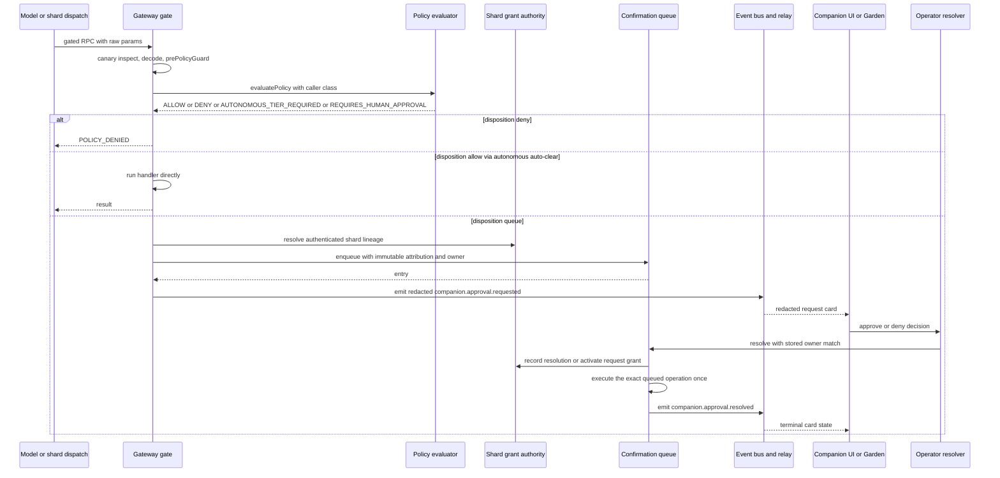
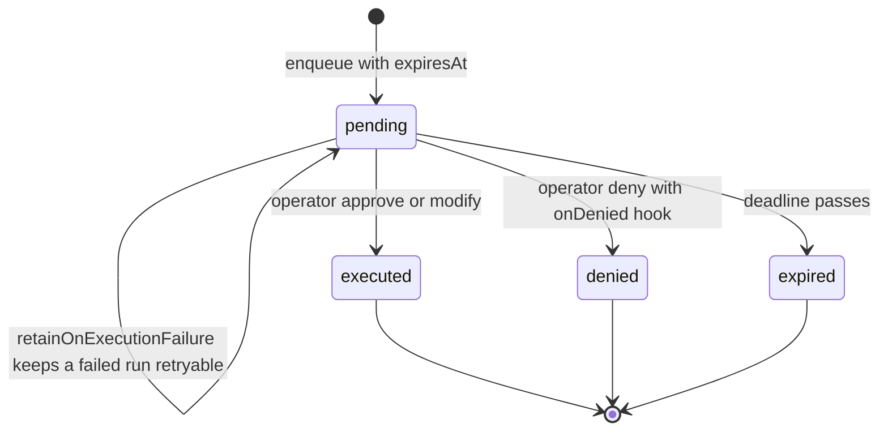

# Approval Envelope

Several subsystems need to route the same question to a human's device: *"an
authenticated part of me wants to do X — decide."* The approval envelope
standardizes **one** redacted, allowlisted projection so every kind of request
flows through the same relay path — the typed `companion.approval.requested` /
`companion.approval.resolved` bus events — and renders through one request-card
contract on Companion UI and one queue in Garden.

The canonical contract lives in `src/shared/contracts/approval-envelope.ts`; the
wire realization is `CompanionApprovalRequestedPayload` /
`CompanionApprovalResolvedPayload` in `src/shared/contracts/companion-relay.ts`.
The envelope is a **projection, never a view onto raw state**: it carries no
tool params, prompts, task text, chain-of-thought, filesystem paths,
credentials, or grant secrets. Identity, scope, and the grant offer are
resolved **server-side from authenticated lineage** and are never trusted from
client-supplied fields. The design direction is `docs/approval-envelope.md` and
`companion-ui/SHARD_APPROVALS.md`; the latter is the target contract for the
not-yet-shipped shard surfaces (TTL grants, shard directory, direct shard chat)
and a description of the shipped seams.

This page covers the shipped execution path: the gateway approval boundary
(`src/boundary/gateway/approval-boundary.ts`), confirmation actions
(`src/boundary/gateway/confirmation-actions.ts`), the confirmation queue
(`src/system/capabilities/confirmation-queue.ts`), shard approval grants
(`src/system/capabilities/shard-approval-grants.ts`), and the fail-closed
delivery surfaces. Related: [Tool Surface](/openwiki/runtime/tool-surface.md),
[Shards](/openwiki/faculties/shards.md), [Garden](/openwiki/apps/garden.md),
and [Cognitive Security](/openwiki/security/cognitive-security.md).

## Envelope contract

`ApprovalRequestEnvelope` is the unified v2 superset. `CompanionApprovalRequestedPayload`
is the wire form: the original **v1** fields never change shape, and the **v2**
fields are additive, optional, and server-resolved.

| Field | v | Meaning |
| --- | --- | --- |
| `id` | v1 | Approval / request id — the queue key. Possession is never authority. |
| `title` | v1 | Redacted `action: scope` summary. |
| `requestedAt` / `expiresAt?` | v1 | ISO create / expiry. |
| `redactedContext` | v1 | Redacted companion-authored reason. |
| `status` | v1 | Always `pending` on the request event. |
| `sourceSystem` | v2 | Which subsystem raised the request (tag only, never authority). |
| `attribution` | v2 | Server-resolved lineage `{ parentLabel, parentId, shardLabel?, shardId? }`; ids opaque, labels presentation-only. |
| `action` / `scope` / `reason` | v2 | Redacted strings; the card breaks out what `title` / `redactedContext` fold together. |
| `grantMode` | v2 | The grant the server is **offering**: `{ kind: 'once' }` (the only emittable mode today) or, contract-only, `{ kind: 'ttl', ttlSeconds }`. |

`ApprovalSourceSystem` is an **open** string union so a new projector (expensive
usage, shard, CogSec intake quarantine, broadcast) can join without a breaking
contract change. `KNOWN_APPROVAL_SOURCE_SYSTEMS` names the tags with a
production projector; today that is exactly `tool-access`, the gateway
confirmation gate's tool / information-access escalation surface. The open
union keeps the wire open to future tags without claiming they are wired.

The hub-protocol terminal statuses on the resolved side are `approved`,
`denied`, `expired`, `blocked`; the internal queue has a richer set
(`approved`, `denied`, `modified`, `expired`, `failed`, `not_found`) that
`toCompanionApprovalStatus` maps at emission: `modified` executes with
operator-adjusted params so it reads as `approved`, a `failed` action is
`blocked` only when it did not execute, and a post-execution durability failure
reads `approved` so a caller can never infer that retrying an already-committed
effect is safe. `not_found` is not emittable — it never corresponds to a real
entry.

### Grant modes

- `once` — request-scoped, the default and **today the only mode the server may
  emit**. It authorizes the exact queued operation one time; the queue consumes
  the authorization on execution, leaving no residual capability.
- `ttl` — time-limited. **Contract-only.** The union carries it so app and wire
  agree on the shape, but the server MUST NOT emit `ttl` until a separately
  approved JSON-owned TTL policy exists (eligible actions, maximum TTL,
  revocation, recovery). `redactApprovalRequested` throws if handed a non-`once`
  mode, so a TTL offer cannot slip onto the wire, and
  `ShardApprovalGrantAuthority.offerTtlGrant` is non-constructible and throws.

## Control flow

*End-to-end approval path: the policy disposition decides at the gate, the
confirmation queue holds the pending operation, and redacted events fan out to
whichever operator surface resolves it.*

## Gateway approval boundary

`createGatewayApprovalBoundaryService` (`src/boundary/gateway/approval-boundary.ts`)
owns the confirmation queue, the emission observer, the gate, and the
notification path. `GatewayServer` constructs it with the policy config, event
bus, capability-tier provider, and — when a server-owned shard workload registry
is wired — a `ShardApprovalGrantAuthority` (`src/boundary/gateway/server.ts`).
Absence of the registry keeps every shard temporary-grant path disabled
(fail closed).

### Policy disposition and auto-clear

`resolveGatewayApprovalDisposition` is deliberately **total over `unknown`**:

- `ALLOW` → allow; `DENY` → deny.
- `AUTONOMOUS_TIER_REQUIRED` → allow only when the **calling companion's own**
  tier is `autonomous` (resolved per authenticated companion via
  `capabilityTierProvider(authenticatedCompanionId)`, never the gateway's
  root), else queue.
- `REQUIRES_HUMAN_APPROVAL` → queue; any unknown vocabulary → deny.

The gate runs, in order: the canary-egress inspect (which strips a leaked
canary carrier before policy or handlers see it), `prepareParams` decoding,
`prePolicyGuard`, shard lineage resolution, then `evaluatePolicy`; the decision
is audited and the method's success/failure recorded. A queued disposition
enqueues through `requestExplicitApproval` and returns the `NEEDS_APPROVAL`
error carrying the queue id; the handler runs only after a terminal approve
resolution — `executeQueuedAction` re-audits `ALLOW` with the confirmation id
before dispatch. Auto-clear applies only to an `AUTONOMOUS_TIER_REQUIRED`
decision for the calling companion's own autonomous tier: it never clears a
`REQUIRES_HUMAN_APPROVAL` decision and never clears a shard fence (below).

### Fail-closed enqueue validations

`requestExplicitApproval` refuses **before anything enqueues, emits, or
notifies** when:

- there is no authenticated companion owner (the ownerless refusal);
- a shard-originated request has no shard instance id (orphaned lineage);
- a `shardGrant` workload's parent does not equal the authenticated owner;
- supplied shard attribution does not match the authenticated workload; or
- a supplied `approvalOwner` differs from the authenticated lineage.

For a shard grant, identity is read from the opaque server-owned workload
handle via the grant authority — `shardLineage` alone is attribution-only and
never confers authority.

### Attribution is never caller authority

`resolveEnqueueAttribution` resolves server-side lineage before enqueue. A
caller-supplied `attribution` must exactly match the authenticated owner and
shard lineage or the request throws before enqueue. `parentId` is always the
authenticated enqueue owner; the presentation label comes from the roster
resolver with an explicit "Unknown companion · id" fallback (a spoofed label is
never echoed).

### Emission and notification

After enqueue the boundary emits the redacted `companion.approval.requested`
event and notifies the operator (Discord channel and/or ntfy topic, configured
via `confirmation.operatorDiscordChannelId` / `confirmation.ntfyTopic`). The
emission observer refuses ownerless events and events whose attribution does not
match the stored owner, and builds every payload through the redaction
whitelist at that single emission site.

- With `requirePartnerAlertDelivery: true`, an event-emission failure discards
  the pending entry and rethrows — no acknowledgment of post-enqueue state.
- An unreachable notification sink is different: the confirmation stays durably
  queued and the failure surfaces through runtime subsystem health
  (`recordApprovalNotificationFailure`) instead of hiding the request.

### Owner-scoped resolution

`resolveConfirmationForOwner` resolves only when the pending record's immutable
stored `approvalOwner.companionId` matches the caller; any mismatch is a
non-enumerating `not_found` that leaves the request pending (a leaked approval
id can never re-attribute a sibling parent or shard). `ownerOfConfirmation` /
`approvalOwnerOfConfirmation` expose the stored owner for fleet views and relay
revalidation. `refreshExplicitApproval` and `reconcileExplicitApproval` (used by
the memory-deletion flow) apply the same owner check.

## Confirmation actions

`src/boundary/gateway/confirmation-actions.ts` implements the queued-execution
glue:

- `executeQueuedAction` runs the gated handler **inside** the queue's terminal
  approve/modify dispatch: it audits `ALLOW` with the confirmation id and
  decision `approve` appended to the summary, runs the handler, and records
  success or failure through `auditComplete`.
- `resolveCompanionReason` extracts the companion-authored reason from
  `reason` / `prompt` / `intent` / `summary` params (in that order) with a
  "No companion reason provided." fallback — the source of the envelope's
  redacted `reason` / `redactedContext`.

## Confirmation queue — the single choke point

`ConfirmationQueue` (`src/system/capabilities/confirmation-queue.ts`) is the one
in-process authority for approval lifecycle. It holds a `pending` map plus a
terminal `history`; every enqueue, resolution, and expiry passes through its
lifecycle observer, and the gateway approval boundary builds the envelope at
that single emission site.

*Confirmation-queue entry lifecycle. Every terminal transition can be guarded;
a commit-guard failure keeps the entry pending.*

Key semantics:

- **Default expiry** is 24 hours (`DEFAULT_CONFIRMATION_EXPIRY_MS`), overridable
  per request and via gateway `confirmation.expiryMs`. Expiry is checked lazily
  on every list/resolve; `renewOnExpiry` extends instead of terminalizing, and
  an expired resolution emits the `expired` outcome through the observer.
- **Lifecycle observer.** `beforeTerminalized` is a synchronous commit guard: it
  MAY throw, in which case the queue retains the pending entry and emits no
  resolution — used so a failed shard-grant security audit never completes a
  terminal transition. `onResolved` / `onEnqueued` MUST NOT throw; the boundary
  wires event-bus emission behind them.
- **Operator resolution authority.** An entry with
  `resolutionAuthority: 'operator'` (every shard request grant) resolves only
  when the resolver is an independently authenticated operator; a companion
  resolver gets `failed` with no execution. Shard request grants are stamped
  with this authority at enqueue.
- **Execution proof.** `confirmedApprovalExecutions` is a `WeakMap` that proves
  an executor is running inside this queue's one terminal approve/modify
  dispatch (`readConfirmedApprovalExecution` enforces it); records exist only
  for the duration of the executor call, and a structural object or captured
  context is never authority.
- **Committed-execution signal.** `ConfirmationExecutionCommittedError` marks a
  queued side effect that committed before a post-execution durability/audit
  step failed. The queue never describes it as unexecuted, so callers cannot
  retry a non-idempotent mutation; the relay maps it to `approved`.
- **Immutable provenance.** Entries carry optional `sourceSystem`,
  `attribution`, and `approvalOwner` (`{ companionId, shardId? }`), deep-cloned
  at enqueue and on every snapshot. Ordinary entries omit both fields and behave
  exactly as before. Params are cloned under a strict wire-representability
  check (plain objects/arrays/Date, no cycles, no getters, no symbol keys, no
  `toJSON` override, finite JSON numbers), so queued values are safe to hold and
  later re-validate.
- **Retained failures.** `retainOnExecutionFailure` keeps a failed run retryable
  via `reconcileRetainedResolution`, and `refreshPending` replaces the executor
  without touching the immutable provenance.

## Shard approval grants

Shard approvals are the extension the envelope was built for. A shard's standing
capability tier is derived by subtracting `SHARD_CAPABILITY_DENIAL_MASK` (which
includes `world.control`) from the parent's grant; an approval **never** changes
that standing tier, mask, or owner file. The gateway provides temporary
authority only through `ShardApprovalGrantAuthority`.

### Authenticated workload registry

`AuthenticatedShardWorkloadHandle` is an opaque, process-local, unforgeable
brand: only the shard runtime's `ShardWorkloadRegistry.registerWorkload` (fed by
ShardManager launch registration) can mint one; browser, RPC, or tool values
never can. The gateway's `GatewayShardWorkloadRegistrar` exposes the
`shard.workload.register` / `shard.workload.end` lifecycle RPC, derives the
shard capability grant from the gateway snapshot, verifies `ownerVersion` and
`grantDigest` equality, and keeps per-connection leases so a connection drop
revokes its workloads. Gated dispatches resolve lineage per-request through
`resolveWorkloadForChannel`: the correlation channel id is only a lookup key
into server-owned registration state. `hasHostedWorkloadForChannel` makes shard
recognition registry-backed — a satellite/Wyoming channel with an arbitrary
scheme that once hosted a shard but no longer resolves to a live workload is
denied, never treated as the parent's own dispatch.

### Request-scoped exact-once grant

A shard request grant is a separate exact-use dispatch record, not a standing
right. The lifecycle:

1. **Prepare** — `prepareRequestGrant` normalizes the trusted tuple (workload,
   method/action, scope, params) and refuses if the workload's standing access
   already holds the token (a grant can never widen standing access) or the
   tuple is not an eligible exceptional action.
2. **Bind** — `bindRequestGrant` ties the reservation to the approval id and
   expiry after enqueue.
3. **Activate** — `activateRequestGrant` runs inside the queue's confirmed
   operator resolution (via `readConfirmedApprovalExecution`), rechecks the
   live workload and expiry, and issues a grant id.
4. **Consume** — the approved executor calls `consumeRequestGrant` with the
   exact tuple; the grant is single-shot, and a replay is denied with a
   `replay_denied` audit. `recordRequestExecution` then records `executed` or
   `execution_failed`; an execution-audit failure after the side effect
   committed throws `ConfirmationExecutionCommittedError` so the queue never
   reports it unexecuted.

Consumption requires the same approval id, the same workload handle, the same
workload generation / owner version / grant digest / access, the same token,
the same normalized scope, and the same canonical params digest; any mismatch
revokes the grant and denies. Clock uncertainty, a missing or replaced workload
generation, or unverifiable lineage all deny use (`readNow` latches
clock-uncertain after a backwards clock jump). Terminal denial/expiry
transitions are **audit-then-remove**: if the audit sink throws, the prepared
reservation stays bound, the queue keeps the entry pending, and a retried
resolution re-emits the audit.

### TTL is disabled

`offerTtlGrant` unconditionally throws: TTL grants must not exist until the
separately approved JSON-owned server policy (eligible actions, maximum TTL,
revocation, recovery) is implemented. The only currently implemented exceptional
action is `home_assistant.call_service` + `home_assistant.control`, which maps
to the `world.control` token through the trusted `resolveShardExceptionalAction`
mapping — a caller cannot relabel an unrelated method as `world.control`.

### Shard fences are never auto-cleared

A shard-originated gated dispatch that is not an eligible exceptional action
denies (`POLICY_DENIED`) rather than enqueuing a grantless approval — including
under an autonomous parent tier and including when the lineage resolver itself
throws or no grant authority is configured. Only the eligible exceptional path
takes the exact-once grant + operator-approval path.

## Delivery surfaces

### Relay fan-out

`CompanionEventRelay` (`src/channels/backplane/companion-relay/relay.ts`)
subscribes to the typed `companion.*` bus events and publishes redacted
envelopes to scope-gated SSE subscribers. It refuses to publish ownerless
events, and for both approval kinds it revalidates routing metadata against the
queue's stored binding (`approvalBindingOf`, backed by
`approvalOwnerOfConfirmation`): the envelope's `companionId` / `shardId` and the
payload's `attribution` / `shardId` must all agree with the queued parent/shard
lineage or the event is dropped. A self-consistent shard event whose queued
binding belongs to another parent is also dropped — the relay never fans out to
a subscriber that is not the exact owner.

### SSE events route

`GET /v1/companion/events` requires a satellite endpoint with the `approvals`
telemetry scope (`companionEventKindsForScopes` denies by default). The v2
approval-request fields are emitted **only** to subscribers that advertise the
`approvals.v2` capability token (via the `caps` query parameter); otherwise
`projectApprovalRequestedPayload` reconstructs the exact six-field v1 subset by
explicit construction, so deployed old clients with strict parsers keep
working. Only `approval.requested` is capability-gated; other event kinds pass
through unchanged.

### Decision route

`POST /v1/companion/approvals/{id}` resolves through the confirmation queue —
there is no bypass of the capability-tier/approval path. Every accepted decision
is audit-logged with satellite/device attribution **before** resolution, and an
audit write failure fails the request closed (`503 audit_unavailable`). The
stored approval owner must equal the route's authenticated companion, else a
non-enumerating `404 approval_not_found` is returned (and the mismatch is
audited as `DENY`). Expired resolutions map to `409 approval_expired`;
already-resolved ids map to `409 approval_already_resolved`; the decision body
is size-capped (16 KiB) and strictly validated.

### Companion UI action path

The browser reaches approvals through the authenticated Companion UI action
protocol (`confirmations.list` / `confirmations.resolve`). The
`GatewayCompanionUiActionBroker` denies `confirmations.resolve` for guest
operator roles and for ids whose stored owner differs from the authenticated
context companion. `dispatchCompanionUiApproval`
(`src/boundary/gateway/companion-ui-approvals.ts`) projects a pending entry only
when `attribution.parentId`, `approvalOwner.companionId`, and shard provenance
all match the target companion exactly, and re-applies owner scoping at the
gateway port even for callers that bypass the broker. The projected list is
built through the same redaction whitelist, so raw params never reach the
browser.

### Client surface

- `companion-ui/src/lib/approvals.ts` — the approval surface is fail-closed:
  it is `available` only when the hub session acknowledged **both** the
  `approvals` control capability and the `approvals.v2` event capability.
  Absent an ack, the panel reports `unsupported` and `submitApprovalDecision`
  throws; no cached card or event confers authority.
- `companion-ui/src/lib/stream/hub-stream.ts` — the reducer lifts only known
  fields into `ApprovalStreamEntry`, dedupes by id, ignores a request that is
  already resolved, and retains terminal resolutions so a resolved card cannot
  regress.
- `companion-ui/src/lib/protocol/framing.ts` — `approval.requested` is the only
  message validated with `tolerantDataRecord` (unknown future keys tolerated,
  known v1/v2 fields validated, unknown keys dropped downstream); every other
  message stays strict-exact.

### Operator surfaces

The Garden confirmation queue is an operator surface for the **same** underlying
queue — Companion UI does not create a parallel approval store, and a resolution
from either authorized surface produces one terminal queue outcome. Garden's
fleet-wide pending-approval view (`GET /v1/fleet-auth/approvals`) joins
ownership from the approval boundary's owner map and excludes entries with no
resolvable owner or an owner outside the session's authorized roster (fail
closed, never mis-attributed, non-enumerating); its redaction reuses the
companion-relay approval whitelist.

## Fail-closed invariants

- The envelope is built by explicit allowlisted construction at the single
  emission site; raw tool params, prompts, reasoning, paths, and credentials
  can never survive into a payload (proven by `redaction.test.ts`).
- Ownerless approvals are refused: no enqueue, no event, no notification, no
  ownerless fan-out.
- Caller-supplied attribution, labels, grant offers, and approval ids are never
  authority; every value is resolved or revalidated against authenticated
  lineage and stored queue state.
- Shard fences are never auto-cleared by a parent's autonomous tier, and a
  shard-originated gated method that is not an eligible exceptional action
  denies rather than enqueues a grantless approval.
- No failure falls back to global fleet visibility, parent execution, durable
  tier widening, an ownerless queue entry, or a browser-trusted authority
  field.
- Versioning is capability-gated emission plus tolerant parsing for
  `approval.requested` only; everything else stays strict, and the client
  surface is fail-closed until the hub acked the approvals capabilities.

## Focused tests

- `src/boundary/gateway/approval-boundary.test.ts` — attribution refusal before
  enqueue (ownerless, orphaned shard, spoofed parent/shard), owner-scoped
  simultaneous-parent resolution with leaked ids, autonomous auto-clear
  boundaries, shard grant exact-once execution, terminal audit atomicity,
  non-eligible shard methods denying, notification-sink failure durability, and
  partner-alert delivery failure discarding the entry.
- `src/boundary/gateway/shard-approval-grant-production-composition.test.ts` —
  the production chain from ShardManager launch registration through the
  gateway workload registry, approval boundary, request grant, and Hub egress:
  a live shard request reaches exactly one operator-approved execution and
  replay is denied; the parent's autonomous affordance on the same method is
  preserved; ended, replaced, or registry-less shard dispatches deny fail
  closed; and unresolved shard approvals expire with a terminal audit.
- `src/boundary/gateway/companion-ui-approvals.test.ts` — only exact
  owner-and-shard entries project through the redaction boundary; shard
  provenance survives list/resolve; unrelated resources pass through.
- `src/channels/backplane/companion-relay/redaction.test.ts` — exact payload
  key sets, sentinel-stripping, v1 subset reconstruction, v2 field validation,
  and fail-closed redaction of missing ids/labels.
- `src/channels/backplane/companion-relay/relay.test.ts` — shard provenance
  survives fan-out, cross-owner isolation, and dropped events on routing or
  binding mismatch.
- `companion-ui/src/lib/stream/hub-stream.test.ts` and
  `companion-ui/src/lib/protocol/framing.test.ts` — reducer dedupe/correlation
  and the tolerant-but-scoped `approval.requested` parsing.
