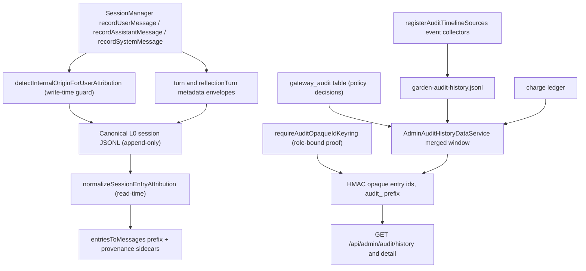

# Attribution: Opaque Audit and Provenance

This page documents the security-facing attribution machinery: who is recorded as
having said or done something, which turn or request an entry belongs to, and the
audit timelines that make runtime actions accountable to a source **without
exposing real identities**. Three provenance surfaces and one audit trail exist,
each with a single owner module:

| Surface | Question it answers | Owner |
| --- | --- | --- |
| Session entry attribution | Who spoke, and in what role? | `src/core/session/entry-attribution.ts` |
| Turn / reflection provenance | Which turn, request, actor, and reflection stage does an entry belong to? | `src/core/session/turn-provenance.ts`, `src/core/session/reflection-turn-provenance.ts` |
| Garden audit timeline | What action was taken, with what decision, by whom? | `src/operator/garden/audit-timeline.ts`, `src/operator/garden/services/audit-event-collector.ts`, `src/operator/garden/services/audit-history-service.ts` |
| Gateway policy audit store | Which gateway policy decision was made for which request? | `src/boundary/gateway/audit-port.ts`, `src/boundary/gateway/postgres-audit.ts` |

Memory provenance (where a memory came from and who owns it) and the sanctioned
repair paths are documented on [Attribution and
Provenance](/openwiki/attribution.md); the session layer that owns entry
recording is [Session Runtime](/openwiki/runtime/session.md). Source and tests are
authority: where prose and code disagree, the code wins.

The governing discipline is **fail-closed and append-only**: malformed provenance
throws instead of degrading, canonical L0 history is never rewritten, and audit
identifiers are HMAC opaque ids derived server-side from role-bound proofs — never
raw principal ids, contact ids, or credentials.



*Attribution and audit flow: write-time guards and metadata envelopes feed the append-only L0 chain; read-time normalization renders it; event collectors, the gateway audit table, and the charge ledger feed one merged history window whose entries are exposed only as scoped HMAC opaque ids.*

## 1. Session entry attribution

### 1.1 Group speaker attribution contract

In multi-speaker (non-private) conversation a Partner turn is rendered with a single
text prefix:

```text
DisplayName (stableId): <content>
```

Provider chat formats do not carry portable per-message speaker metadata, so this
text prefix — emitted OUTSIDE Partner-authored content — is the canonical carrier of
authorship. `formatGroupUserMessageContent` is the only code allowed to construct
that prefix and `parseGroupUserMessageContent` the only code allowed to interpret
it; runtime trust decisions never depend on parsing a rendered string back
(`src/core/session/entry-attribution.ts` header contract).

The trust rule:

- Only a prefix produced by `formatGroupUserMessageContent` is authoritative,
  because it is generated by the runtime, never by a speaker.
- `stableId` is the trustworthy identity anchor. `DisplayName` is cosmetic and
  attacker-influenced; it is sanitized but MUST NOT be trusted for identity
  decisions.
- Any prefix-shaped text appearing INSIDE Partner content is untrusted and is
  neutralized by `escapeAttributionForgery`: the parentheses of a forged
  `Name (id):` line are escaped to `\(` `\)`, which breaks the grammar while
  keeping the text human-readable. The guard regex allows leading whitespace so
  indentation tricks cannot smuggle a forged prefix past it, and it runs on every
  content line independently.

### 1.2 Sanitization and the trust boundary

`formatGroupUserAttributionLabel` builds the label from `formatStableAuthorId` +
`sanitizeAttributionDisplayName`:

- **Display names** are NFC-normalized, stripped of C0/C1 controls, DEL, and
  Unicode format/bidi/zero-width (Cf) characters, and lose the delimiter
  characters `(`, `)`, `:`, so a name can never break out of its label slot or
  forge a separator. Whitespace is collapsed; an empty result falls back to the
  stableId. Unicode confusables cannot be fully defeated here — which is exactly
  why identity decisions anchor on the stableId.
- **Stable ids** keep the source separator `:` but lose parentheses and
  whitespace; empty results become `unknown`. The source is taken from an
  explicit `source`, or inferred from the channel id (`discord-voice:` prefix,
  Discord snowflake-shaped ids, or the prefix before the first `:`). An already
  source-qualified id (`discord:morgan-id`) is never double-qualified.

Re-formatting an already-labeled turn is idempotent (the same author's prefix is
not nested twice), but the remainder of the body is still guarded so a trailing
forged speaker line cannot slip through. The focused tests prove a hostile
display name containing the delimiter cannot forge a second speaker and a body
impersonating another user id still parses back to the real author's stableId.

### 1.3 Where the prefix is rendered

- **Session history**: `entriesToMessages` in
  `src/core/session/manager/context-support.ts`, gated by
  `shouldRenderGroupUserAttribution(visibility)` which returns true for every
  visibility except `private`. Private/DM channels have a single human speaker
  and receive no prefix.
- **The live current turn**: `formatCurrentTurnUserContentForPrompt` in
  `src/core/agent/substrate-agent/turn-execution/agent-invocation.ts`, gated by
  `shouldRenderCurrentTurnGroupAttribution(message)` — DM turns are never
  prefixed; non-DM turns and explicit non-private `channelPrivacy` are prefixed.
  For multi-block content only the first text block receives the prefix.

### 1.4 Read-time role normalization

`normalizeSessionEntryAttribution` decides the effective role/author for context
assembly, in priority order:

1. Tool entries stay `tool` (rendered as system with tool-result provenance).
2. An explicit `speakerRole` in the turn metadata envelope wins over legacy
   author heuristics (an entry stored as `user` with `speakerRole: "system"`
   renders as system).
3. Intention appraisal artifacts — `system:`-prefixed authorIds, the legacy
   author name "Intention Appraisal", `intention-follow-up:` request/source ids,
   `[Intention Appraisal]` content prefixes, and capability tier change notices —
   normalize to `system` with author "Intention Appraisal".
4. Scheduler prompts and `internal:` reflection/planned channels with
   `reflection-*` request ids normalize to `system` (author "Scheduler" when no
   explicit name exists).
5. Otherwise the stored role passes through (`assistant` / `user`).

This re-tagging keeps legacy mistagged entries rendering correctly; the write-time
guard below stops new mistagged entries from being persisted in the first place.

### 1.5 Write-time authorship guard

`detectInternalOriginForUserAttribution` is the write-time integrity detector.
`SessionManager.recordUserMessage` calls it before persisting and **refuses user
attribution for internal-origin entries**: a `scheduler` authorId, a `system:` or
`internal:` authorId prefix, an intention-appraisal artifact, or an internal
reflection request all force the entry role to `system`, log a warning, and emit
the `session.authorship_guard.retagged` event. Without this guard an internal
message could persist as partner speech and regress into a future context read as
if the partner spoke inside the companion's head. The mirrored-to-active-sessions
path is also skipped for retagged entries.

### 1.6 System content attribution and provenance sidecars

System entries render with a `[SYSTEM: <label>]` prefix via
`formatAttributedSystemContent`; already-prefixed content (`[SYSTEM:`,
`[System note]`, `[Mirror note`) is left alone. Every rendered context message
also carries an authenticity provenance sidecar (`provenanceForEntry` in
context-support.ts): `user_direct`, `companion_direct`, `system_note`, or
`tool_result`, with explicit wording/transformation flags and `safeAsPartnerSpeech`
marking — so downstream consumers can tell partner speech, companion speech,
system notes, and tool results apart without re-parsing text. When consecutive
messages of different provenance kinds merge, the result is a `projection` kind
with `safeAsPartnerSpeech: false` and a note that mixed spans must not be treated
as partner-authored speech.

## 2. Turn provenance

### 2.1 The turn envelope and actor kinds

`buildSessionMetadataWithTurn` stamps a `turn` envelope (schemaVersion 1) into a
session entry's metadata at append time. The envelope records `turnId`,
`requestId`, `sourceMessageId`, `replyToMessageId`, `role`, `speakerRole`, and
`actorKind`. `SessionManager.recordUserMessage`, `recordAssistantMessage`, and
`recordSystemMessage` each build it with their own default actor kind —
`unknown`, `machine_intelligence`, and `system` respectively
(`src/core/session/manager.ts`). The empty-`requestId` case throws rather than
stamping an unidentifiable turn.

`resolveSessionEntryActorKind` returns one of `human | machine_intelligence |
system | unknown`. Missing provenance yields `unknown`; an invalid `actorKind`
value throws. This is deliberately strict: a malformed actor record is rejected
instead of being silently treated as human. The turn-execution runtime uses actor
kind to count only genuinely human entries when enforcing fatigue caps on
machine-intelligence turns.

### 2.2 Turn identity resolution

`resolveSessionEntryTurnContext` resolves, for any entry:

- **turnId + source**: a persisted UUIDv7 `turnId` (`turnIdSource: "persisted"`)
  or a deterministic backfill (`turnIdSource: "backfilled"`). Backfill derives a
  stable id from the seed `legacy-turn:<channelId>:<id>:<timestamp>:<role>` via
  `backfillLegacyTurnId` — SHA-256 over the seed shaped into a UUIDv7-compatible
  string, so the same seed always yields the byte-identical id
  (`src/core/turns/id.ts`). Corrupt explicit ids throw.
- **requestId / sourceMessageId / replyToMessageId**: optional string fields that
  throw when present but not strings.
- **turnRecordExpectation**: `required` for ordinary entries, `not_expected` for
  `observed_message` entries (observed context that never executed locally
  bypasses TurnRecord lookup).

Memory extraction consumes this through `resolveLatestTurnContext` (walking
backwards to the most recent user/assistant entry) to stamp the `turnId` and
`requestId` onto extracted memories' provenance
(`src/faculties/memory/extraction/orchestrator.ts`); turn records and the session
channel index key their derived mirrors by the resolved turnId.

### 2.3 Reflection turn provenance

Reflection sessions carry their own provenance envelope.
`buildSessionMetadataWithReflectionTurn` stores a `reflectionTurn` key in the
entry metadata with `schemaVersion: 1`, `stage` (`tool_grounding` |
`final_output`), `mode` (`agent` | `deliberation`), a non-empty `templateId`, and
an optional `journalEntryId` that is only legal on `final_output` entries.
Parsing is fail-closed: unknown keys, an unsupported schemaVersion, an invalid
stage or mode, an empty templateId, or a `journalEntryId` without
`final_output` all throw — an unmarked entry resolves to `null` rather than
guessing a stage.

Consumers:

- `recordAssistantMessage` in `src/core/agent/substrate-agent/turn-records.ts`
  stamps the reflection envelope onto assistant messages when
  `message.routing.reflectionTurn` is present.
- `projectFinalReflectionForExtraction`
  (`src/faculties/memory/extraction/reflection-output.ts`) projects one canonical
  reflection-journal record into the transcript shape consumed by experiential
  extraction as an assistant entry with authorId `companion:self-reflection` and
  a `final_output` reflection envelope; the journal entry itself remains the
  durable owner and this projection is never appended to the ordinary session
  store.
- Self-directed extraction
  (`src/faculties/memory/extraction/self-directed.ts`) rejects companion source
  entries from reflection sessions whose stage is not `final_output`
  (`invalid_reflection_source_stage`) — read-only grounding and tool-worker notes
  are evidence for reflection, never lived self-experience.

## 3. Audit timelines

### 3.1 Garden timeline sources and the bounded ring

`registerAuditTimelineSources` (`src/operator/garden/services/audit-event-collector.ts`)
listens to the event bus and appends audit entries:

- `agent.tool.start` / `agent.tool.end` produce `tool_invocation` entries with a
  narrative, `callId=`, `outcome=`, optional `shard=` and `durationMs=` details,
  and actor `companion`; a `success` outcome maps to decision `allowed`, anything
  else to `denied`.
- `identity` tool calls (and the `prompt_layer_update` / `prompt_layer_toggle` /
  `persona_update` tools) additionally produce `identity_edit` entries.

`AdminAuditTimelineStore` (`src/operator/garden/audit-timeline.ts`) is the
in-memory bounded-ring primitive: entries are unshifted newest-first, capped at
500 (`MAX_AUDIT_TIMELINE_ENTRIES`), with a closed set of action types (11),
decisions (`allowed | denied | needs_approval`), and time ranges (`15m | 1h |
24h | 7d | 30d | all`). `parseFilters` is fail-closed: an unknown actionType or
decision falls back to `all`, an unknown timeRange to `24h`. In the production
Garden contract the collector appends straight into the durable JSONL history
(§3.2); the ring store models the same filtering semantics.

### 3.2 Durable garden audit history

`GardenAuditHistoryJsonlStore` (`src/operator/garden/services/audit-history-service.ts`)
appends `schemaVersion: 1` records with `recordType: 'garden_audit_history'` to
`garden-audit-history.jsonl` under the companion data dir. Reads are bounded and
race-checked: `list()` reads at most the last 16 MiB / 2 000 entries
(`MAX_GARDEN_AUDIT_READ_BYTES`, `MAX_SOURCE_SCAN`) and re-verifies the file
identity (device, inode, size, mtimes) before and after the read, throwing
"Garden audit history changed while it was being read" on any mismatch — a log
file mutating mid-read fails closed instead of returning a torn view. Entries
carry `id`, `timestamp`, `source`, `sourceRecordId`, `actionType`, `decision`,
`narrative`, optional `details`, `actor` (`operator` | `companion`), and an
optional frozen `requestAttribution` snapshot (actor kind, principal/contact ids
for fleet principals, companionId, requestId, decisionId, action, routeId,
resource scope/area, subjectRelation, authority versions).

### 3.3 Gateway policy audit store

The gateway audits every policy decision through the `GatewayAuditStorePort`
(`src/boundary/gateway/audit-port.ts`): `append` returns an id, `complete`
records duration and error, `recordSummary` appends and completes in one call,
`createSummaryHook` adapts the port for event-bus summaries, `enforceRotation`
prunes, and history reads go through `getRecent`, `getByMethod`,
`getApprovalEvents`, and `count`, with a paginated `GatewayAuditHistoryQuery`.

`PostgresGatewayAuditStore` (`src/boundary/gateway/postgres-audit.ts`) persists
to the `gateway_audit` table:

- **Param summarization at the write seam**: `content` longer than 200 chars is
  truncated with a character count, `messages`/`texts` become array counts,
  `systemPrompt` becomes a length, and `syncEnvelope`/`syncDecision` are reduced
  to allowlisted fields — sensitive request bodies never land verbatim.
- **Read-seam decision normalization**: pre-upgrade `NEEDS_APPROVAL` rows read
  back as `AUTONOMOUS_TIER_REQUIRED` (preserving the historical autonomous-tier
  meaning); an unknown persisted decision throws.
- **Rotation**: defaults are 10 MiB max payload, 30 days max age, and 50 000 max
  rows; `enforceRotation` deletes by age, then by count, then prunes by size in
  batches of 100 until under the byte budget.

Wiring: the gateway server calls `auditStore.append({method, decision, params})`
for every RPC/policy method and `auditStore.complete(id, durationMs, error)` when
the call finishes (`src/boundary/gateway/server.ts`). `privileged-core.ts`
requires `config.persistenceBackend=postgres` and a `postgresDatabaseUrl`,
waits for the `gateway_audit` store's readiness, and fails startup otherwise.

## 4. The opaque-id audit trail

The Garden admin audit history ties runtime actions to accountable sources
without leaking identity: entry ids in every list payload are HMAC-derived opaque
ids, and raw source records are reachable only through an explicit detail
endpoint that re-derives the same ids server-side.

### 4.1 Key derivation from the role-bound proof

`requireAuditOpaqueIdKeyring` (`src/operator/garden/audit-opaque-id-keyring.ts`)
derives an audit-only key from the agent's existing role-bound worker proof
(`GATEWAY_SESSION_INTEGRITY_AUTH_TOKEN`, shaped `version.64-hex`). The proof
digest is treated as pseudorandom key material and mixed with the Garden-specific
context `psfn-garden-audit-opaque-id-key-v1` and the proof version via
HMAC-SHA256, producing a stable per-version base64url key. This gives the audit
surface a stable opaque-ID key **without delegating the gateway root key that can
mint companion or role proofs** — the focused test proves a token minted with the
derived audit key is rejected by gateway `verifyCompanionAuthToken`. An absent or
malformed token throws rather than falling back.

### 4.2 Opaque entry ids and scope binding

`toOpaqueAuditEntryId` (`src/operator/garden/services/audit-history-service.ts`)
computes each list/detail id as:

```text
audit_ + HMAC-SHA256(key, "psfn-garden-audit-opaque-id-v1\0" + scopeId + "\0" + source + "\0" + sourceRecordId)  (base64url)
```

- The id is bound to the **scopeId** (the selected companion), so the same source
  record produces a different opaque id per companion, and to the server-side
  key — a client cannot mint or guess ids.
- The merged history window (§3.2 + gateway reader + charge ledger) is filtered,
  sorted newest-first, and paginated (default limit 100, max 500) by
  `AdminAuditHistoryDataService.getAuditHistory`; per-source availability is
  reported in the payload. In the current production contract the gateway reader
  resolves to `null`, so the `gateway` source is reported as unavailable while
  `garden` and `charge` contribute entries.
- Raw detail is served only by `GET /api/admin/audit/history/:entryId`, which
  rejects anything not matching `/^audit_[A-Za-z0-9_-]{43}$/` with 404, then
  re-derives the id across the active key AND all retained keys (rotation: old
  entries stay resolvable until their key version is retired). List payloads
  never carry `sourceRecordId` or raw data; only the detail endpoint returns
  `raw`, and responses are `Cache-Control: no-store`.
- `AdminAuditHistoryDataService` fails closed at construction: an empty scopeId
  or a missing/empty opaque keyring throws "Audit history requires a valid
  server-side opaque-id keyring."

The admin routes (`/src/operator/garden/routes/overview-routes.ts`) return 503
when the audit history service is absent, 400 on invalid `limit`/`offset`/
`actionType`/`decision`/`timeRange`/`source` filters, and 404 for unknown detail
ids.

### 4.3 Content-free subject audit

Protected Garden actions — concern resolve/suppress/transition, high-intimacy
memory reveal, and quarantine decide — are additionally recorded by
`AdminSubjectVisibleAuditService` into the selected companion's durable audit
history and conversational context as **content-free notices**: they name the
actor, time, protected category, concrete action, and operator-stated reason, but
never the memory body, concern text, quarantined payload, or sensitive target
parameters.

## 5. Fail-closed invariants

- Malformed provenance is never coerced: invalid metadata JSON, non-object
  envelopes, invalid `actorKind`, corrupt turn ids, unknown reflection keys, and
  unsupported reflection stages all throw; missing provenance yields `unknown` or
  a deterministic backfill, never a guess.
- Internal-origin entries can never persist as partner speech (write-time guard)
  and always render as system even when a legacy entry was mistagged
  (read-time normalization).
- Audit surfaces never leak identity: params are summarized at the gateway write
  seam, list payloads expose only scoped HMAC opaque ids, and raw detail is
  reachable only through the explicit opaque-id endpoint.
- Canonical L0 history is append-only; `runAttributionRepair`
  (`src/persistence/repair/attribution-repair.ts`) re-normalizes only the derived
  `_turn_records` mirror and channel index (backing up and atomically rewriting
  those files), leaving canonical L0 bytes byte-identical with no canonical
  backup taken — the focused test asserts exactly this.

## 6. Focused tests

- `src/core/session/entry-attribution.test.ts` — group prefix grammar,
  sanitization of hostile names (delimiters, controls, zero-width/bidi),
  forgery escaping including indented forged lines, idempotency, and parse
  round-trips.
- `src/core/session/turn-provenance.test.ts` — actor-kind round-trip,
  unknown-on-missing, throw-on-malformed, persisted vs. backfilled turn ids, and
  the `observed_message` exception.
- `src/core/session/reflection-turn-provenance.test.ts` — round-trip while
  preserving existing metadata, `null` on unmarked entries, and rejection of
  malformed or expanded provenance.
- `src/persistence/repair/attribution-repair.test.ts` — derived mirror corrected
  while canonical L0 bytes stay byte-identical and no canonical backup is taken.
- `src/operator/garden/audit-opaque-id-keyring.test.ts` — stable domain-separated
  key vector, fail-closed on absent/malformed tokens, and the derived key cannot
  mint a gateway-accepted role proof.
- `src/operator/garden/services/audit-history-service.test.ts` — opaque ids keep
  raw source records out of list payloads, scope-bound detail resolution, and
  fail-closed construction without a usable keyring.
- `src/operator/garden/audit-timeline.test.ts` — filter defaults and fallbacks,
  action-type/decision/time-range filtering, and the event-collector wiring.
- `src/boundary/gateway/postgres-audit.test.ts` — param summarization, decision
  normalization, and the age/count/size rotation prunes.
- `src/operator/garden/api-routes-audit-history.test.ts` — filter validation
  (400), service absence (503), opaque-id detail (200 with raw), and sanitized
  not-found (404).

Related: [Session Runtime](/openwiki/runtime/session.md), [Identity
<!-- openwiki: broken internal link [/openwiki/context-envelope.md] file "/openwiki/context-envelope.md" does not exist. Fix the href or restore the target, then delete this comment. -->
Runtime](/openwiki/runtime/identity.md), [Context Envelope](/openwiki/context-envelope.md),
<!-- openwiki: broken internal link [/openwiki/attribution.md] file "/openwiki/attribution.md" does not exist. Fix the href or restore the target, then delete this comment. -->
[Attribution and Provenance](/openwiki/attribution.md), [Memory: L2 Typed
Memory](/openwiki/memory/l2-typed.md), [Approval Envelope](/openwiki/security/approval-envelope.md),
[Internal Review](/openwiki/process/internal-review.md).
