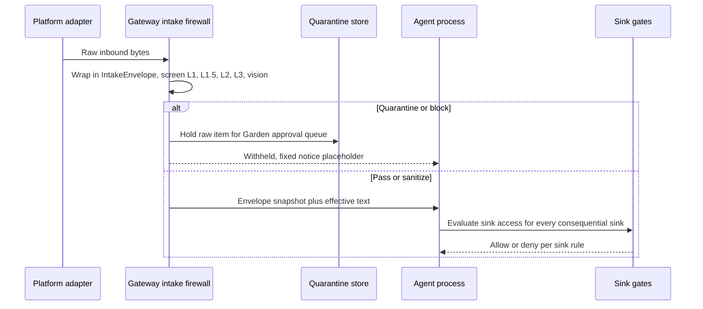
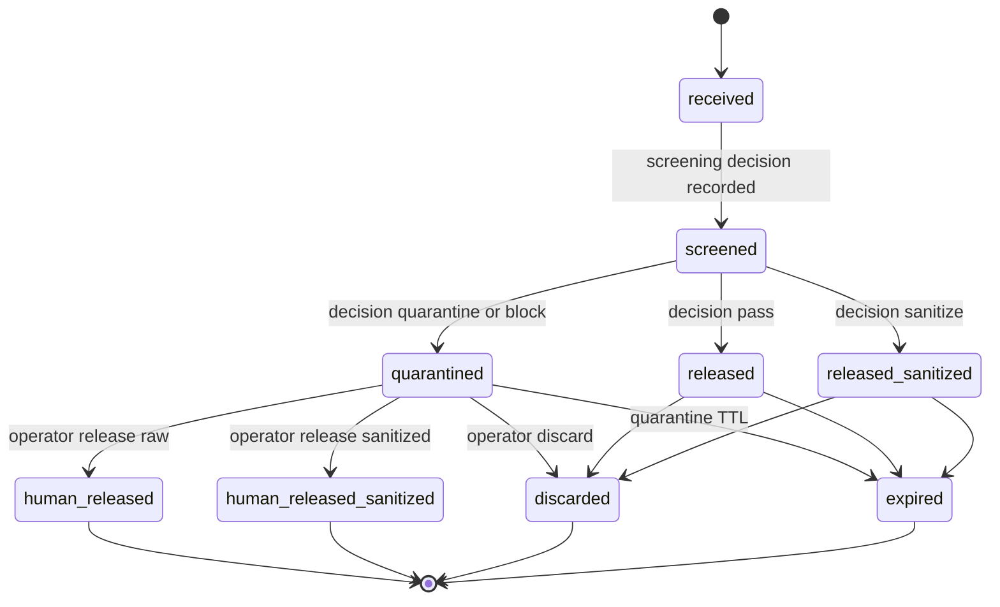
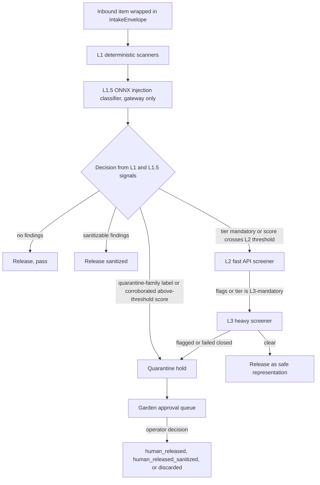
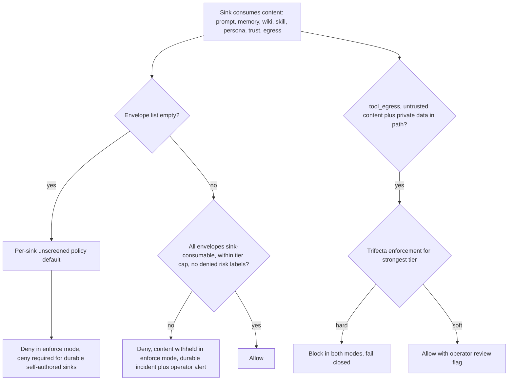

# Cognitive Security: Prompt-Injection Defense, Memory Candidacy, and the Fail-Closed Boundary

This page documents the cognitive security ("CogSec") system that defends the
runtime boundary: the intake firewall that wraps every untrusted inbound item
(web fetch, document, image OCR, chat body, tool output, subagent digest, shard
foldback, MCP tool description) in a typed, taint-tracked `IntakeEnvelope`
**before** it can reach prompt, memory, wiki, persona, trust state, or tools; the
layered L1 → L1.5 → L2 → L3 → vision prompt-injection screening pipeline; the
per-sink gates and memory-candidacy gating that enforce the structural rules at
every consequential sink; the durable quarantine-and-release store; the
incident, lineage, revocation, and regeneration machinery that contains
poisoning after the fact; the canary/disclosure egress protections; and the
hygiene regression suites that pin the surrounding chat/context invariants.
Source and tests are authoritative; when prose and code disagree, write the
code. Charter law anchors (the inform-vs-instruct rule, the fail-closed
doctrine, and the clean-bubble separation) live in
`docs/PSFN_PROJECT_CHARTER.md` — this page links to it, it never restates it.

## 1. Purpose and fail-closed doctrine

The companion's cognition surface (prompt context, memory, wiki, persona, trust
state, and tool access) is an instruction surface. Anything that reaches it can
change who the companion is, what it believes, and what it does. The system's
security posture is **fail closed by construction**:

- **Structural rules are not policy.** Quarantined content is invisible to every
  sink; tier-N content may *inform* but never *instruct* higher-tier state
  mutation; the lethal trifecta (untrusted content + private data + egress) never
  meets in one uncontrolled path. These are hard rules in
  `src/core/cogsec/intake/sink-gates.ts`, not knobs.
- **No implicit defaults.** Every source class maps to a risk tier, every
  consequential sink maps to a gate rule (an unmapped sink fails startup
  validation), every tier maps to each screener threshold
  (`src/system/config/intake-policy-config.ts`).
- **Nothing trusts content about provenance.** The clean bubble keys off
  structurally authenticated call sites — the tool name and authenticated path —
  never message text or model arguments (`src/shared/contracts/cogsec-mode.ts#L23-L27`).
- **Failures are visible, not swallowed.** A scanner error is recorded on the
  report; a quarantine-hold failure is recorded on the result and the content
  stays withheld; a broken audit hook is logged and the decision stands.

## 2. Architecture: gateway owns the firewall, agent is isolated

The runtime is the split shape (see `/openwiki/architecture.md`). The **gateway
process** owns platform adapters, the intake firewall, LLM/model provisioning,
and the L1.5/L2/L3/vision screeners — it is the secret holder and the process
that sees raw inbound bytes. The **agent process** is an isolated process owning
the turn, the session store (L0), and the memory faculties; it runs L1-only
screening through `maybeCreateIntakeScreeningService` and **never composes an
escalation port** (it has no external egress). The **Garden** operator plane is
the only surface that resolves quarantine holds and drift review cards.

*Untrusted content crosses the runtime boundary only as a screened envelope; quarantine holds stay in the gateway-side store until a human decision.*

Composition points:

- Gateway: `composeGatewayIntakeScreening` builds L1 + L1.5 (ONNX, when
  provisioned) + L2/L3 escalation + vision, plus the durable quarantine store
  (`src/boundary/gateway/intake/compose-screening.ts#L141-L160`). The gateway
  also owns the fleet-wide bounded `ScreeningPool`.
- Agent: `maybeCreateIntakeSinkGate` and `maybeCreateIntakeScreeningService`
  build the sink gate and the L1-only screening service from the same
  intake-policy.json owner file; the gate is threaded to every consequential
  sink — prompt assembly, memory candidacy, the wiki tool, managed skill
  mutation, the identity tool, the contact tool, and the substrate agent's
  egress tool guard (`src/app/agent/core-runtime.ts#L470-L513`).

## 3. The IntakeEnvelope contract (layer 0)

`src/shared/contracts/intake-envelope.ts` owns the envelope schema, the
quarantine/release state machine, and taint propagation on derivation. Every
untrusted inbound item is wrapped in an `IntakeEnvelope` at the boundary before
it can reach any sink. Raw bytes never travel with the envelope — only an opaque
content ref that a store on the gateway side can resolve.

### Closed vocabularies

- **Source classes** (15): `operator`, `companion_self`, `primary_user`,
  `trusted_contact`, `regular_contact`, `public_contact`, `web_fetch`,
  `web_search`, `document`, `image_ocr`, `audio_transcript`, `tool_output`,
  `subagent_output`, `shard_foldback`, `mcp_tool_description`
  (`intake-envelope.ts#L53-L71`).
- **Risk tiers**, least to most risky: `trusted` < `standard` < `untrusted` <
  `hostile`. The contract owns only the ordering so taint propagation can take
  the max of parent and child tiers (`intake-envelope.ts#L86-L113`).
- **Risk labels**: a closed `category/subcategory` taxonomy
  (`content/*`, `persona/*`, `policy/*`, `execution/*`, `injection/*`,
  `exfil/*`, `pii/*`, `secrets/*`, `poisoning/*`). Classifiers assign from this
  list; they must never invent labels outside it
  (`intake-envelope.ts#L134-L165`). The `content/*`, `persona/*`, `policy/*`,
  and `execution/*` labels generalize the memory-write-time `CogSecMemoryRiskClass`
  A–E vocabulary (see §8) to intake time.
- **Sinks** (7): `prompt_assembly`, `memory_write`, `wiki_write`,
  `skill_write`, `persona_mutation`, `trust_mutation`, `tool_egress`
  (`intake-envelope.ts#L185-L193`).

### The state machine

*Envelope lifecycle: only released, released_sanitized, human_released, and human_released_sanitized are sink-consumable.*

Only the four released/human-released states are **sink-consumable**
(`INTAKE_SINK_CONSUMABLE_STATES`, `intake-envelope.ts#L207-L216`) — every other
state (received, screened, quarantined, discarded, expired) is invisible to ALL
sinks as a structural rule, not a policy. `human_*` states are reachable only
from `quarantined`: a human release presupposes a quarantine hold
(`intake-envelope.ts#L280-L303`). The transition journal must be a connected
path from `received` to the recorded state; `validateIntakeEnvelope` rejects
broken chains, incoherent decision/state combinations, and unknown keys — a
malformed envelope throws at the persistence/RPC boundary
(`intake-envelope.ts#L781-L851`).

### Content refs: raw bytes never travel

The envelope carries an opaque `IntakeContentRef` (store + opaque `ref`,
optionally sha256/sizeBytes/mediaType). Validation rejects handles that look
like inline content (no `data:` URLs, no newlines), so the envelope can never
smuggle raw bytes (`intake-envelope.ts#L376-L384`, `L463-L496`). The
gateway-side quarantine store resolves the `intake-quarantine` handles for
screening and human review.

### Taint propagation (CaMeL rule)

`deriveChildIntakeEnvelope` derives a child envelope (summary, OCR/audio
transcript, subagent digest, translation, extraction) from a parent: the child
inherits the parent's full provenance chain plus a `derivation` hop referencing
the parent envelope, its effective tier is **max(parent tier, derived-class
tier)**, and it starts unscreened (`received`) — derived text must pass
screening itself before any sink. A summary of untrusted content stays untrusted
(CaMeL, arXiv 2503.18813) (`intake-envelope.ts#L1095-L1136`).

### Provenance-ref stamping

`intakeEnvelopeProvenanceRef` produces the canonical `intake-envelope:<id>` ref
that memory and wiki writes append to their persisted `provenanceRefs` arrays.
A poisoned source's lineage is therefore excisable later through the existing
lineage/revocation machinery with **no storage schema change**
(`intake-envelope.ts#L1147-L1172`).

## 4. Policy: the intake-policy.json owner file

`src/system/config/intake-policy-config.ts` is the canonical mutable config
(schema v6, seed in `config/intake-policy.seed.json`), following the standard
owner-file pattern: strict fail-closed validation, `loadRequiredJson` with
seed-example guidance, atomic saves, and an explicit migration command for older
schema versions (`npm run migrate:intake-policy-owner`). Key sections:

- **`mode`**: `shadow` (evaluate + telemeter every declared vector, never
  block), `boundary` (enforce external ingress and registered outbound
  publication; the clean bubble makes internal activity non-blocking), `strict`
  (enforce every vector). The retired `off` and `enforce` values are migrated
  explicitly (off → shadow, enforce → strict) and rejected at validation
  thereafter (`intake-policy-config.ts#L81-L103`).
- **`surfacePostures`**: one matrix over channel classes (`operator_direct`,
  `private_direct`, `group_chat`, `public_channel`) and workflows
  (`file_ingress`, `web_fetch`, `web_search`), with profiles
  `shadow_full` / `enforce_full` / `fast_pass_post_escalate`. Every profile
  scans (`screens: true`); posture changes enforcement and deep-screen timing,
  never visibility (`cogsec-mode.ts#L63-L135`). The global shadow switch is an
  absolute observational ceiling — surface policy can narrow enforcement in
  boundary/strict but never make a shadow deployment disruptive.
- **`sourceRiskTiers`**: every one of the 15 source classes mapped explicitly.
- **`sourceLists`**: operator-curated `trustedSites` / `deniedSites` /
  `trustedPeople` / `deniedPeople`. A trusted hit lowers the effective tier one
  step (never below `trusted`, never skipping L1); a denied hit raises it to
  `hostile`; a denied hit always wins. Patterns are validated at config load —
  exact host or `*.domain.tld` suffix for sites, exact canonical contact id for
  people; no regex from config (`intake-policy-config.ts#L343-L563`,
  `source-lists.ts#L1-L19`).
- **`urlScanner.schemeActions`**: per-scheme allow/deny/deny_except_inline_image
  for the deterministic URL scanner; must deny at least one scheme.
- **`quarantine`**: held-item TTL and maximum held items.
- **`injectionClassifier`**: L1.5 label threshold plus per-tier score
  thresholds.
- **`l2Screener`**: per-tier escalation thresholds, mandatory tiers, per-tier
  fail-closed action (`quarantine` for high-risk, `l1_labels_only` for
  trusted), timeout and content cap.
- **`l3Screener`**: dual-vs-single verdict knob, per-tier L2-confidence
  escalation thresholds, mandatory tiers, timeouts and caps. **There is no
  per-tier fail-closed action for L3**: anything that reached L3 is already
  suspect, so an L3 failure always holds in quarantine — never a silent pass.
- **`visionScreener`**: enable/disable + timeouts for the VLM image screener.
- **`chatBodyHandling`**: the narrow `highestTrustPrivateDirect` mark-only
  exception (fresh canonical-Contact resolution, eligible channel classes).
- **`sinkGates`**: per-sink `maxSourceRiskTier` / `denyRiskLabels` /
  `unscreened`; the `benignClasses` allowlist; `trifecta.enforcementByTier`.
  Every sink must be mapped explicitly. `unscreened: 'deny'` is **required** for
  the durable prompt-bearing self-authored sinks (`skill_write`,
  `persona_mutation`, `wiki_write`) — `allow` is rejected at validation with no
  operator override (`intake-policy-config.ts#L690-L698`, `L1405-L1413`).
- **`screeningPool`**: the bounded async screening pool — concurrency 2–4,
  queue depth 1–1024, whole-item deadline 5s–300s, bounded by the code-owned
  contract `intake-screening-pool-contract.json`.
- **`driftDetection`**: knobs for the four slow-poisoning signals plus the
  second-arrow rumination lane.

The seed (`config/intake-policy.seed.json`) runs `mode: shadow` with
`image_ocr` and `mcp_tool_description` at `hostile`, `web_fetch`/`web_search`/
`document`/`tool_output`/`subagent_output` at `untrusted`, contacts at
`standard`, and operator/companion-self/primary-user at `trusted`.

## 5. Screening layers: L1 → L1.5 → L2 → L3 → vision

*Screening layers: deterministic L1 always runs; L1.5, L2, and L3 are escalation layers; every layer's output folds onto the one envelope.*

### L1: the deterministic in-process pipeline

`createIntakeL1Scanner` (`src/core/cogsec/intake/scanners/index.ts`) is the
synchronous first layer. The ordering is load-bearing: cap input at
`INTAKE_L1_SCAN_MAX_CHARS` (65 536) before any regex; invisible/zero-width
detection on the raw capped string; datamark-marker stripping; NFKC
normalization (folds full-width homoglyphs) and re-cap; a detection-only Unicode
projection for keyword probes; then the rule engine, encoding smuggling, URLs,
and secrets/PII on their respective surfaces. `sanitizedText` is the
transform-not-just-gate output; **L1 never decides** — quarantine/block
authority belongs to the envelope policy and the sink gates. A scanner that
throws is recorded in `scannerErrors` and the rest of the report is still
produced (fail-open-advisory, errors always visible); construction, by contrast,
fails closed on a missing or invalid rule file (`scanners/index.ts#L1-L27`).

The rule engine (`scanners/rule-engine.ts`) compiles
`config/intake-l1-rules.json`: each rule names the envelope risk labels it
asserts and uses only bounded primitives — `phrase` (anchors joined with a
bounded-filler primitive), `near` (bounded gap), and a linted `regex` escape
hatch that rejects unbounded quantifiers. The file hot-reloads; a bad hot edit
keeps the last-good rule set and surfaces the error in the report, never taking
scanning down. Evidence for a holding decision is a bounded projection:
`MAX_DECISION_RULE_MATCHES` (32) matches with excerpt, offsets, and truthful
truncation flags (`intake-rule-match.ts#L9-L13`).

### L1.5: the ONNX injection classifier

`src/boundary/gateway/intake/injection-classifier.ts` runs
protectai/deberta-v3-base-prompt-injection-v2 in-process on the gateway. It
emits a calibrated 0–1 P(injection) into `envelope.scores` under
`onnx-prompt-injection` and at most one `injection/override_attempt` label. The
score **never hard-blocks alone** (known over-defense behavior, InjecGuard
arXiv 2410.22770); per-tier thresholds in policy decide when it counts. In
enforce mode the ~700 MiB weights are a **hard startup prerequisite** — a
degraded L1-only firewall under an enforce posture is a fail-closed violation.
In shadow mode weights are optional; absence emits one loud startup warning and
marks the composition `injectionClassifier.degraded`
(`compose-screening.ts#L10-L21`).

### L2: the fast API LLM screener

`src/boundary/gateway/intake/l2-screener.ts` is a tool-less pi-ai provider call
on the canonical `background` model purpose — dual-LLM discipline (CaMeL): it
sees untrusted content but holds no tools and no capabilities. `evaluateL2`
skips L2 for below-threshold, non-mandatory items (the trusted-tier fast path
pays no latency), runs `screenL2` when the item escalates, and on failure
produces a **per-tier fail-closed outcome** — quarantine for high-risk sources,
L1-labels-only for trusted — never a silent pass. A flagged L2 verdict (or an
L3-mandatory tier) returns an `escalate_l3` outcome; L2 routes, it never decides
the L3 verdict (`l2-screener.ts#L1-L38`).

### L3: the heavy screener

`src/boundary/gateway/intake/l3-screener.ts` is the deep pass on the canonical
`reasoning` purpose (optional dual-model mode adds the `background` purpose and
aggregates with either-flags fail-closed). **Hard rule**: anything that reaches
L3 writes an auditable CogSec event. In enforce posture, flagged or
failed-closed content is quarantined; cleared content is released_sanitized as
the **safe representation** (bounded neutral summary + typed extracted fields,
never the raw text). A verbatim-quote guard rejects (fail closed) any screener
output echoing a run of the screened content
(`l3-screener.ts#L18-L38`, `L121-L126`).

### Vision

`vision-screener.ts` (htm9.8) OCRs **and** describes an inbound image in one
tool-less multimodal call; the resulting transcript is itself untrusted (taint
rule) and runs through L1 with `sourceClass: 'image_ocr'` — a tier mapped
`hostile`, so every existing tier-keyed escalation policy applies to
image-derived text by construction. `enabled: false` restores the pre-htm9.8
bypass; with `enabled: true` the pipeline fails closed in enforce mode — an
unreachable vision model means the image is withheld, never delivered unscreened
(`vision-screener.ts#L1-L33`).

## 6. The screening service and decision flow

`createIntakeScreeningService` (`src/core/cogsec/intake/screening.ts`) is the
core orchestration. Ports keep it free of gateway internals: the injection
scorer port, the escalation port, and the quarantine hold port are structural;
the agent process composes L1-only.

- **`screen()`** runs the full path; **`screenSync()`** is the synchronous
  L1-only path for session-entry recording and **throws** when an async scorer
  or escalation port is configured — silently skipping a configured screening
  layer is not allowed (`screening.ts#L1807-L1814`).
- **Clean bubble**: under `boundary` mode with a structurally authenticated
  internal vector (own-memory read, local database read, journal, local fs read,
  self-directed shell, authenticated internal chat), screening creates a
  released envelope with **zero semantic-scanner calls** and never holds solely
  by content (`screening.ts#L826-L900`).
- **Decision**: `decideAction` — quarantine-family L1 labels force quarantine;
  quarantine-family prior-signal labels (e.g. vision flags) quarantine exactly
  like L1 findings (fail-closed aggregation across layers); an above-threshold
  L1.5 score corroborated by at least one deterministic finding quarantines; a
  score **alone** never quarantines (sanitize instead); sanitize labels with
  differing text sanitize; otherwise pass (`screening.ts#L585-L642`).
- **Shadow observation**: in shadow mode the would-be action is preserved as
  evidence (`shadow.observed_action`, `shadow.observed_reason`) on a released
  envelope — a shadow finding never becomes a durable quarantine hold
  (`screening.ts#L1162-L1170`).
- **Marking plan** (htm9.13): `resolveMarkingPlan` is a pure function of
  (labels, max score, effective tier) → `none` / `wrap` / `interleave` /
  `summary_only`, computed at screening time for markable source classes and
  **applied only at prompt-assembly read time in enforce mode** — marking never
  touches persisted content, so inbound re-scans only ever see forged markers
  (`marking.ts#L1-L30`, `L132-L143`).
- **Quarantine hold**: a quarantine decision holds the raw item in the durable
  quarantine store for the Garden approval queue. A hold failure is recorded on
  the result (`quarantineHoldError`) and the content **stays withheld in
  enforce mode regardless** — only the operator review copy was lost
  (`screening.ts#L1274-L1305`).
- **Observability**: every decision (including pass) emits a content-free
  observability event; semantic-layer routing is recorded as a
  `IntakeSemanticScreeningTrace` so an operator can distinguish a gated-off
  layer from a layer that ran clear.

### The screening pool

Gateway screen calls flow through one fleet-wide bounded `ScreeningPool`
(psfn-framework-yxz0z.4): independent companion streams overlap up to the
operator-owned concurrency bound (2–4) while a single companion's stream stays
serial, preserving decision/delivery order. Pool-level failures (caller
cancellation, the hard whole-item deadline, disposal, worker crash) synthesize a
**fail-closed result**: enforce withholds with a quarantine decision; shadow
passes the original but records the miss in audit. The synthesized result never
writes a durable hold (`pooled-screening-service.ts#L1-L27`).

## 7. Sink gates: the actual security boundary

`src/core/cogsec/intake/sink-gates.ts` is the ONE module every consequential
sink consults before consuming content. Policy lives in the owner file; this
module only interprets it, plus three structural rules that are not
configurable:

1. Quarantined content is invisible to all sinks (non-consumable state ⇒ deny).
2. Content riskier than the sink's `maxSourceRiskTier` cap may inform but never
   instruct the sink (state-mutation sinks cap lower than inform sinks).
3. The lethal trifecta never meets in one uncontrolled path.

*Sink-gate decision: one denied envelope denies the whole consumption; the hard trifecta tier blocks even in shadow mode.*

- **Mode semantics**: `shadow` evaluates and audits every gate but `allowed` is
  always true; `enforce` honors the verdict; `off` constructs no gate (callers
  treat a missing gate as pre-firewall behavior). **One exception**: a
  hard-enforcement lethal-trifecta deny blocks in BOTH modes (hrmrq.77) — the
  trifecta's hard tier is fully armed in shadow because shadow already delivered
  the untrusted content (`sink-gates.ts#L22-L40`, `L330-L334`).
- **`evaluateSinkAccess`**: an empty envelope list means unscreened content and
  resolves to the sink's explicit `unscreened` policy default; multiple
  envelopes (body + attachments) are all checked and one denied envelope denies
  the whole consumption; per-envelope posture is resolved with one enforcing
  snapshot keeping a mixed set enforcing (`sink-gates.ts#L267-L315`).
- **`evaluateEgressTrifecta`**: the three legs are external enveloped content in
  the turn's path, private data in the same path, and an egress-capable
  invocation. Enforcement strength is the strongest tier mapping across
  participating envelopes: `hard` denies, `soft` allows with a review flag —
  never a silent pass. In enforce mode only sink-consumable envelopes count as
  content in the path (quarantined content was withheld upstream); in shadow
  every envelope counts (`sink-gates.ts#L336-L410`).
- **Egress tokens**: `INTAKE_EGRESS_CAPABILITY_TOKENS` is the closed list of
  capability tokens that constitute egress (outbound notifications, git writes,
  shell/code execution, world effectors, process/agent spawning); web fetch is
  ingress and deliberately absent (`sink-gates.ts#L173-L190`).
- **Durable denial incidents**: enforce-mode ordinary denials record a
  deterministic, content-free incident (hashed correlation) plus a canonical
  operator alert; hard trifecta blocks require durable incident context and a
  recorder whose failure **propagates** — a security block cannot silently lose
  its durable operator trace (`sink-gate-incidents.ts`,
  `sink-gates.ts#L610-L623`).

## 8. Session integration: prompt assembly, self-authored mutations, memory candidacy

- **`applyPromptAssemblySinkGate`** (`src/core/session/intake-sink-gating.ts`)
  is the read-time counterpart of record-time screening: before session entries
  become prompt context, every entry carrying persisted `intakeScreening`
  metadata is checked against the `prompt_assembly` gate. In enforce mode a
  denied entry renders as the fixed htm9.12 withheld-content placeholder; shadow
  never alters entries but still evaluates and audits. **Malformed intake
  metadata fails closed in enforce mode**: the entry's screening state is
  unknowable, so its content is withheld and the error is logged — never
  swallowed (`intake-sink-gating.ts#L216-L317`). The htm9.13 data-marking plan
  is applied at this same read seam, so markers never exist in persisted
  content.
- **`screenSelfAuthoredMutation`** gates persona/wiki/trust mutations: every
  string leaf gets its own envelope, the active turn's envelopes join the
  proposed-content envelopes (a clean-looking derivative cannot shed hostile
  provenance from the audit), and the function **never** calls a mutation sink
  with an empty envelope list — that would silently reduce every enforce-mode
  mutation to the sink's unscreened default. Persona mutations preserve the
  companion-authored value (CogSec is audit-only; the structural/charter and
  confirmation path remains authoritative); wiki and trust consume the screened
  effective value and enforce the verdict (`intake-sink-gating.ts#L84-L205`).
  The wiki tool consumes this seam (`src/faculties/wiki/tools.ts#L419-L441`),
  as do the identity and contact tools.
- **Memory candidacy** (`memory-candidacy.ts`) is the `memory_write` gating
  layer; see §9.
- **Derived content** (`derived-content.ts`): subagent output and shard
  foldback are screened with every ingested parent snapshot retained in the
  same sink decision — summarization cannot launder a denied source.

## 9. Memory candidacy gating

`src/core/cogsec/memory-candidacy.ts` is the second line of defense on the
`memory_write` sink: `evaluateCogSecMemoryCandidacy` classifies every candidate
memory write into a **five-class risk vocabulary** before it becomes durable
memory:

| Risk class | Meaning | Disposition |
| --- | --- | --- |
| `A_harmless_fact` | ordinary fact | allow |
| `B_relationship_state` | relationship/preference/boundary fact | allow |
| `C_persona_modification` | persona/self-modifying write | **review** |
| `D_policy_security_modification` | policy/security-modifying write | **reject** |
| `E_executable_instruction` | executable or obfuscated instruction | **reject** |

The A–E vocabulary generalizes directly to the intake risk-label taxonomy —
`content/harmless_fact`, `content/relationship_state`,
`persona/mutation_attempt`, `policy/security_modification`,
`execution/executable_instruction` (`intake-envelope.ts#L115-L165`) — so the
same closed vocabulary governs intake screening, sink gates, and memory writes.

**Upstream gate integration (htm9.3).** The function reads the upstream
`memory_write` sink-gate decision through `intakeGateDecision` instead of
re-deriving it: a **mode-aware denied decision rejects the candidate outright**
(`reasonCodes: ['intake_sink_gate_denied']`, risk class
`D_policy_security_modification`). The local pattern heuristics still run
afterwards as **defense in depth** for extraction-synthesized text — a
gate-allowed candidate that trips an instruction pattern is still rejected
(`memory-candidacy.ts#L14-L31`, `L135-L167`). A decision for the wrong sink
(`sink !== 'memory_write'`) throws, fail closed
(`memory-candidacy.test.ts#L216-L221`).

**Pattern families.** Obfuscation markers (zero-width/directional codepoints,
long base64-ish runs, `data:` URLs, hidden markup, large code fences) and
executable-instruction patterns (trigger-action rules, always-tool rules, tool
behavior updates, executable payloads) reject as `E`; policy/security patterns
(ignore-previous-instructions, disable-safety-policy, hidden-prompt-exfiltration,
role-hierarchy confusion, jailbreak markers) reject as `D`; persona-mutation
patterns (identity assignment, future-identity assignment, become/roleplay,
persona updates, assigned feeling/mood) route to `review` as `C`
(`memory-candidacy.ts#L200-L257`).

**Well-being and anti-forensics exclusions.** Two exclusions fire before any
security pattern, deliberately as `A_harmless_fact` (well-being classes, not
security findings):

- **Intake-firewall quarantine notices never become durable memory**: a
  firewall event must not leave a lasting "memory of threat"
  (`reasonCodes: ['intake_firewall_quarantine_notice']`).
- **Runtime-authored fallback notice templates are rejected**: a runtime
  template must never be recorded as her authentic self-report
  (`reasonCodes: ['runtime_fallback_notice']`); the exclusion is keyed on the
  fixed signature phrase every runtime fallback template is load-time-guaranteed
  to carry.

Payload-bearing CogSec notices (forensic refs, `sealed payload`, `exact
payload`, `reproducer`, `bypass pattern`, `unicode trick`) are rejected as
`D_policy_security_modification` before any allow path — even when relationship
signals or safe CogSec tags are present — while bland CogSec event notices pass
as `A` (`memory-candidacy.ts#L169-L198`, `L229-L248`).

## 10. Quarantine store and the artifact guard

`src/core/cogsec/intake/quarantine-store.ts` is the held-item half of the
quarantine-and-release state machine. Screening layers hold quarantined items
here; the Garden Cognitive Security approval queue is the **only** surface that
resolves them (release raw / release sanitized / discard), always through a
human decision on the envelope state machine. Storage is one JSON file under
companion-data/state with atomic tmp+rename writes, fail-closed validation on
load, a reload from disk on every operation, and a cross-process write lock —
gateway, agent, and Garden each hold their own instance over the same file.

- Terminal discard/expire decisions **scrub the raw text** (and the safe
  representation) from the entry; the envelope journal and content hash remain
  for audit (`quarantine-store.ts#L1-L21`, `L1180-L1197`). Lazy TTL expiry
  transitions held items to `expired`.
- `release_sanitized` is available only when an L3 safe representation exists —
  explicit, never a silent fallback to raw.
- Held items register their on-disk artifact paths **and device/inode
  identities** at hold time, closing hardlink/rename aliases.

`quarantined-artifact-guard.ts` (hrmrq.54) closes the containment bypass where a
quarantined document's raw bytes were one fs.read away: filesystem seams consult
the guard before serving or mutating file content. Released entries do not
block; any other match records an attempted access on the entry (operator-visible
in the Garden queue — a bypass attempt is never invisible) and, in enforce mode,
withholds the read with the fixed quarantine notice. A failed audit write is
thrown so the caller fails the tool path closed instead of returning content
without the required queue evidence (`quarantined-artifact-guard.ts#L1-L26`,
`L66-L115`). The guard also produces the physical deny set (paths and identities)
for sandbox launches; enforce mode throws when the store cannot enumerate — a
sandbox that cannot know what to mask must not launch.

## 11. Incidents: events, lineage, revocation, regeneration

### CogSec events

`src/core/cogsec/events.ts` defines the durable case record: case types
(`prompt_injection`, `persona_poisoning`, `memory_poisoning`, `policy_drift`,
`content_poisoning`, `intake_firewall`, `persona_mutation_bypass`,
`session_integrity`, `unknown`), severities, statuses (`open` → `planned` →
`applying` → `applied` / `failed` / `superseded`), and actions (`seal`,
`tombstone`, `search_exclude`, `revoke`, `regenerate`, `epoch_cut`). The
`CogSecEventStore` is a file-JSON store with cross-process write locking and an
`upsertEvent` that atomically creates a case or updates its correlated
recurrence (gateway retries cannot fork cases). All text fields are safe-text
normalized; presentation text is never parsed as state (`events.ts#L22-L39`,
`L95-L119`).

### Lineage preview

`src/core/cogsec/lineage.ts` builds a `CogSecLineagePreview` from the event's
affected message ranges: L0 rows, transcript-projection rows, memories
(including embedding rows), compaction summaries, and external artifacts
(focus-knowledge, active-memory cache, episodic landmarks, profile/contact
personas, persona artifacts). Each ref is classified `tainted` or `uncertain`
with a reason and the actions that apply; gaps are recorded when evidence is
unreachable (`lineage.ts#L111-L129`).

### Revocation and regeneration

`src/core/cogsec/revocation.ts` applies the preview: auto-revoked memories are
soft-deleted; tainted memories and affected sessions invalidate active-memory
contexts; flagged compaction summaries are invalidated; tainted external
artifacts are invalidated; uncertain items route to manual review. Every
per-artifact failure is recorded and merged into the event's result counters —
a revocation never silently skips an artifact class
(`revocation.ts#L168-L300`).

`src/core/cogsec/regeneration.ts` rebuilds what revocation removed: the search
index is rebuilt from clean entries, compaction summaries and memories are
regenerated over the clean window, active-memory contexts are rebuilt, and
external artifacts are regenerated. Regeneration ends with a persona-conformance
evaluation recorded on the event (`regeneration.ts#L143-L154`).

### Tombstones and safe logs

`tombstones.ts` owns the fixed redaction surface: `[CogSec redaction:
<cogsec_...>]` content plus structured metadata (`kind:
cogsec_l0_tombstone`), and the invalidated-summary form for compaction
summaries. `safe-log.ts` projects events into **agent-visible** and
**operator-visible** views: the agent sees only safe summaries, counts, ranges,
and epoch cuts; the operator additionally sees actor, sealed-artifact hashes,
failure summaries, alert delivery status, and persona-conformance records.

## 12. Slow-poisoning drift detection (nightly review lanes)

`src/core/cogsec/drift/` clones the trust-drift charter: pure arithmetic over
already-persisted evidence, **zero LLM calls, zero synchronous-turn latency**,
conservative by construction, and a lane that never mutates memories, trust, or
emotion — findings become operator review cards in the Garden Cognitive
Security tab, never companion-visible actions.

- **Four signals** (`drift-signals.ts`): `valence_velocity` (z-scored shift of
  the short-window valence mean/median vs the contact's own long-window
  baseline, gated on near-monotonic movement — an engineered love→hate walk
  triggers, a healthy annoyance/repair cycle does not); `memory_write_rate`
  (recent write rate per source vs its own baseline daily rate);
  `label_frequency` (recurrence of trust-lobbying envelope labels); and
  `low_trust_retrieval_share` (share of recent retrievals from one low-trust
  source — belief-base capture).
- **The nightly lane** (`drift-review-lane.ts`) is scheduler-owned work behind
  the rest-window poll, at most one run per local calendar day keyed by a
  durable watermark. Fail-closed per contact: malformed evidence for one contact
  logs an error and skips that contact (skip count is loud in the completion
  log); a whole-store failure throws so the action queue records a retryable
  failure instead of silently losing the day.
- **Second-arrow rumination** (`second-arrow-signals.ts`, htm9.15): the
  self-inflicted sibling — near-duplicate memory stacking around one concern,
  detected by embedding-proximity clustering over recent memory writes.
  Rumination stacks are separated from healthy recurrence on three deterministic
  axes: mutual similarity (rumination restates at cosine near the dedup band),
  velocity vs the topic's own baseline, and source mix (rumination stacks are
  self-sourced; a topic the operator raises daily arrives as turn-sourced writes).
  Cards propose (never perform) consolidation.
- **The card store** (`drift-review-card-store.ts`) persists `source_drift` and
  `second_arrow` cards with resolutions `acknowledged` / `dismissed` /
  `consolidated`. Only second-arrow cards can consolidate, and only the Garden
  resolve path — after explicit operator approval — applies the proposed
  supersession via the existing memory-supersession machinery: never deletion,
  always audited.

## 13. Egress protections: canaries and disclosure

### Canary tokens

`src/core/cogsec/canary/` plants a per-session secret marker in privileged
(system-layer) prompt material. The live token lives only in process memory —
any durable or audit record carries the sha256 digest only — and rotates per
session so a leaked token has no replay value. At the gateway egress boundary,
`scanEgressParamsForCanary` runs a deterministic substring check over outbound
free text (bounded by depth/node/byte caps that fail closed on exceedance); a
hit holds the action as a prompt-leak/hijack signal. The reserved carrier
parameter key (`__cogsecCanary`) rides with each request and is stripped by the
egress guard before the real handler runs (`canary-token.ts#L1-L17`,
`egress-scan.ts#L1-L49`).

### Outbound disclosure

`src/core/cogsec/disclosure/` is the destination-eligibility axis (bible §9):
effective sensitivity is the **most restrictive** of all admitted sources; a
destination survives only when **every** source permits it (intersection, never
union); an output with no usable lineage is never auto-shareable outward; and a
channel's classification epoch bounds auto-eligibility — a destination with a
mismatched or unknown epoch fails closed to review, never auto-release
(`disclosure/decision.ts#L1-L28`). Share capsules carry custody, expiry,
revocation, and replay detection.

## 14. Companion-facing wording (htm9.12)

`src/core/cogsec/intake-firewall-notice-templates.ts` is the complete, fixed set
of companion-facing firewall notices — one/two-item quarantine heads-up, the
in-place withheld-content placeholder, the withheld-image placeholder, the
sink-held step notice, the second-arrow circling observation, and the
released-content intro for operator-released items. The wording is fixed and
checked in; **no LLM ever generates it**; it is truthful but never alarming,
contains no imperative aimed at the human (enforced at module load — a violating
edit throws and the runtime refuses to start), and every template carries the
signature phrase *"being kept aside for the Operator to look over"*, which the
emotion and memory exclusions key on (`intake-firewall-notice-templates.ts#L15-L38`).

## 15. Hygiene regression suites

`src/core/chat-hygiene-regression.test.ts` is the regression pin for the
chat/context hygiene invariants adjacent to the firewall — the behaviors that
keep untrusted and stale material out of prompt context and keep the prompt
assembly itself stable:

- **Temporal session-history anchoring** (`applyTemporalSessionHistoryWindow`):
  once enough same-day conversation exists the temporal filter drops prior-day
  context, and a temporal cue landing right after a date boundary backfills the
  prior day instead of collapsing to a single exchange. Continuity has a floor:
  the canonical `runtime.current_datetime` anchor — not history truncation —
  owns time-of-day correctness (`chat-hygiene-regression.test.ts#L80-L142`).
- **Masked tool observations**: `normalizeToolObservation` truncates/redacts
  tool output into structured metadata; stale or masked observations carry
  `MASKED_TOOL_OBSERVATION_CONTENT` and `entriesToMessages` renders them to
  nothing — raw tool payloads (including embedded secret material) never reach
  context (`tool-observation.ts#L50-L53`,
  `chat-hygiene-regression.test.ts#L174-L219`).
- **Static prompt-prefix cache stability**: companion-derived value layers live
  in the dynamic suffix while the static prefix template and its hash stay
  stable; the settings hash is order/time-insensitive, so the rendered static
  prefix is reused across turns without cache churn
  (`chat-hygiene-regression.test.ts#L241-L318`).
- **Runtime datetime contradiction guard**: dissent against the authoritative
  `current_datetime` anchor is detected only when the anchor is actually
  present; broad conversational phrases ("are you sure", "must be a bug") count
  as datetime dissent only when a datetime reference sits within a bounded
  adjacency window. On a detected contradiction the retry prompt asserts the
  runtime block is authoritative and preserves the previous reply verbatim as
  companion-authored speech
  (`runtime-datetime-contradiction-guard.ts#L28-L79`,
  `chat-hygiene-regression.test.ts#L320-L358`).
- **Pending follow-up expiry**: pending follow-ups expire from the later of age
  expiry and the dueAt grace expiry, so a stale follow-up cannot surface as
  current intent (`chat-hygiene-regression.test.ts#L221-L239`).

## 16. Operations summary

- **Owner files**: `intake-policy.json` (schema v6; migrate via
  `npm run migrate:intake-policy-owner`), `config/intake-l1-rules.json`
  (hot-reloadable L1 rules), `intake-screening-pool-contract.json` (code-owned
  bounds).
- **Rollout**: start in `shadow` (observe-only, zero behavior change except the
  hard trifecta tier), move to `boundary`, then `strict`. Surface postures can
  narrow enforcement per channel/workflow within boundary/strict but never make
  a shadow deployment disruptive.
- **Provisioning**: `npm run provision:injection-model` for the L1.5 ONNX
  weights; enforce mode fails startup without them.
- **Failure posture**: L1 scanning is fail-open-advisory (errors visible);
  construction, policy validation, envelope validation, quarantine holds, L2/L3
  escalation failures, artifact-guard audit writes, and pool deadlines all fail
  closed.

## 17. Related pages

- `/openwiki/chat-turn-lifecycle.md` — where the firewall sits in one turn end
  to end.
- `/openwiki/architecture.md` — the gateway/agent split the firewall assumes.
- `/openwiki/security/approval-envelope.md` — the operator approval queue that
  Garden shares with artifact egress and share-capsule custody.
- `/openwiki/security/attribution.md` — provenance and attribution machinery
  the CogSec lineage/revocation surfaces build on.
- `/openwiki/cogsec-corpus-coverage.md` — what the attack-class corpus and the
  L1 rule file actually cover, including known-gap ratchets.
- `/openwiki/context-envelope.md` — channel privacy/scope inputs used by
  chat-body screening and surface resolution.
- `/openwiki/faculties/file-ingest.md` — the file-ingress surface the intake
  firewall wraps first.
- `/openwiki/memory.md` — the memory-write surface the `memory_write` gate and
  candidacy protect.
