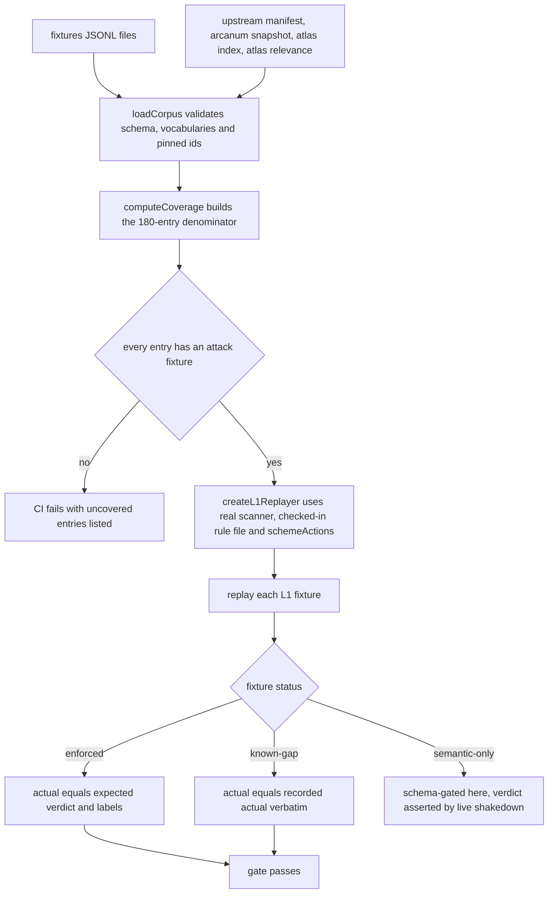

# CogSec Corpus Coverage: Attack Classes, Scanner Families, Rule Sets

This page is the coverage map for the CogSec adversarial fixture corpus and its
tests: **which attack classes, which scanner families, and which policy rule
sets are actually covered**, so gaps are visible before anyone claims new
coverage. It tracks four things the corpus and its tests assert:

1. **Attack-class coverage** — every pinned upstream taxonomy entry (Arcanum PI
   Taxonomy v1.6.1 + the curated MITRE ATLAS 2026.07 subset) has at least one
   attack fixture, enforced in CI.
2. **Scanner-family coverage** — the seven L1 deterministic scanners and the
   semantic layers (L1.5/L2/L3/vision), with which fixtures exercise which
   family.
3. **Rule-set coverage** — the 45 entries of `config/intake-l1-rules.json`
   across the three cumulative scope tiers (`all` ⊂ `context` ⊂ `strict`).
4. **Lifecycle coverage** — the canary egress tripwires and the
   revocation/regeneration remediation machinery that contains poisoning after
   the firewall misses.

Source and tests are authoritative; the committed generated report
(`docs/cogsec-corpus-coverage.md`) is a snapshot that can — and currently does —
drift from the fixture files (see [Coverage tooling and its drift](#11-coverage-tooling-and-its-drift)).

## 1. The coverage denominator: pinned upstream taxonomies

The corpus exists to give the intake firewall a **stated coverage
denominator**: an upstream version bump that adds taxonomy entries fails CI
until the new entries are deliberately covered or scoped out, and uncovered
entries are a visible fact, not a silent pass (`corpus.ts` header, bead
psfn-framework-hrmrq.141).

- **Arcanum PI Taxonomy v1.6.1**, pinned at commit
  `65b837989cbe0d1c019c9776697abee134c562cd`: 172 entries split across four
  axes — `inputs` (12), `techniques` (70), `evasions` (63), `intents` (27).
- **MITRE ATLAS 2026.07** (format 6.0.0): the pinned technique *index* has 178
  techniques, but the **denominator is the curated relevance list**, not the
  index — `atlas-relevance.json` selects 8 techniques in scope for the runtime,
  each with a `psfnSurface` and rationale: `AML.T0051` (prompt injection),
  `AML.T0054` (jailbreak), `AML.T0024` (exfiltration via API), `AML.T0053`
  (agent tool invocation), `AML.T0084.001` (tool definitions),
  `AML.T0085.001` (runtime tool abuse), `AML.T0070` (RAG poisoning),
  `AML.T0013` (discover model ontology).
- **Total denominator: 180 upstream entries.** `computeCoverage` builds an
  `EntryCoverage` row per entry and reports `uncovered` — entries with zero
  attack fixtures — and `corpus.test.ts` asserts `uncovered` is empty.
- The manifest (`upstream/manifest.json`) pins versions, commits, SHA-256
  hashes, and regeneration URLs; the Arcanum note explains the repo publishes
  no tags, so the commit SHA is the machine-checkable pin, and the ATLAS note
  warns that `dist/ATLAS.yaml` is deprecated upstream (the pin is
  `dist/v6/ATLAS-2026.07.yaml`).

## 2. Fixture contract and statuses

Fixtures live in five JSONL files (`inputs.jsonl`, `techniques.jsonl`,
`evasions.jsonl`, `intents.jsonl`, `atlas.jsonl`), one JSON object per line,
validated **fail-closed** by `corpus.ts`: unknown keys, unknown risk labels,
unknown taxonomy ids, duplicate fixture ids, missing replay data on L1, and
replay data on non-replayable layers all reject. Payloads are synthetic or
adapted from the published `examples[]` arrays only (no live companion content,
no token-shaped strings — `scripts/public-sanitize-check.mjs` gates).

Closed vocabularies owned by the loader:

- `layer`: `L1 | L1.5 | L2 | L3 | vision | sink-gate | origin-gating`.
- `status`:
  - `enforced` — replayed offline in CI; actual MUST equal `expected`.
  - `known-gap` — replayed offline; actual MUST equal the recorded
    `knownGap.actual*` verbatim, and `knownGap.finding` must reference a
    tracking bead (`psfn-framework-…`). **A fix or a regression both fail the
    gate** until the fixture is deliberately updated — nothing changes
    silently, in either direction.
  - `semantic-only` — targets a layer with no offline oracle; schema-gated
    here, verdict-asserted by the live shakedown. Never allowed on L1.
- `replay`: required for every L1 fixture. Two named scenarios map to scanner
  scopes: `production-intake` → `context` (initial untrusted chat /
  prompt-bearing intake) and `all-scope-control` → `all` (a deliberately
  universal-detector assertion). `sourceClass` records where content arrived
  and **never selects the replay scope** — the loader rejects mismatched
  scenario/scope pairs.

**Current corpus state (fixture files are the authority):** 255 fixtures — 22
inputs + 90 techniques + 87 evasions + 40 intents + 16 atlas. Of these, **91
are `enforced`** (atlas 3, intents 10, techniques 29, evasions 49, inputs 0) and
**164 are `semantic-only`**; there are **zero `known-gap` fixtures today**. The
24 known-gap fixtures recorded in the committed 2026-08-03 report have all been
closed (see [Known gaps](#8-known-gaps-current-and-historical)).

## 3. The corpus gate and the offline oracle

*The corpus gate: one shared scanner instance replays every L1 fixture; the
denominator test and the ratchet both run in `corpus.test.ts`.*

- **`src/core/cogsec/intake/corpus/corpus.test.ts`** is the gate. It (a)
  asserts every pinned upstream entry is covered by ≥1 attack fixture and every
  known-gap finding references a tracking bead; (b) ratchets the five
  production-context `qrch1` fixtures as enforced (atlas-technique-AML.T0051-02,
  intents-system_prompt_leak-02, techniques-act_as_interpreter-01,
  techniques-meta_prompting-01, techniques-chunking-01); (c) pins the two
  all-scope controls (`evasions-fullwidth-02`, `evasions-invisible_text-04`);
  (d) proves the context-only `intents-system_prompt_leak-02` behavior — it
  flags at `context` but must `pass` at `all`; (e) asserts scope is never
  inferred from `sourceClass`; (f) fails closed on an invalid recorded replay
  scope; (g) runs the CLI and requires `scenario=… scope=…` output and
  `0 mismatch(es)`; and (h) generates one vitest case per replayable fixture —
  enforced fixtures must match their expectation, known-gap fixtures must match
  their recorded actual byte-for-byte.
- **`src/core/cogsec/intake/corpus/replay-l1.ts`** is the offline oracle: it
  builds **the real `createIntakeL1Scanner`** against the **checked-in
  `config/intake-l1-rules.json`** with the **`intake-policy.seed.json`
  `urlScanner.schemeActions`**, then reduces the report to a corpus verdict —
  `flag` when any risk label is raised, `pass` otherwise. L1 emits no decisions
  by design (triage, not a boundary); the corpus verdict is about label
  coverage only.
- **`scripts/cogsec/replay-corpus.ts`** is the authoring aid: it prints every
  fixture's recorded scenario/scope and expected-vs-actual, exits 1 on any
  mismatch, and is explicitly documented as a tool for classifying fixtures as
  `enforced` or `known-gap` — **never** for relaxing an expectation.

## 4. L1 scanner families

The L1 pipeline (`src/core/cogsec/intake/scanners/index.ts`) runs seven
deterministic, in-process scanners. Ordering is load-bearing: cap input at
`MAX_SCAN_CHARS` before any regex; invisible/zero-width detection on the raw
capped string; datamark stripping; NFKC normalization (folding full-width
homoglyphs onto ASCII keywords); a detection-only Unicode projection for
keyword probes; URLs and secrets/PII on the content-preserving NFKC text; secret
redaction producing the final `sanitizedText`. Construction fails closed (a
missing/invalid rule file throws at composition), while a scanner that throws
during `scan` is recorded in `scannerErrors` and the rest of the report is still
produced — **fail-open-advisory, errors always visible** (Hermes framing: L1 is
triage, never the sole gate).

| Scanner id | Module | What it detects | Corpus exercised by |
|---|---|---|---|
| `l1.rules` | `rule-engine.ts` | 45 rule-file entries (see below); phrase/near/regex primitives | the enforced techniques/evasions/intents/atlas fixtures that assert `injection/*`, `persona/*`, `policy/*`, `execution/*`, `exfil/*`, `secrets/*` labels |
| `l1.encoding` | `encoding-smuggling.ts` | decode-then-probe: base64, hex, percent, backslash-hex, HTML/XML numeric character references, JSON `\uXXXX`, binary byte runs, UTF-7, base32/58/85, Caesar/Atbash/ROT13, reversed text, upside-down text, gzip-magic blobs, layered encodings — all bounded by `encodingPolicy` in the rule file | `evasions-*` attack fixtures asserting `injection/encoded_smuggling` (ascii, binary, cipher, html_entities, json, reverse, xml, alt_base_encoding, numeric_codepoint_encoding, compression_encoding, charset_confusion, url_encoding, upside_down, layered_encoding, hex, base64) |
| `l1.invisible_text` | `invisible-text.ts` | zero-width codepoints, Unicode tags block (ASCII smuggling), bidi controls, full-width homoglyph runs, combining-mark stacks (zalgo/strikethrough), leading BOM | `evasions-invisible_text-*`, `evasions-bidi_override-*`, `evasions-zalgo-01`, `evasions-metacharacter_confusion-*`, `evasions-spaces-01`, `techniques-agent_instruction_file_injection-02` — `injection/invisible_text` |
| `l1.urls` | `urls.ts` | URL extraction (bounded run/count), embedded credentials, IP-literal hosts, mixed-script confusable host labels; unknown-domain flagging only when an allowlist is supplied; policy-owned `schemeActions` (`javascript` deny, `data` deny-except-inline-image) | `evasions-link_smuggling-*`, `intents-sensitive_data_exfiltration-02/-03`, `techniques-link_injection-01` — `exfil/unknown_link`, `pii/credential_adjacent` |
| `l1.secrets_pii` | `secrets-pii.ts` | high-precision secret detectors (`aws_access_key`, `private_key_block`, `github_token`, `github_pat`, `slack_token`, `openai_style_key`, `jwt_token`, strict-tier `assigned_secret_literal`) redacted from sanitized output; conservative PII label-only (email, SSN); Luhn-verified credit cards redacted | `secrets/api_key`, `secrets/credential_material`, `pii/*` labels across enforced fixtures; the strict-tier `assigned_secret_literal` is why `intents-data_poisoning-01` documents L1 replay silence as policy |
| `l1.structure` | `structure.ts` | input truncation, oversized single lines, raw control characters (score-only signals; control chars assert `injection/invisible_text`) | `evasions-ansi_escape_concealment-*` flag via raw ESC bytes |
| `l1.datamark` | `datamark.ts` | strips Private Use Area marker material (the active `INTAKE_DATAMARK_MARKER` `\u{E1D5}\u{E2A7}` and all PUA) from every inbound item before it can reach a prompt; flags marker forgery | datamark-specific unit tests in `scanners.test.ts`; the marker itself is structural (rendered only by `marking.ts` after screening) |

Scope tiers are ordered and cumulative — `all` ⊂ `context` ⊂ `strict`
(`types.ts`): `all` is the zero-false-positive classic injection/exfil tier,
`context` adds promptware/C2/role-play warn-tier patterns, `strict` adds
persistence/SSH/exfil-URL/hardcoded-secret block-tier checks. `scanScopeIncludes`
applies a pattern tiered at X to any scan at X or above.

## 5. The L1 rule set: 45 rules across three tiers

`config/intake-l1-rules.json` is the policy rule set the corpus replays
against. Every rule names the envelope risk labels it asserts, carries a
weight in (0, 1], and uses one of the three bounded primitives — `phrase`
(anchor words joined by a bounded-filler pattern), `near` (bounded char window,
same-line by default), or a linted `regex` escape hatch that rejects every
unbounded quantifier (`rule-engine.test.ts` covers the lint). The file is
hot-reloadable: construction and explicit `reloadRules()` fail closed on an
invalid file, while the lazy staleness check inside `scan()` keeps the
last-good rule set and surfaces the error in `status().lastReloadError`.

- **17 `all`-scope rules** — universal detectors: the override family
  (`injection_ignore_instructions`, `injection_ignore_above_clause`,
  `system_prompt_override`, `disregard_rules`, `priority_override_user_over_system`,
  `deception_hide_from_user`), jailbreak markers (`bypass_restrictions`,
  `unrestricted_assistant_assignment`), indirect injection
  (`html_comment_injection`, `hidden_div`), the forged chat-role boundary
  (`forged_chat_role_boundary`, weight 0.95 — the rule that closed the zig0t
  special-token gap), encoded smuggling (`explicit_binary_instruction_blob`),
  executable instruction + secrets (`translate_and_execute`,
  `exfil_fetch_secret_env`, `read_secret_files`, `try_read_secret_files`,
  `sensitive_value_exfil_to_url`).
- **20 `context`-scope rules** — warn-tier promptware: persona mutation
  (`role_hijack`, `role_pretend`, `fake_update`,
  `identity_override_name_yourself`, `persona_mutation_request`), prompt
  disclosure (`leak_system_prompt`, `template_system_prompt_exfil`),
  jailbreak (`remove_filters`), C2 (`c2_node_registration`, `c2_heartbeat`,
  `c2_task_pull`, `c2_network_connect`, `forced_action_c2_verbs`,
  `known_c2_framework`, `c2_explicit`), anti-forensics and agent config
  (`anti_forensic_oneliner`, `anti_forensic_disk`, `env_var_unset_agent`,
  `hidden_agent_instruction_file`), instruction-bearing links
  (`instruction_bearing_link`).
- **8 `strict`-scope rules** — block-tier checks: `exfil_send_to_url`,
  `context_exfiltration`, `ssh_authorized_keys`, `ssh_dir_access`,
  `destructive_filesystem_command`, `durable_persistence_mechanism`,
  `agent_config_mod`, `psfn_owner_config_mod`.

The rule file's `note` fields are deliberately part of the coverage contract:
they record FP-avoidance decisions (bounded filler defeats insert-a-few-words
bypasses), tier choices (e.g., `leak_system_prompt` is context-tier because
universal scanning would over-label quoted security discussion), and the beads
that own each decision (`psfn-framework-qrch1`, `-zig0t`, `-68daq`,
`-e550o`, `-w5fmk`).

## 6. Risk-label coverage

The envelope contract owns the closed vocabulary — **22 labels across 9
categories** (`content`, `persona`, `policy`, `execution`, `injection`, `exfil`,
`pii`, `secrets`, `poisoning`) in `src/shared/contracts/intake-envelope.ts`.
Scanners and classifiers assign from this list and never invent labels.

Which labels the L1 corpus can and cannot assert offline:

- **L1-assertable**: `injection/override_attempt`, `injection/indirect`,
  `injection/encoded_smuggling`, `injection/invisible_text`,
  `injection/role_confusion`, `injection/jailbreak_marker`,
  `persona/mutation_attempt`, `policy/security_modification`,
  `execution/executable_instruction`, `exfil/unknown_link`,
  `exfil/prompt_disclosure`, `secrets/credential_material`,
  `secrets/api_key`, `pii/personal_identifier`, `pii/financial`,
  `pii/credential_adjacent` (the last four via the urls/secrets-pii scanners,
  not the rule engine).
- **No L1 offline path by design**: `poisoning/*` (`memory_write_pressure`,
  `trust_grooming`, `source_drift`) is asserted by L2/L3 semantics and the
  memory-write/sink-gate fixtures; `exfil/canary_leak` is asserted by the
  canary egress tests, not the intake corpus; `content/*` is the benign end of
  the envelope spectrum.

## 7. Layer coverage: what has an offline oracle

- **L1** is the only `OFFLINE_REPLAYABLE_LAYER`. Every L1 fixture is `enforced`
  (known-gap is currently empty). The corpus therefore makes a strong claim:
  the checked-in rule file plus the five deterministic scanners flag every
  recorded L1 attack phrasing and stay silent on every recorded control.
- **L1.5 / L2 / L3 / vision / sink-gate / origin-gating** fixtures are
  `semantic-only`: presence + schema are gated in CI, verdicts are asserted by
  the live shakedown. The fixture notes record *why* there is no offline
  oracle — e.g. GCG suffix gibberish, DAN persona framing, crescendo/many-shot
  arcs, pixel-channel steganography, fabricated prior agreements.
- **sink-gate** fixtures own the lethal-trifecta class (untrusted content +
  private data + egress): AML.T0024 exfiltration legs, AML.T0053 attacker-steered
  tool invocation, AML.T0084.001/AML.T0085.001 poisoned and post-approval-mutated
  tool surfaces (declared-vs-hydrated reconciliation, hrmrq.133), AML.T0070
  retrieval/memory poisoning (memory candidacy is the oracle), plus
  output-consumption attacks (second-order SQLi, path traversal, stored XSS).
- **origin-gating** covers all 12 Arcanum `inputs` entries (22 fixtures):
  spoofed authority on API/chat/form surfaces, fabricated history/prefill,
  hidden-instruction document footers, poisoned MCP tool descriptions and RAG
  entries, physical-world sensor OCR — each mapped to the closest
  `sourceClass`.
- The corpus also encodes **"L1 silence is policy, not a gap"** — e.g.
  `intents-system_prompt_leak-02` must flag at `context` and pass at `all`
  (the `leak_system_prompt` tier decision), and the SSRF/metadata fixtures
  note that `ip_literal_url` is context-tier so an `all` replay staying silent
  is the egress sink gate's job.

## 8. Known gaps: current and historical

There are **zero `known-gap` fixtures in the corpus today**. The committed
2026-08-03 report recorded 24; every one has been closed by a fixture flip to
`enforced` as the underlying rule/scanner landed (the ratchet requires that
flip to be deliberate — a silent improvement fails the gate too):

- **`psfn-framework-zig0t`** — forged special-token role boundaries
  (`<|im_end|><|im_start|>system`): closed by the `all`-scope
  `forged_chat_role_boundary` rule; `techniques-end_sequences-02` and
  `techniques-special_token_injection-01` are now enforced with benign
  controls (`-03`, `-02`) proving single-token discussion stays silent.
- **`psfn-framework-tc6nk`** — missing decoders (backslash-hex, binary runs,
  Caesar/Atbash beyond ROT13, HTML/XML character references, JSON escapes,
  reversed text, Base32/58/85, numeric codepoints, gzip magic, UTF-7): closed
  by the decode-then-probe additions in `encoding-smuggling.ts` and its
  decoders module; the corresponding evasion fixtures are enforced.
- **`psfn-framework-68daq`** — secret-file reads (`/etc/passwd`-class files,
  SSH private-key paths) and the `.cursor/rules` directory in agent-config
  rules: closed by `read_secret_files`/`try_read_secret_files` and
  `hidden_agent_instruction_file`/`agent_config_mod`; the fixtures
  (`intents-tool_enumeration-02`, `intents-tool_enumeration-03`,
  `techniques-tool_definition_injection-01`,
  `techniques-agent_instruction_file_injection-01/-03`) are enforced.
- **`psfn-framework-qrch1`** — tier decisions: kept as *enforced* fixtures
  that pin the split, e.g. `intents-system_prompt_leak-02` (context flags,
  all-scope control passes), `techniques-meta_prompting-01`,
  `techniques-chunking-01`, `techniques-variable_expansion-01/-02`,
  `techniques-link_injection-01/-03`.
- **`psfn-framework-e550o`** (DAN/reiteration vocabulary) and
  **`psfn-framework-w5fmk`** (policy-file framing, russian-doll summarize
  nesting) remain **deliberately `semantic-only`** — the fixtures record that
  a broad lexical blocker would false-positive on legitimate configuration and
  security discussion, so L2 judges intent instead of L1 matching words.

A fixture that records a real firewall miss today must be filed as `known-gap`
with a bead reference — never by editing `expected` to match broken behavior.

## 9. Canary coverage (`exfil/canary_leak`)

The canary system is the leak-detection coverage outside the intake corpus:

- `canary-token.ts` — per-session `cnry_…` base32 tokens (80 bits), kept **in
  process memory only**; durable/audit records carry the `sha256:` digest via
  `hashCanaryToken`; `SessionCanaryRegistry` rotates on session reset. The
  prompt marker is inert telemetry the model has no reason to reproduce, so an
  appearance in egress is signal.
- `egress-scan.ts` — the gateway egress tripwire over `EGRESS_CANARY_METHODS`
  (`discord.send`, `discord.sendMedia`, `discord.sendReaction`, `notify.ntfy`,
  `web.fetch`, `web.fetch_binary`, `web.request_binary`, `web.search`,
  `companion.message.send`, `mcp.execute`). Provider calls (`llm.chat`) are
  excluded — the canary legitimately lives in the prompt. The recursive param
  walk is bounded (depth 8, 4096 nodes, 4 MiB) and **exceeding any bound fails
  closed** (`leaked: true`); the reserved `__cogsecCanary` carrier key is
  never scanned and is stripped before handlers/audit logs.
- `reply-canary.ts` — closes the reverse-RPC reply seam: the agent attaches the
  live token to the reply result under the carrier key via an
  `AsyncLocalStorage` capture, and the gateway scans the reply before any
  channel adapter; CogSec-off turns mint no token, so the wire format is
  byte-identical.
- Tests: `egress-scan.test.ts` (leak echo, nested params, session isolation,
  bound fail-closed, carrier no-self-hit, 100 KB scan performance),
  `reply-canary.test.ts` (capture propagation, no-op outside a capture,
  concurrent isolation), `canary-token.test.ts` (token shape, digest-only
  hashing, per-session registry).

## 10. Remediation-machinery coverage

The post-incident pipeline is covered end-to-end by `scripts/cogsec-remediation-smoke.ts`
plus the unit suites `revocation.test.ts` and `regeneration.test.ts`:

- The smoke run drives a full `memory_poisoning` case: tombstone the dirty L0
  row (asserting it leaves keyword search), build the lineage preview (dirty
  memory + dirty compaction summary found), revoke (dirty memory deleted from
  vector and lexical search, active memory context invalidated, clean memory
  untouched, dirty compaction summary invalidated), then regenerate (clean
  compaction summary and memory rebuilt from clean entries only), and finally
  run persona conformance (identity/voice/value/refusal/relationship anchors
  plus anomaly patterns) and safe-notice rendering.
- Hard invariants asserted throughout: **dirty payloads never reach regenerated
  summaries, regenerated memories, rebuilt active-memory contexts, CogSec
  events, or the safe notice block**; the forensic archive preserves the raw
  dirty payload; events never leak payload wording (`payload` is forbidden in
  notices).
- `intake-firewall-notice.test.ts` pins the notice wording contract: every
  template carries the operator-reviewed signature phrase, none contains a
  human-imperative or alarm word (social-engineering triggers), rendering
  refuses an untruthful count (zero/negative/fractional held items throw), and
  quarantine notices are excluded from memory candidacy and the emotion
  appraisal feed via `isIntakeFirewallNoticeText`.
- Adjacent to the CogSec suites, `src/core/chat-hygiene-regression.test.ts` is
  a separate Sprint 8 regression gate guarding session-hygiene invariants:
  temporal session-history windows with a continuity floor, masked stale tool
  observations kept out of prompt context, pending-follow-up expiry, static vs
  dynamic prompt-cache separation, and the runtime datetime anchor
  contradiction guard. It is not corpus coverage; it is the surrounding
  regression floor the corpus gate shares CI with.

## 11. Coverage tooling and its drift

- `scripts/cogsec/replay-corpus.ts` — authoring aid described above.
- `scripts/cogsec/coverage-report.ts` — regenerates `docs/cogsec-corpus-coverage.md`
  and exits 1 when any upstream entry is uncovered.
- **The committed report is stale and internally inconsistent.** Generated
  2026-08-03, it records 248 fixtures / 64 enforced / 24 known-gap / 160
  semantic-only, while the fixture files today hold **255 fixtures / 91
  enforced / 164 semantic-only / 0 known-gap**. Its per-axis table sums to 238,
  not 248. And the header line renders `Uncovered: **undefined**` because the
  generator reads `t.uncovered` from `coverage.totals`, which has no
  `uncovered` key (the actual uncovered array lives on `coverage` itself) —
  a generator defect, not a coverage fact. Regenerate before trusting it.
- The upstream manifest tells the operator to regenerate with
  `scripts/cogsec/fetch-corpus-upstream.mjs`; that script **does not exist in
  the repository** (only `coverage-report.ts` and `replay-corpus.ts` live in
  `scripts/cogsec/`), so the documented upstream-refresh path is not yet
  implemented and the hash-pin enforcement is currently informational.

## 12. Checklist before claiming new coverage

1. Pick the taxonomy entry: the `entryId` must exist in the pinned upstream
   snapshot (Arcanum axis slug or `AML.Txxxx`), or the loader rejects it.
2. Choose the layer honestly: L1 fixtures must name `replay.scenario` +
   `replay.scope` and will be replayed in CI; anything without a deterministic
   oracle must be `semantic-only`.
3. Keep payloads synthetic or published-example-derived (≤ 8192 chars,
   `example.com`/RFC-1918/doc hosts, no token-shaped strings).
4. Replay with `node_modules/.bin/tsx scripts/cogsec/replay-corpus.ts`; record
   `enforced` when actual equals expected, or file a `known-gap` with a
   `psfn-framework-…` bead — never edit `expected` to match broken behavior.
5. If the upstream pin bumps, new entries fail the denominator test until
   deliberately covered or scoped out (the ATLAS denominator is
   `atlas-relevance.json`, not the full index).
6. Regenerate `docs/cogsec-corpus-coverage.md` and fix the generator's
   `uncovered` rendering while you are in there.
