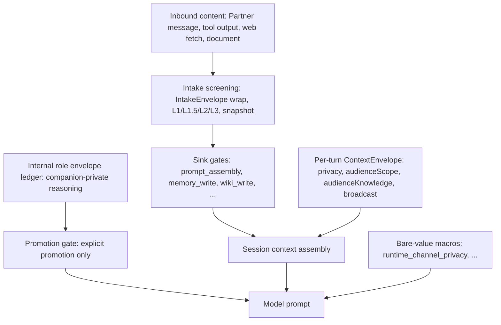
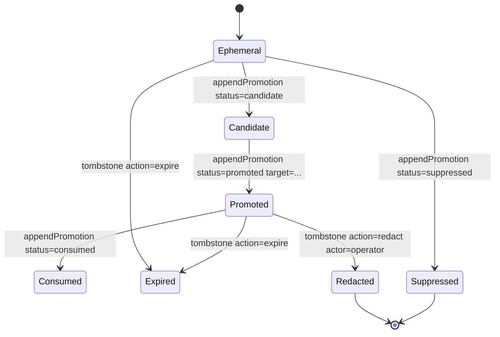

# Context Envelope: Bounding What Reaches the Model Context

This page documents the **envelope machinery that bounds what content reaches the
model context**: the deterministic per-turn privacy `ContextEnvelope` ("who can
hear this"), the taint-tracked **intake-screening envelope snapshots** that decide
what recorded content may be consumed at all, and the companion-private
**internal role envelope** ledger whose records are never part of the Partner-facing
conversation unless explicitly promoted. It also documents the fail-closed rules
for **provenance** (a derived artifact can never launder its source's risk) and
**role isolation** (internal-origin content is never Partner speech, companion-private
reasoning is never Partner-visible context) that hold the boundaries shut.

Canonical contract doc for the per-turn privacy envelope: `docs/context-envelope.md`
(the E3.1–E3.4 operator-review surface). Canonical code:
`src/system/trust/context-envelope.ts`. Source and tests are authoritative; where
prose and code disagree, write the code.

## 1. Three envelopes, one boundary

Three envelope mechanisms converge at context assembly, each answering a
different question:

| Envelope | Question | Owner |
| --- | --- | --- |
| Per-turn privacy envelope (`ContextEnvelope`) | Who can hear this turn? | `src/system/trust/context-envelope.ts` |
| Intake screening envelope (`IntakeEnvelope` + snapshot) | Is this content trusted to be consumed at a sink? | `src/shared/contracts/intake-envelope.ts`, `src/core/cogsec/intake/` |
| Internal role envelope (`InternalRoleEnvelope` ledger) | What reasoning does the companion keep to itself? | `src/core/internal-role-envelopes/` |



*The privacy envelope is frozen pre-prompt state, intake envelopes gate what recorded content may enter assembly, and internal role envelopes reach the prompt only through explicit promotion.*

## 2. The per-turn privacy envelope: "who can hear this"

The retired single-axis `ChannelVisibility` model (`private | semi_private |
public | broadcast`) compressed disclosure into one dimension. The envelope
replaces it with four deterministic dimensions while **referencing, not
redefining**, the unchanged 4-tier trust ladder and 4-level sensitivity ladder
(`repo://src/system/trust/context-envelope.ts#L31-L56`):

```text
ContextEnvelope = {
  channelPrivacy:    'private' | 'invite_only' | 'public'
  audienceScope:     'one' | 'few' | 'many' | 'unbounded'
  audienceKnowledge: 'all_known' | 'partially_known' | 'anonymous'
  broadcast:         boolean
}
```

`channelPrivacy` is the structural access to the room; `broadcast` is a **flag,
not a privacy level** and is always paired with `'public'`. The `{channelPrivacy,
broadcast}` pair resolves with fixed precedence — **channel-owned label >
operator trust-policy override > derived default** (`dm` → `private`, else
`invite_only`) — and is consumed as the highest-precedence source of a channel's
privacy pair at classification time
(`repo://src/system/trust/runtime-channel-labels.ts#L1-L36`).

Both runtime processes publish the same channel-owned labels and persisted
classification-epoch records at startup, so gateway-side and agent-side
classification and disclosure enforcement see identical precedence and demotion
boundaries (`repo://src/boundary/gateway/bootstrap-input.ts#L406-L420`,
`repo://src/app/agent/startup-context.ts#L143-L153`).

### Derivation fails closed

`deriveScopeContextEnvelope` produces the full envelope from channel
classification, conversation topology, the recent-speaker window, and contact
resolvability of that window (`repo://src/system/trust/context-envelope.ts#L286-L338`):

- `audienceScope` comes from topology plus known-roster size; a group whose
  roster the runtime **cannot bound fails closed to `unbounded`**.
- `audienceKnowledge` comes from the fraction of recent speakers resolvable to
  contacts; an **empty or unknown speaker window is `anonymous`, never
  `all_known`**, and `resolvedSpeakerContactCount` may never exceed
  `recentSpeakerCount`.
- A **DM is `all_known` only when its partner is a genuinely resolved canonical
  contact**; participant-id and channel-derived identities are degraded and fail
  closed to window-derived knowledge
  (`repo://src/core/session/conversation-scope.ts#L278-L299`).

The derivation-fail-closed rules are pinned by the envelope-gating suite, which
asserts `anonymous` for empty/unknown windows and `unbounded` past the
`fewMax`/`manyMax` thresholds (`repo://src/system/trust/envelope-gating.test.ts#L226-L267`).

### Scope attachment and prompt macros

`ConversationScope` is the value object answering "who is this conversation with"
for one turn, resolved once at session-manager ingress and frozen; since E3.3
every scope carries `readonly envelope: ContextEnvelope`
(`repo://src/core/session/conversation-scope.ts#L55-L73`). The recent-speaker
window feeding it comes from `SessionManager.getRecentConversationSpeakers` /
`scanRecentConversationSpeakers` (distinct user-role speakers, max 5)
(`repo://src/core/session/manager.ts#L1946-L1971`).

The envelope **never becomes prompt prose**. The prompt sees exactly four
bare-value macros — `runtime_channel_privacy`, `runtime_audience_scope`,
`runtime_audience_knowledge`, `runtime_broadcast` — built by
`buildContextEnvelopePromptState` (`repo://src/system/trust/policy.ts#L97-L108`)
and frozen into the turn variable namespace from the scope envelope; **internal
turns blank all four** so channel-family sections prune
(`repo://src/core/agent/substrate-agent/runtime-context.ts#L372-L382`). The full
privacy contract — gates, consent, broadcast safety, classification epochs — is
documented on the sibling page
<!-- openwiki: broken internal link [/openwiki/context-envelope.md] file "/openwiki/context-envelope.md" does not exist. Fix the href or restore the target, then delete this comment. -->
[/openwiki/context-envelope.md](/openwiki/context-envelope.md).

## 3. Intake screening: content envelopes at the boundary

Every untrusted inbound item (web fetch, document, image OCR, chat body, tool
output, subagent digest, shard foldback, MCP tool description) is wrapped in a
typed, taint-tracked `IntakeEnvelope` **before** it can reach prompt, memory,
wiki, persona, trust state, or tools. The contract is deliberately structural,
not probabilistic: **raw bytes never travel with the envelope** — only an opaque
`contentRef` a gateway-side store can resolve — and malformed input throws,
illegal state transitions throw, and derived envelopes can never carry a lower
risk tier than their parent (`repo://src/shared/contracts/intake-envelope.ts#L1-L18`,
`repo://src/shared/contracts/intake-envelope.ts#L376-L384`).

### State machine and sink-consumability

Envelope states form a legal-transition graph: `received → screened →
{released | released_sanitized | quarantined}`, with `quarantined` reachable
from `screened` and `human_*` release states reachable **only** from
`quarantined`; `human_released*`, `discarded`, and `expired` are terminal
(`repo://src/shared/contracts/intake-envelope.ts#L261-L335`). Validation across
persistence/RPC boundaries requires the transition journal to be a connected
path from `received` to the recorded state — a broken journal chain throws
(`repo://src/shared/contracts/intake-envelope.ts#L812-L825`).

**Quarantined content is invisible to ALL sinks**: only
`released`/`released_sanitized`/`human_released`/`human_released_sanitized` are
sink-consumable states; every other state — received (unscreened), screened
(not yet routed), quarantined, discarded, expired — denies at every sink. This is
a structural rule, not policy (`repo://src/shared/contracts/intake-envelope.ts#L202-L216`).
At each sink, `evaluateEnvelopeAtSink` additionally enforces the
inform-not-instruct rule: content riskier than the sink's `maxSourceRiskTier`
cap never drives the sink, and deny-listed risk labels deny
(`repo://src/core/cogsec/intake/sink-gates.ts#L220-L251`).

Sink-gate mode semantics follow the firewall split: **shadow** evaluates and
audits every gate but allows (with one fail-closed exception: a HARD-enforcement
lethal-trifecta deny — untrusted content + private data + egress — blocks in both
modes), **enforce** honors verdicts, and **off** constructs no gate so callers
behave byte-identically to pre-firewall (`repo://src/core/cogsec/intake/sink-gates.ts#L22-L40`,
`repo://src/core/cogsec/intake/sink-gates.ts#L194-L218`). Screening mode semantics
mirror this: in **shadow** `effectiveText` is always the original input
(observe-only rollout); in **enforce** `effectiveText` honors the decision —
`sanitize` substitutes the L1-sanitized text, `quarantine`/`block` substitute the
fixed operator-reviewed withheld-content placeholder, so quarantined content
never reaches prompt, memory extraction, or emotion appraisal
(`repo://src/core/cogsec/intake/screening.ts#L10-L33`).

### Record-time: session entries persist the effective text

Screened surfaces persist the screening outcome on the session entries whose
content was screened (tool observations today; Partner messages carrying upstream
envelope snapshots). The entry's `metadata` JSON bag owns the `intakeScreening`
sub-key (`schemaVersion`, `mode`, `withheld`, `envelopes`, optional `marking`)
(`repo://src/core/session/intake-screening-metadata.ts#L31-L47`). Parsing is
strict fail-closed: an unknown schema version, unknown mode, unknown risk label,
or malformed subject throws; building requires at least one envelope snapshot
(`repo://src/core/session/intake-screening-metadata.ts#L155-L199`).

`resolveIntakeScreeningSessionOutcome` projects the snapshot set onto the
persisted `{mode, withheld}` pair: one enforcing snapshot keeps a mixed item
enforcing, an entirely shadow-stamped set stays observe-only, and `withheld` is
true only when an **enforce-mode quarantined** snapshot is present
(`repo://src/core/session/intake-screening-metadata.ts#L53-L63`,
`repo://src/shared/contracts/intake-envelope.ts#L1218-L1236`).

Two hard fail-closed wiring rules sit at the record seam:

- `recordUserMessage` persists incoming envelope snapshots onto the session
  entry; **envelopes arriving while intake screening is off throws** — both
  derive from the same intake-policy.json, so an unattributable screening state
  is refused (`repo://src/core/session/manager.ts#L836-L858`).
- `recordToolObservation` screens the RAW tool output before it becomes persisted
  content: what lands in the entry is the screening's `effectiveText`. In
  enforce-mode quarantine only the fixed withheld placeholder lands, so raw
  hostile tool output never reaches context assembly, memory extraction, or the
  emotion-appraisal feed. A precomputed scheduler-seam screening is reused
  rather than re-run, so the same result is not journaled twice
  (`repo://src/core/session/manager.ts#L1166-L1210`).

The critical surface is that emotion appraisal and memory extraction read
**persisted session entries** independent of prompt assembly — the effective-text
substitution happens at record time, and the metadata carries the envelope
snapshot so downstream consumers read what was decided without re-screening. The
SessionManager-level regression proves shadow posture for private-direct
findings under a strict service default, enforce-mode quarantine of hostile tool
output, and that shadow-mode content persists unaltered while still stamping
envelope snapshots (`repo://src/core/session/manager-intake-screening.test.ts#L95-L129`).

### Read-time: the prompt_assembly sink gate

`applyPromptAssemblySinkGate` is the read-time counterpart: before session
entries become prompt context, every entry carrying persisted `intakeScreening`
metadata is checked against the `prompt_assembly` sink gate
(`repo://src/core/session/intake-sink-gating.ts#L224-L263`). It runs on the
cloned entries **before any downstream use** in `buildSessionContext`
(`repo://src/core/session/manager/context-builder.ts#L454-L466`) and on
conversation-evidence windows (`repo://src/core/session/manager.ts#L2160-L2173`).
This is defense in depth for content recorded under shadow mode (original text
persisted, snapshot quarantined) and later consumed under enforce mode: the gate
denies it and the entry renders as the fixed htm9.12 withheld placeholder.
**Malformed intake metadata fails closed in enforce mode**: the entry's screening
state is unknowable, so its content is withheld and the error is logged — never
swallowed (`repo://src/core/session/intake-sink-gating.ts#L248-L263`). Shadow
mode never alters entries; the gate still evaluates and audits.

Data marking (htm9.13) rides the same seam: the marking plan is computed at
screening time and **applied at read time** by the prompt-assembly gate in
enforce mode — the marker never exists in persisted content, so inbound re-scans
only ever see forged markers; shadow mode audits the plan only. Entries beyond a
bounded 256 KiB synchronous-marking work budget keep their provenance wrapper but
use the reduced form (`repo://src/core/session/intake-sink-gating.ts#L282-L308`).

### Masking and the leak audit

Tool observations are per-turn secrets. `applyObservationMasking` keeps the
latest `observationMaskingWindow` turns' tool results unmasked (default `1`) and
rewrites every older `tool` entry's content to the `__masked_tool_observation__`
sentinel before assembly (`repo://src/core/session/manager/context-builder.ts#L948-L993`,
`repo://src/core/session/tool-observation.ts#L53`). The leak audit runs the real
`SessionManager`/`buildContext` path repeatedly and asserts the secret sentinel
and `[Tool result: ...]` stamps never appear in assembled context while
`maskedEntryCount` stays greater than zero
(`repo://src/core/session/context-leak-audit.test.ts#L52-L88`).

## 4. Internal role envelopes: the companion's own reasoning

The **internal role envelope** subsystem is the companion-private side of the
per-turn privacy model: a durable, channel-scoped, append-only ledger of the
companion's own reasoning artifacts that is **never part of the Partner-facing
conversation unless a record is explicitly promoted**. It is wired into session
runtime composition at startup and held by the `SessionManager`
(`repo://src/core/internal-role-envelopes/runtime-wiring.ts#L10-L17`,
`repo://src/app/startup/composition/composition.ts#L261-L291`).

### Vocabulary, ids, and inspection

Seven kinds, five visibilities, six source stages, eight promotion targets, six
promotion statuses, and three tombstone actions are **closed vocabularies**,
validated at creation and again at ledger replay
(`repo://src/core/internal-role-envelopes/types.ts#L4-L51`):

- **kinds**: `internal_thought`, `self_reflection`, `values_reflection`,
  `concern_candidate`, `outreach_candidate`, `outreach_handoff`, `outreach_result`;
- **visibilities**: `companion_private`, `operator_summary`, `operator_forensic`,
  `promoted_context`, `user_visible` — the audit axis for who may ever see a record;
- **source stages**: `turn_execution`, `post_turn_appraisal`, `heartbeat`,
  `scheduler`, `replay`, `operator`;
- **promotion**: `status` (`ephemeral`, `candidate`, `promoted`, `suppressed`,
  `consumed`, `expired`) × `target` (`none`, `turn_record_summary`,
  `continuity_summary`, `values_journal`, `memory_write`, `concern_store`,
  `outreach_handoff`, `session_message`);
- **tombstones**: `redact` | `expire` | `cancel`, each with an actor.

Every envelope gets a deterministic `env_<24 hex>` id derived from
`{turnId, sourceStage, internalRole, ordinal}`; creation requires either an
explicit `envelopeId` or a `turnId` for the deterministic id
(`repo://src/core/internal-role-envelopes/types.ts#L299-L311`,
`repo://src/core/internal-role-envelopes/types.ts#L332-L344`). Role-defaulted
**inspection** policy governs operator surfaces: `internal_thought` defaults to a
7-day raw TTL with a non-searchable body; `self_reflection`/`values_reflection`
default to 30 days with a searchable body; other kinds default to 30 days
(`repo://src/core/internal-role-envelopes/types.ts#L236-L261`).

### Lifecycle

A record advances through promotion and tombstone entries appended to the ledger:



*Internal role envelope promotion lifecycle: ledger entries (envelope / promotion / tombstone) advance a record from ephemeral to candidate, promoted, consumed, or tombstoned, each with reason/ref/at attribution.*

Promotion entries carry `status`, `target`, `reason`, and an optional
`promotedRef`; tombstones carry an `action` and an `actor`
(`repo://src/core/internal-role-envelopes/types.ts#L130-L158`,
`repo://src/core/internal-role-envelopes/store.ts#L212-L243`).

### Persistence and prompt rendering

The ledger is a per-channel JSONL append-only store at
`companion-data/.../internal-role-envelopes/<sanitizedChannelId>.jsonl`;
`appendEnvelope`/`appendPromotion`/`appendTombstone` append, and `readEntries`
replays with strict fail-closed parsing — a malformed line throws rather than
degrading (`repo://src/persistence/layout.ts#L704-L713`,
`repo://src/core/internal-role-envelopes/store.ts#L191-L257`).

Prompt-format helpers render deterministic `[ROLE_ENVELOPE v1]` blocks in fixed
priority order (concerns before outreach before reflections before thoughts) and
the compact `[Internal Ledger]` block of promoted summaries with
`ref=envelope:<id>` / `ref=handoff:<id>` pointers
(`repo://src/core/internal-role-envelopes/prompt-format.ts#L13-L97`).

### Session-record integration

Producers stamp a normalized `SessionRoleEnvelopePreview` (envelope id, kind,
summary, source stage, promotion target, promoted ref) onto session entry
metadata via `buildSessionMetadataWithRoleEnvelopePreview`, so turn records carry
a lightweight, validated projection of the ledger
(`repo://src/core/session/turn-provenance.ts#L127-L147`). The scheduler's
outbound gate uses exactly this path when it records a companion-authored
proactive outbound message as an `outreach_candidate` promoted to
`turn_record_summary` (`repo://src/core/scheduler/post-turn-outbound-gates.ts#L383-L418`).

## 5. Provenance and role isolation

### Taint propagation (CaMeL rule)

`deriveChildIntakeEnvelope` derives a child envelope from a parent with taint
propagation: the child inherits the parent's **full provenance chain plus a
derivation hop referencing the parent envelope**, and its risk tier is **never
lower than the parent's** — a summary of untrusted content stays untrusted
(CaMeL, arXiv 2503.18813). The child starts `received` and must pass screening
itself before any sink, so a cleaner derivative cannot launder a flagged source
(`repo://src/shared/contracts/intake-envelope.ts#L1068-L1136`). Provenance refs
stamp memory and wiki writes with the `intake-envelope:` prefix so a poisoned
source's lineage stays excisable through revocation machinery without storage
schema changes (`repo://src/shared/contracts/intake-envelope.ts#L1140-L1172`).

### Role isolation at the session seam

- **Internal-origin content is never Partner speech.** `recordUserMessage` runs the
  authorship-integrity guard `detectInternalOriginForUserAttribution`, which
  retags internal-origin messages as `system` entries — storing them as `user`
  would let a future consumer present the companion's machinery as the partner
  speaking (`repo://src/core/session/manager.ts#L861-L890`).
- **Role is structurally authenticated, never content-derived.** Chat screening
  resolves its CogSec surface from authenticated adapter topology and channel
  privacy (`group_chat`, `public_channel`, `operator_direct`, `private_direct`)
  and throws when topology is absent — content and origin strings never
  participate (`repo://src/core/cogsec/intake/chat-message-screening.ts#L58-L77`).
- **Internal role envelopes are channel-scoped and visibility-typed.** Each
  record names one channel and a visibility on the audit axis from
  `companion_private` to `user_visible`; promotion is the only mechanism that
  moves a record toward prompt or session context.

### Self-authored mutations screen before durable state

Model-authored persona/wiki/trust mutations pass `screenSelfAuthoredMutation`
before reaching durable state: **every string leaf gets its own envelope**, the
active turn's envelopes join the proposed-content envelopes so a clean-looking
derivative cannot shed hostile provenance from the audit, and a partially wired
runtime fails loudly — an empty envelope list refuses the sink evaluation rather
than silently reducing every enforce-mode mutation to the sink's unscreened
default. Persona mutations preserve the companion-authored value and treat CogSec
as audit-only; their structural/charter and confirmation path remains
authoritative (`repo://src/core/session/intake-sink-gating.ts#L99-L205`).

## 6. Accounting: the ContextManifest

`buildSessionContext` — the single session-context derivation for a turn — emits
a `ContextManifest` that accounts for every entry in the assembled context:
session counts (`sourceEntryCount`, `trimmedEntryCount`, `maskedEntryCount`,
`roomWindowFilteredEntryCount`, `bondedEntryCount`, `finalEntryCount`), the
memory included/excluded ledger, budget summaries, and compaction state
(`repo://src/shared/contracts/context-manifest-contracts.ts#L105-L152`,
`repo://src/core/session/manager/context-builder.ts#L428-L466`). The manifest
rides the model response contract and feeds the context-feedback faculty; its
masked counts are what the leak audit asserts.

## 7. Fail-closed invariants

- **No privacy prose in prompts.** The envelope is deterministic pre-prompt
  state; the prompt sees bare-value macros only, and internal turns blank all
  four channel-family macros.
- **Derivation fails closed.** Unboundable rosters → `unbounded`; empty/unknown
  speaker windows → `anonymous`; unresolved DM partners are never `all_known`.
- **Quarantined is invisible.** Only released/sanitized/human-released states are
  sink-consumable, structurally, at every sink.
- **Taint never launders.** Derived envelopes keep the parent's provenance chain
  and a risk tier no lower than the parent's; a screened child must re-pass
  screening.
- **Screening state is never unattributable.** Envelope snapshots persisted
  while screening is off throw; malformed persisted screening metadata withholds
  the entry in enforce mode instead of guessing.
- **Enforce-mode quarantine never persists raw hostile text.** The record-time
  `effectiveText` substitution and the read-time sink gate are two independent
  layers asserting the same property.
- **Role isolation is structural.** Internal-origin messages are retagged
  `system`, never `user`; internal role envelopes reach prompts only through
  explicit promotion; the lethal trifecta hard deny blocks even in shadow mode.
- **Ledgers are append-only and fail-closed on replay.** Both the intake envelope
  journal (transition chain must lead to the recorded state) and the internal
  role envelope ledger (malformed line throws) refuse to degrade.

## 8. Configuration and operations

- **channels.json** → `contextEnvelope.channels.<channelId>` — channel-owned
  envelope labels (`privacy`, `broadcast`, `contactTracking`, `deliveryStyle`,
  `needsReview`, `classificationSource`), published at startup into the runtime
  label holder by both gateway and agent processes; and
  `contextEnvelope.classificationEpochs` for the operator-signed public-demotion
  records.
- **trust-policy.json** — `trustCeiling`, `visibilityAllowed`,
  `audienceScopeThresholds` (defaults `fewMax: 10`, `manyMax: 100`),
  `channelClassification` (`visibilityOverrides`, prefixes, `defaultVisibility`),
  `participantRelationshipConfidenceThreshold`.
- **intake-policy.json** — canonical global mode `shadow` | `boundary` | `strict`
  (retired `off`/`enforce` migrate explicitly and are rejected thereafter),
  per-sink gate rules with `maxSourceRiskTier` caps and deny-label lists,
  surface postures, quarantine limits. The enforcement posture projection is the
  binary `shadow`/`enforce` carried by envelopes
  (`repo://src/system/config/intake-policy-config.ts#L81-L112`).
- **SessionManager wiring** — `intakeScreening` and `intakeSinkGate` are assigned
  by composition from the same intake-policy.json; null means the firewall is
  off and recording/context assembly stay byte-identical to pre-firewall
  behavior (`repo://src/core/session/manager.ts#L277-L292`,
  `repo://src/app/agent/core-runtime.ts#L471-L499`).
- **Settings** — `observationMaskingWindow` (default `1`) controls how many
  most-recent turns keep unmasked tool observations in assembled context.
- **Operator surfaces** — the intake quarantine hold and release flow, and the
  session-entry `roleEnvelopePreview` metadata that carries internal role
  envelope projections into turn records.

## Related pages

- [/openwiki/runtime/chat-turn-lifecycle.md](/openwiki/runtime/chat-turn-lifecycle.md) — where gateway intake screening, RPC notification, session-bound turn execution, and post-turn lanes sit in the full turn.
- [/openwiki/runtime/prompt-macros.md](/openwiki/runtime/prompt-macros.md) — the macro machinery whose per-turn variable namespace carries the four bare-value envelope macros.
- [/openwiki/security/attribution.md](/openwiki/security/attribution.md) — session-entry attribution, turn provenance, and the opaque audit surface that role isolation feeds.
- [/openwiki/security/cognitive-security.md](/openwiki/security/cognitive-security.md) — the intake firewall: envelope contract, screening pipeline, sink gates, quarantine, and incident machinery.
<!-- openwiki: broken internal link [/openwiki/context-envelope.md] file "/openwiki/context-envelope.md" does not exist. Fix the href or restore the target, then delete this comment. -->
- [/openwiki/context-envelope.md](/openwiki/context-envelope.md) — the full per-turn privacy envelope contract: classification, policy gates, broadcast safety, migration, and epochs.
