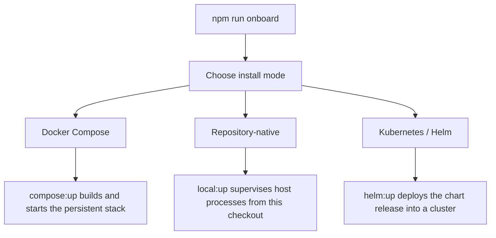
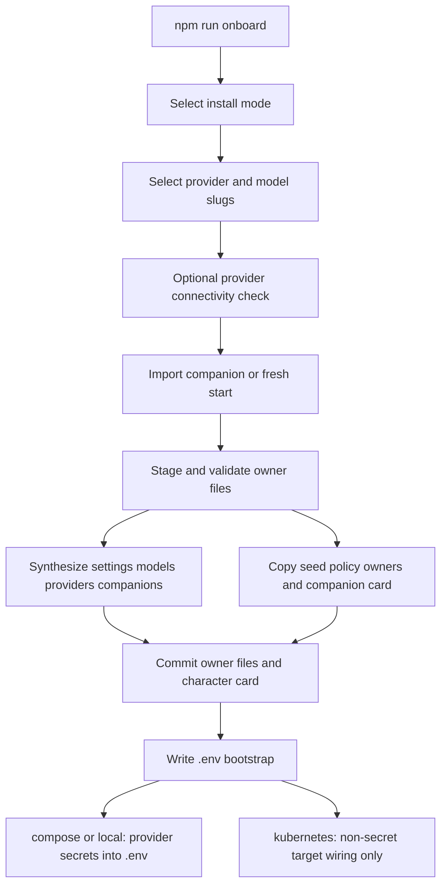
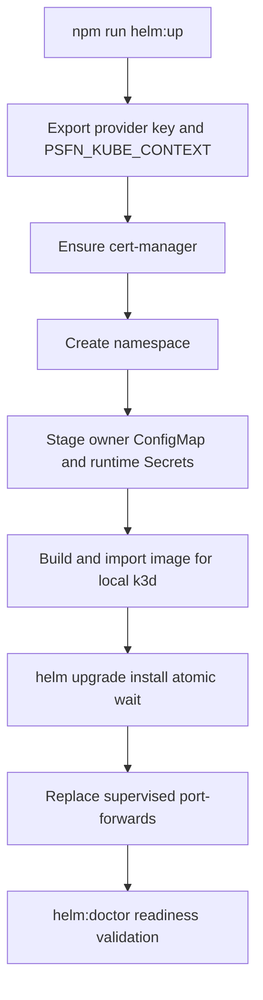

# Setup and Install Paths

PSFN has exactly three public installation paths — **Docker Compose**,
**repository-native**, and **Helm / Kubernetes**. Every path runs the same
complete persistent split runtime — PostgreSQL, gateway, isolated agent, Garden
(operator), pinned model prefetch, and an internal operator-alert sink — and is
driven by lifecycle commands owned by the repository
(`scripts/compose-lifecycle.ts`, `scripts/local-lifecycle.ts`,
`scripts/helm-lifecycle.ts`). The split runtime (gateway / isolated agent /
operator) is the only supported shape, Postgres (pgvector) is the only
persistence backend, and each path has its own process supervision and retained
storage. Pick one path and keep using its lifecycle commands; do not combine
process supervision or volumes from different paths.

Live details of any installation (addresses, kubeconfigs, cluster names, Helm
values, credentials, host inventory) are operator-owned and never belong in the
repository or this documentation.



*Install-path decision: one interactive onboarding flow configures all three supported modes; each mode then has its own lifecycle command family.*

The companion identity-and-continuity charter
([`docs/PSFN_PROJECT_CHARTER.md`](../docs/PSFN_PROJECT_CHARTER.md)) is the
architectural authority; this page records how an installation is created and
verified. When prose and code disagree, the code wins — lifecycle scripts,
`docker/compose.yml`, the Helm chart, and their tests first.

## Prerequisites

All three paths share a base set of prerequisites:

- **Node.js 24.19.0 or newer in the Node 24 LTS line** (`.node-version` pins
  24.19.0) and npm. The repository declares `npm@11.17.0` as its package
  manager and expects a `npm ci`-produced `node_modules`.
- A supported **LLM provider credential** and outbound HTTPS to that provider.
  A first install also downloads pinned local embedding, text-emotion, and
  CogSec prompt-injection model weights (see
  [First start: model assets](#first-start-model-assets)).
- **Docker with Compose v2** for the Docker Compose path.
- **PostgreSQL 17 with pgvector** for the repository-native path (an external
  server; the other two paths self-provide Postgres).
- **`kubectl` and Helm** for the Kubernetes path, plus either Docker and `k3d`
  (local k3d cluster) or an existing cluster with a default StorageClass.
  Kubernetes also needs outbound HTTPS for the pinned image, model, and
  cert-manager artifacts.

Repository checkouts use pinned image and artifact references throughout; the
lifecycle commands reject floating `latest`/branch-style tags rather than
guessing what to run.

## Worktree dependency bootstrap

A fresh checkout does not require a manual install before onboarding. The
tracked worktree git hooks (`post-checkout`, `post-merge`, `post-rewrite`,
`pre-push`) run `scripts/ci/bootstrap-worktree.mjs` through
`run-repository-node.sh`, which first verifies the running Node version against
`.node-version`. `prewarm-worktree` populates npm's shared cache from
`package-lock.json` inside disposable directories, proves the cache with a
clean `npm ci --offline --ignore-scripts`, and writes a lockfile-SHA-256
attestation; `bootstrap-worktree` then installs isolated `node_modules` from
that attested cache (`npm run deps:ensure`). A changed lockfile selects a new
attestation and forces a rewarm; manual fallback is `npm run prewarm` followed
by `npm ci --offline --ignore-scripts`. No `node_modules`, `dist`, or other
mutable worktree output is ever shared between worktrees.

## Common onboarding: `npm run onboard`

From a clean checkout, onboarding is the single entrypoint for every path:

```bash
npm ci
npm run onboard
```

Onboarding accepts two CLI options: `--seed-dir <dir>` selects the owner-file
seed directory (default `./config`, or `$CONFIG_DIR`), and `--env-path <path>`
selects the `.env` bootstrap path (default `./.env`). The installer flag is
deliberately spelled `--env-path` because Node's own runtime consumes
`--env-file` wherever it appears on the command line before the installer can
parse it.

The interactive flow (`scripts/onboarding/index.ts` driving
`scripts/onboarding/flow.ts`) asks, in order:

1. **Install mode** — Docker Compose, repository-native, or Kubernetes / Helm.
2. **Provider and models** — the selectable provider types are derived from the
   runtime contract (`CANONICAL_PROVIDER_TYPES`), not a hand-maintained list;
   onboarding fails closed if a contract type has no metadata. The operator
   confirms the primary, extraction, and vision model slugs.
3. **Optional voice** (STT/TTS providers) — disabled by default.
4. **Optional provider connectivity check** — one lightweight authenticated
   call (a models-list GET for OpenAI-compatible providers, a minimal models
   call for Anthropic) that surfaces a bad key before first chat; always
   skippable for offline setups.
5. **Companion definition** — import an existing companion (Character Card
   V2/V3, SoulMD, or plain persona markdown) or scaffold a fresh one, with a
   preview/confirm before anything is written.
6. **Persistence roots** — the mode's default two-root layout
   (`system-data` + `companion-data`), overridable at the prompt.



*Onboarding control flow: every prompt happens before any write, so aborting at any point leaves zero files; the commit validates through the real settings-contract guard first.*

Onboarding then generates the **canonical JSON owner files** and validates them
against the real settings-contract startup guard before a single file lands on
disk:

- **Synthesized**: `settings.json`, `models.json`, `providers.json`,
  `companions.json`.
- **Seed-copied policy owners** (from `config/*.seed.json`):
  `trust-policy.json`, `intake-policy.json`, `backup.json`, `mcp-servers.json`,
  `partner-affect-shadow.json`, `automata-policy.json`, `places.json`,
  `runtime-prompt-layers.json`, and the per-companion `scheduler.json`,
  `capability-tier.json`, `charge-policy.json`, `skills.json`.
- The **character card** (`companion.json`) is written to the companion-data
  root, exactly where the single-companion runtime reads it.

The generated `companions.json` names one companion with the
`companion_main`/`companion_main_runtime` Postgres tenancy contract and env-var
database URL references; `providers.json` records the provider's API key as an
env-var reference (`apiKeyRef.kind: env`), never a value.

Guarantees:

- **Abort-safe**: aborting at any prompt writes zero files; a failure during
  the commit restores any overwritten files from backups.
- **Idempotent**: an existing configuration offers update-vs-abort, never a
  silent overwrite. Updates preserve the existing `companionId` — rotating it
  would orphan the Personal Workspace, database schema, and session history.
- **Secret hygiene**: host-mode secrets (provider and voice keys) are entered
  masked and written only to the ignored `.env` file, never to the JSON owner
  files. Kubernetes onboarding never captures the provider key at all.

The `.env` writer merges entries into an existing `.env` preserving comments
and ordering, upserts matched keys, quotes values only when needed, and writes
durably. Compose onboarding stores the provider credential under the fixed
name `PSFN_PROVIDER_API_KEY`; repository-native uses the env-var name chosen
during the flow. Kubernetes onboarding writes only non-secret deployment
coordinates — `PSFN_KUBE_CONTEXT`, `PSFN_GARDEN_PORT`,
`PSFN_K3D_NATIVE_GARDEN`, `PSFN_TAILSCALE_SERVE`, plus `PSFN_K3D_CLUSTER` and
`PSFN_TAILNET_HOST` for a local k3d target — and the operator must export the
provider env var named by the generated `providers.json` in the shell that runs
`helm:*` commands.

After a successful run, onboarding prints the mode-specific next steps and the
remaining first-chat gaps (Postgres provisioning expectations per path and the
provider-key export requirement for Kubernetes).

## Path 1: Docker Compose

The smallest self-contained persistent installation:
`docker/compose.yml` + `scripts/compose-lifecycle.ts`.

```bash
npm run compose:up
npm run compose:verify
```

The stack runs: `postgres` (pgvector, image pinned by digest), a one-shot
`bootstrap` container that provisions database tenancy, a `model-prefetch`
job, an `operator-alert-sink`, then `gateway`, `agent`, and `garden`. Docker
networks separate concerns: an internal-only network for runtime traffic, a
dedicated `host-access` bridge so Garden's published loopback port works, and
an `egress` network for the provider-facing gateway and model prefetch.
Gateway and Garden are published only on `127.0.0.1` — API on
`http://127.0.0.1:10054/v1`, Garden login on `http://127.0.0.1:10053/login`
(override with `PSFN_API_PORT` / `PSFN_GARDEN_PORT`).

`loadContext` reads the ignored `.env` (explicit process environment wins over
file values), requires `COMPANION_ID`, `PSFN_POSTGRES_SUPERUSER_PASSWORD`,
`PSFN_COMPANION_DATABASE_PASSWORD`, `PSFN_SHARED_MIGRATION_DATABASE_PASSWORD`,
`API_KEY`, `ADMIN_TOKEN`, `GATEWAY_SESSION_HMAC_KEY`,
`PSFN_BACKUP_ENCRYPTION_KEY`, and `PSFN_PROVIDER_API_KEY`, rejects a
`PSFN_IMAGE` ending in `:latest`, injects the host UID/GID
(`PSFN_HOST_UID`/`PSFN_HOST_GID`) and `PSFN_GIT_COMMIT` for build provenance,
and creates the host data directories under `PSFN_DATA_ROOT` (default
`./data`) before any command runs.

Lifecycle commands:

```bash
npm run compose:status   # docker compose ps
npm run compose:doctor   # services, Postgres topology, gateway subsystems, Garden login
npm run compose:logs     # follow gateway, agent, garden logs
npm run compose:restart  # restart gateway/agent/garden, then doctor
npm run compose:update   # same safe, data-preserving convergence as up
npm run compose:down     # stop containers; preserve all persistent data
```

`compose:up`/`compose:update` run `docker compose up -d --build --wait` and
then `doctor`. `compose:down` runs a plain `docker compose down` — it never
deletes the Postgres volume or the data root, and a later `compose:up` resumes
with the same owners, workspace, memories, sessions, models, and database.

## Path 2: Repository-native

Use this path when the runtime should be supervised directly from the
checkout, against your own PostgreSQL server. Before onboarding, create a
PostgreSQL 17 server with pgvector and have a credentialed `postgres`
administrator URL. Onboarding asks for that URL and writes it only to the
ignored `.env`.

```bash
npm run local:up
npm run local:verify
```

`local:up` (`scripts/local-lifecycle.ts`):

1. Validates the layout — the required system and companion owner files must
   exist, and the `.env` must carry the full wiring set (`PSFN_RUNTIME_ROOT`,
   `SYSTEM_DATA_DIR`, `COMPANION_DATA_DIR`, `WORKSPACE_PATH`,
   `CHARACTER_CARD_PATH`, `PSFN_LOGS_DIR`, `PSFN_TEMP_DIR`,
   `BACKUP_ROOT_DIR`, `PSFN_AGENT_AUTH_DIR`, `GATEWAY_SOCKET`,
   `ADMIN_TRANSPORT_SOCKET`, the four `POSTGRES_*` URLs, the database
   passwords, `API_KEY`, `ADMIN_TOKEN`, `GATEWAY_SESSION_HMAC_KEY`, and
   `PSFN_BACKUP_ENCRYPTION_KEY`).
2. Runs the shared compose bootstrap, which validates the Postgres
   administrator URL authenticates as `postgres`, provisions the isolated
   runtime roles and role-bound agent credentials (`agent-auth.env`), and
   verifies the generated layout against `companions.json`.
3. Builds the application (`npm run build:runtime` into `dist/`) and the
   Garden web UI (`npm run garden:build`) on first start only.
4. Prefetches the pinned local model assets (see below).
5. Starts a **detached supervisor** that owns the `operator-alert-sink`,
   `gateway`, `agent`, and `garden` processes, tracks component PIDs in a state
   JSON under the temp dir, and writes a consolidated runtime log. A
   component exiting unexpectedly marks the runtime failed and stops the
   others.

The same Garden and API defaults apply: `http://127.0.0.1:10053/login` and
`http://127.0.0.1:10054/v1`, overridable via `ADMIN_PORT` / `API_PORT`.

```bash
npm run local:status   # supervisor and component process state
npm run local:doctor   # processes, database topology, gateway subsystems, Garden login
npm run local:logs     # follow the consolidated runtime log
npm run local:restart  # stop then start the complete runtime
npm run local:update   # build current checkout, deploy, roll back automatically on failure
npm run local:recover  # restore the last-good build recorded by local:update
npm run local:down     # stop all components, preserve every persistent root
```

`local:update` protects the current build, builds a candidate from the current
checkout, restarts the runtime, and records the previous build as last-good;
if the candidate fails, it stops the runtime, restores the previous build, and
restarts. `local:recover` restores the recorded last-good build without
touching owner files or persistent data.

## Path 3: Helm / Kubernetes

The public chart is [`deploy/helm/psfn`](../deploy/helm/psfn/); its supported
single-companion path runs PostgreSQL, gateway, isolated agent, Garden, pinned
model prefetch, an internal operator-alert sink, and cert-manager-backed mTLS,
with retained storage for owner files, continuity state, workspace, backups,
models, and PostgreSQL. Advanced chart values — fleet, ingress, Redis,
Satellite Hub, Kubernetes self-management, and observer-eval — are
operator-owned, disabled by default, and are **not** additional public
installation modes.

The lifecycle always requires the exact kubectl context; it never guesses or
selects a live cluster:

```bash
# Registry-backed cluster (immutable tag or digest)
export PSFN_KUBE_CONTEXT=my-cluster-context
export PSFN_IMAGE=registry.example/psfn:0.1.0
export PROVIDER_API_KEY='<provider credential>'   # exact name from providers.json

npm run helm:up
npm run helm:verify
```

`PSFN_IMAGE` must be a pinned tag or `@sha256:<64 hex>` digest; `latest`,
`main`, and `main-latest` are rejected. The default namespace and release are
`psfn`; override with `PSFN_HELM_NAMESPACE` and `PSFN_HELM_RELEASE`. The
lifecycle also requires the full generated owner-file set (including
`trust-policy.json`, `intake-policy.json`, `backup.json`, `mcp-servers.json`,
`automata-policy.json`, `places.json`, `runtime-prompt-layers.json`, and the
per-companion `charge-policy.json`/`skills.json`), exactly one
`companions.json` entry with the `companion_main`/`companion_main_runtime`
tenancy contract, and exactly one enabled provider whose `apiKeyRef` names an
uppercase environment variable.

`helm:up` then:

1. Ensures **cert-manager** is installed (jetstack chart, pinned v1.20.3, with
   CRDs) — the chart's `certificates.yaml` renders a self-signed CA Issuer and
   per-service certificates for the mTLS transport.
2. Creates the namespace and stages the **owner ConfigMap** and the
   **application/PostgreSQL Secrets** directly through `kubectl apply`, so
   credential values never appear in Helm arguments, values, or release
   history. Role-bound agent and session-integrity proofs
   (`GATEWAY_COMPANION_AUTH_TOKEN`, `GATEWAY_SESSION_INTEGRITY_AUTH_TOKEN`)
   are derived by HMAC from `GATEWAY_SESSION_HMAC_KEY`; existing Secret values
   are retained across upgrades.
3. Optionally builds the current checkout and imports it into k3d when a local
   build is selected (`PSFN_K3D_CLUSTER` or `PSFN_HELM_LOCAL_BUILD=1`).
4. Runs `helm upgrade --install --atomic --wait --wait-for-jobs` — a failed
   readiness check rolls the release back while retained storage stays in
   place.



*Helm deployment sequence: the lifecycle stages owner files and Secrets outside Helm history, installs cert-manager, then deploys atomically and validates readiness.*

**Local k3d cluster** (chosen during Kubernetes onboarding): onboarding writes
the context (`k3d-<cluster>`), cluster name, native Garden port, and optional
connected Tailnet hostname to `.env`. On first `helm:up` the lifecycle creates
the k3d cluster (k3s v1.35.5, single server, direct
`127.0.0.1:<gardenPort>:443` Traefik binding) and starts it if it is stopped;
existing clusters are never modified and must already map that exact loopback
port. Garden is then published **natively** through the cluster's Traefik
ingress at `https://127.0.0.1:10053/login` (cluster-issued certificate expected
on loopback) — no Garden port-forward — while the API keeps a supervised
loopback forward on `10054`. When onboarding detects a connected Tailscale
node, it offers to publish Garden at `https://<node>.<tailnet>.ts.net/login`;
Tailscale terminates HTTPS on 443 and forwards to the native ingress, and the
standalone Garden token login stays in force.

```bash
export PROVIDER_API_KEY='<provider credential>'

npm run helm:up
npm run helm:verify
```

Lifecycle commands:

```bash
npm run helm:status      # Helm status, pods, PVCs, local connection
npm run helm:connect     # recreate loopback API forward; reconcile native Garden/Tailscale route
npm run helm:disconnect  # stop only supervised forwards; native Garden ingress stays up
npm run helm:doctor      # workloads, runtime health, authenticated Garden UI
npm run helm:logs        # follow all release container logs
npm run helm:restart     # kubectl rollout restart gateway/agent/garden, then doctor
npm run helm:update      # atomic upgrade of the current checkout/image
npm run helm:token       # print the Garden ADMIN_TOKEN (only command that does)
npm run helm:down        # scale workloads to zero, retain every persistent object
```

`helm:down` scales the release's Deployments and StatefulSet to zero without
uninstalling; PVCs, the generated Secrets, owner files, memories, and Postgres
data are retained, and `helm:up` resumes them.

## First start: model assets

All three paths prefetch the pinned local model assets before the isolated
agent starts, onto a persistent model cache:

- text-emotion ONNX weights (`SamLowe/roberta-base-go_emotions-onnx`,
  pinned revision),
- embedding model (`Xenova/all-MiniLM-L6-v2`),
- the L1.5 prompt-injection classifier weights
  (`protectai/deberta-v3-base-prompt-injection-v2`, sha256-verified,
  ~700 MiB).

In Compose this is the `model-prefetch` one-shot service; in Helm a
model-prefetch Job with a spec-derived name provisions the model-cache PVC;
repository-native runs the same prefetch script into `./models`. The gateway
fails closed at startup when enforce-mode intake weights are absent. Model
content is never committed to Git.

## First-run verification

An installation is ready for normal use after its `*:doctor` **and** `*:verify`
commands pass.

- **`*:doctor`** is the routine readiness check: required workloads/services
  are running and exactly 1/1 ready, the Postgres role/schema topology is
  exactly two roles (`companion_main_runtime`, `shared_schema_migration`) and
  three schemas (`extensions`, `companion_main`, `shared`), gateway `/health`
  reports the `memory`, `embeddings`, and `scheduler` subsystems healthy,
  Garden `/health` is `ok`, the Garden token login challenge succeeds, and the
  authenticated Garden UI serves.
- **`*:verify`** proves more than process health: it runs one real
  provider-backed chat turn through the API, asserts the exact user/assistant
  pair in the canonical `_turn_records` JSONL journal on persistent storage,
  performs a full runtime restart (Compose restart, supervised restart, or
  `kubectl rollout restart` of all three Deployments), and re-proves the same
  persisted turn plus the authenticated surfaces.

Provider authentication, quota, or model-access failures are reported as
external provider failures; the lifecycle never substitutes a different
provider. The Garden login token comes from `ADMIN_TOKEN` in `.env` (Compose
and repository-native) or from the retained application Secret via
`npm run helm:token` (Kubernetes).

## Configuration and persistent data

Environment variables own secrets, ports, sockets, database wiring, and root
locations; mutable settings live in the canonical JSON owner files. The three
roots `SYSTEM_DATA_DIR`, `COMPANION_DATA_DIR`, and `WORKSPACE_PATH` are
distinct — the workspace is the companion's Personal Workspace, not runtime
state or configuration — and the runtime rejects missing or overlapping
production roots.

Do not edit generated owner files inside an image. Change them through Garden
or in the persistent owner-file location; the Helm init container copies only
missing files, so upgrades never overwrite settings changed through Garden.
Upgrades are atomic on every path, and `*:down` on every path stops compute
while retaining runtime data. See [`operations.md`](operations.md) for the
full lifecycle matrix, upgrade/recovery rules, backups, and the operator
self-update job, and [`architecture.md`](architecture.md) for what the
installed processes do. Certificates for the Kubernetes mTLS transport are
<!-- openwiki: broken internal link [certificates.md] file "certificates.md" does not exist. Fix the href or restore the target, then delete this comment. -->
documented in [`certificates.md`](certificates.md); current feature status and
alpha caveats live in [`development-status.md`](development-status.md).

## Common failures

- If Garden does not load, run the path's `*:status` and `*:doctor`; for Helm,
  also run `helm:connect` to restore supervised forwards and revalidate native
  k3d/Tailscale ingress.
- If onboarding reports a provider/model mismatch, use model identifiers the
  selected provider actually serves; no provider is assumed, and the model
  defaults are OpenRouter-flavored.
- If model prefetch fails, confirm outbound HTTPS access and retry `*:up`; it
  is safe against existing persistent volumes.
- If repository-native startup cannot provision roles, verify the
  administrator URL authenticates as PostgreSQL user `postgres` and pgvector
  is installed.
- If Helm refuses to start, run onboarding to record an exact context.
  Existing clusters need a pinned `PSFN_IMAGE`; local k3d needs the matching
  onboarded `PSFN_K3D_CLUSTER` target.
