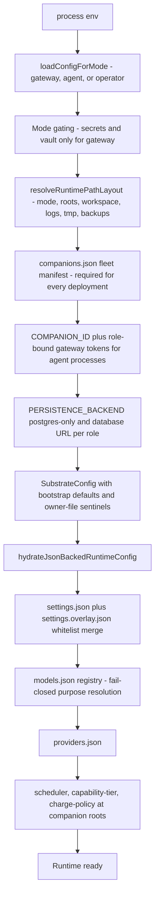
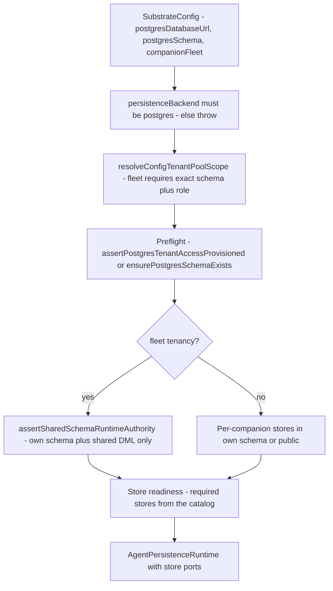

# Specifications: Config, Persistence, Fail-Closed Contracts

This page is the compact contract for how the live runtime is supposed to
behave: who owns configuration, where persistence lives, and which contracts
fail closed. It is the wiki companion to the hand-maintained
[`docs/specifications.md`](../docs/specifications.md) source-of-truth list and
to [`architecture.md`](architecture.md) (runtime shape and composition),
<!-- openwiki: broken internal link [memory-persistence-authority.md] file "memory-persistence-authority.md" does not exist. Fix the href or restore the target, then delete this comment. -->
[`memory-persistence-authority.md`](memory-persistence-authority.md) (who may
<!-- openwiki: broken internal link [cognitive-security.md] file "cognitive-security.md" does not exist. Fix the href or restore the target, then delete this comment. -->
write canonical storage), [`cognitive-security.md`](cognitive-security.md)
(trust, intake, and disclosure policy), [`setup.md`](setup.md) and
[`operations.md`](operations.md) (install and lifecycle surfaces).

Architectural authority beyond this page is the project charter
([`docs/PSFN_PROJECT_CHARTER.md`](../docs/PSFN_PROJECT_CHARTER.md)); this page
describes how the runtime realizes it. The split runtime — privileged gateway,
isolated agent (Companion Core), operator Garden plane — is the **only**
supported shape, PostgreSQL is the **only** runtime persistence backend, and
fail-closed contracts stay fail-closed: there are no compatibility shims,
silent fallbacks, or SQLite runtime paths. When prose and code disagree, the
code wins — entrypoints and contracts first.

## Source-of-truth order

The repository treats these as canonical, in this order:

1. Runtime entrypoints and composition — `src/app/gateway/main.ts`,
   `src/app/agent/main.ts`, `src/app/operator/main.ts`,
   `src/app/startup/composition/*` (the legacy monolith
   `src/app/startup/index.ts` is disabled and exits fail-closed).
2. Config and persistence contracts — `src/shared/contracts/runtime.ts`,
   `src/shared/contracts/runtime-base.ts`, `src/system/settings.ts`,
   `src/system/config/*`, `src/persistence/layout.ts`,
   `src/persistence/postgres.ts`, `src/persistence/runtime-factory.ts`.
3. Bootstrap examples only — `.env.example` and `config/*.seed.json`.

## Config loading and ownership

### One loader per runtime role

The config layer exposes exactly three entrypoints
(`src/system/config/load-config.ts`):

| Role | Loader | Notes |
| --- | --- | --- |
| Gateway | `loadConfig()` | Secret-bearing config: credential vault, Discord tokens, role-bound gateway tokens |
| Isolated agent | `loadAgentConfig()` | Fleet-bound identity; requires role-bound gateway credentials; no secret-bearing startup fields |
| Operator | `loadOperatorConfig()` | Sanitized core projection; no companion identity, no personal workspace |

`COMPANION_ID` is mandatory for gateway and agent startup and the operator
carries no companion identity. Every agent additionally requires both
`GATEWAY_COMPANION_AUTH_TOKEN` (fleet agent authentication) and
`GATEWAY_SESSION_INTEGRITY_AUTH_TOKEN` (isolated session-integrity role);
startup aborts without either.

### Deferred post-turn queue migration boundary

Runtime startup may hydrate only the exact schema-v1 deferred post-turn queue
envelope and valid v1 entries into schema v2. It may derive each entry's durable
demand start and coverage cursor from its validated action and initialize the
new coalescing and retryable-failure counters to zero. Missing action, retry,
timing, capability, or runtime-lane fields are not guessed: malformed entries
are quarantined, and surviving entries are atomically rewritten as v2.

Validate this live-alpha boundary with the mixed valid/invalid v1 hydration
regression and the v2 restart tests for retry checkpoints, coverage cursors,
and pending successors in `post-turn-actions.test.ts`. Remove the v1 reader
before beta after every supported companion has completed a successful v2
rewrite and no retained operational backup requires a v1-capable runtime.

### `.env` vs JSON owner files

The ownership law is strict: **`.env` owns only secrets, host/port/socket
wiring, runtime mode/layout wiring, and explicit bootstrap overrides. JSON
owner files own all mutable runtime state.** Concretely:

- JSON-backed runtime setting env vars (`PRIMARY_MODEL`, `SESSION_MIRROR_ENABLED`,
  `EMBEDDING_PROVIDER`, `THINK_MAX_TOKENS`, ...) are **ignored** by the loader:
  they never override an owner file. The startup preflight logs a warning for
  every ignored key (`getIgnoredJsonBackedConfigEnvKeys`), and the loader emits
  canonical bootstrap defaults — including the `__owner_file_required__`
  sentinel for model identity — until the JSON hydration pass replaces them.
- The mutable owner files are `settings.json`, `models.json`, `providers.json`,
  `scheduler.json`, `capability-tier.json`, `channels.json`, `skills.json`,
  `trust-policy.json`, `mcp-servers.json`, `charge-policy.json`, `backup.json`
  (plus topology/authority owners `companions.json`, `fleet-auth.json`,
  `automata-policy.json`, `subagent-roles.json`, `partner-affect-shadow.json`,
  `intake-policy.json`).
- Missing required owner files **fail closed**: the loader never copies
  distributed seed/example files into runtime state
  (`Startup no longer copies distributed seed/example files into runtime state`).
- Owner files carry canonical POSIX modes enforced against the runtime
  identity: `fleet-auth.json` is owner-only `0600`, per-companion policy owners
  are group-readable `0640`, and fleet-shared system owners are `0644`.

### Loading pipeline

*Config loading pipeline: env produces a bootstrapped `SubstrateConfig`, then the JSON hydration pass applies owner files in a fixed order.*

`hydrateJsonBackedRuntimeConfig` (`src/system/config/runtime-config.ts`) is the
owner-file pass that replaces the bootstrap defaults: it loads
`settings.json` from system-data, merges the per-companion
`settings.overlay.json` (whitelist-only, see below), applies `models.json`
(validating every per-companion model-purpose selection against the hydrated
registry **at startup, never at first call**), applies `providers.json`, and
then roots `scheduler.json`, `capability-tier.json`, and `charge-policy.json`
at the **companion data dir** so fleet companions hold distinct schedules,
tiers, and ledgers.

Mode-specific hardening:

- **Gateway** requires `POSTGRES_DATABASE_URL`; it is the only mode that
  materializes the credential vault and secret-bearing config keys
  (`CORE_SECRET_BEARING_CONFIG_KEYS`: credential vault, Discord tokens, gateway
  tokens, `postgresDatabaseUrl`, fleet-auth, API keys). Discord token and bot id
  are mutually required when either is configured.
- **Agent** resolves its database credential from env, secret file, or file
  descriptor (`POSTGRES_DATABASE_URL` / `_FILE` / `_FD`) and rejects a raw
  inline credential where the secret-file path is the contract; agent config
  stays free of secret-bearing startup fields.
- **Operator** may resolve the direct Garden database credential optionally —
  absence is not fatal here, presence is enforced fail-closed at the point of
  use — and its projection runs through `sanitizeCoreSubstrateConfig`, which
  strips every secret-bearing key from the core config.
- **Production runtime layout** rejects global TLS verification bypasses:
  `GATEWAY_TLS_REJECT_UNAUTHORIZED=false` and `NODE_TLS_REJECT_UNAUTHORIZED=0`
  both abort startup, forcing endpoint-scoped TLS trust
  (`GATEWAY_TLS_CA_PATH`) instead. `WORKSPACE_PATH` is mandatory in production
  layout (startup preflight throws when unset).

## Settings contract and ownership scopes

`src/system/config/settings-contract.ts` builds the versioned
`SettingsContractData` (schemaVersion 1) that Garden and runtime resolution
share: one **owner subsystem** and **owner file** per field, a closed field
**type** (`string`, `boolean`, `integer`, `number`, `string_array`, `enum`,
`object`), optional numeric ranges and enum values, deprecation, and a
`global` vs `perCompanion` **scope**. Scope derives from the overlay whitelist:
`isCompanionSettingsOverlayKey` tags a key `perCompanion` exactly when
`settings.overlay.json` may override it.

Two ownership rules matter operationally:

- **Per-companion owner files** (`PER_COMPANION_OWNER_FILES`):
  `capability-tier.json`, `scheduler.json`, `charge-policy.json`,
  `skills.json`, `partner-affect-shadow.json` are rooted at each companion data
  dir — one companion can never inherit another companion's circadian cadence,
  maturation tier, charge ledger, enabled skill set, or co-emotion subject.
- **Per-companion settings overlay** (`settings.overlay.json`): an absent
  overlay is byte-identical behavior; a present overlay may set only keys in
  `COMPANION_SETTINGS_OVERLAY_WHITELIST` (active timezone, voice identity,
  model-purpose selection, observer sidecar, emotion scoping, CogSec baseline,
  discord trigger policy, ...). Any non-whitelisted key fails startup closed —
  it is never silently merged.

## The eight-domain registry

`src/system/config/settings-domain-registry.ts` is the single typed authority
for exactly **eight operator-approved configuration domains**, in stable
canonical (Garden tab) order:

| Domain | Current owner files | Scope | Activation / failure | Apply |
| --- | --- | --- | --- | --- |
| core | `settings.json`, `backup.json` | global | boot_critical / runtime | live |
| models | `models.json`, `providers.json` | global | boot_critical / runtime | live |
| channels | `channels.json` | global | boot_critical / gateway | component_restart |
| memory | `memory.json` (future), `partner-affect-shadow.json` | global | required_when_enabled / feature | live |
| scheduler | `scheduler.json` | perCompanion | required_when_enabled / agent | live |
| cogsec | `trust-policy.json`, `intake-policy.json` | global | boot_critical / runtime | live |
| economy | `charge-policy.json` | perCompanion | required_when_enabled / feature | live |
| capabilities | `capability-tier.json`, `skills.json`, `subagent-roles.json` | perCompanion | boot_critical / runtime | component_restart |

Every descriptor records its canonical target file, the real owner files that
feed it today, named schema validators, inheritance mode (`global_only` /
`companion_override` / `companion_required`), and code-owned security bounds
metadata (floors, ceilings, stricter-never-weaker). `verifySettingsDomainRegistry`
fails closed on unknown/missing/duplicate domain ids, overlapping owner files,
invalid metadata, Garden tab drift, and relations to unknown domains — and it is
wired into `npm run verify:settings-contract` so the registry is continuously
asserted. **Topology, authority, and namespaced-extension owner files**
(`automata-policy.json`, `companions.json`, `fleet-auth.json`,
`mcp-servers.json`, `satellites.json`) are explicitly
`SETTINGS_NON_DOMAIN_OWNER_FILES` and may never be claimed by a domain; any
field owned by a non-domain file fails the guard closed.

The settings contract guard (`src/system/config/settings-contract-guard.ts`)
continuously asserts backend schema, Garden field-exposure metadata, raw-editor
subsystems, and owner-file inventories stay aligned, and fails closed when a
schema field loses Garden exposure or a Garden field drifts to a non-runtime
owner.

`config/settings.seed.json` is the canonical default-bearing runtime settings
file: `loadRuntimeSettingsContractDefaults` parses it through the runtime
owner-file schema and requires every seed key to be a runtime-owned,
non-deprecated `settings.json` contract field — an unknown seed key is a
contract violation, not a warning.

## Persistence layout

### Two roots, never one

`resolveRuntimePathLayout` / `resolvePersistenceRoots`
(`src/persistence/layout.ts`) enforce:

- `SYSTEM_DATA_DIR` and `COMPANION_DATA_DIR` must be set **together** — one
  without the other throws.
- They must be **distinct roots** — equal paths throw.
- `DATA_DIR` (legacy shared root) is accepted **only in continuous layout
  mode**; production forbids shared-root operation entirely.

`resolveRuntimeLayoutMode` (`src/shared/runtime-layout-mode.ts`) maps
`continuous | dev | development` to continuous and `production | prod | live`
to production; an unknown explicit mode throws, and `NODE_ENV=production`
resolves to production. Defaults: production uses
`./runtime/production/{system-data,companion-data,workspace,logs,tmp,backups}`;
continuous uses `./data` (system), `./companion` (companion), `./workspace`,
`./logs`, `./tmp`.

In production mode three assertions make the split enforceable rather than
advisory — **no duplicate roots**, **no overlapping roots** (no root a strict
subpath of another), and **workspace isolation** (the personal workspace must
not overlap any runtime state root) — over system-data, companion-data,
workspace, logs, tmp, and backups.

### Where artifacts live

- All companion-owned mutable state resolves under
  `resolveCompanionStateDir(companionDataDir)` → `companion-data/state/`
  (sessions, notes, contacts, reflection journals, prompt lineage, core memory,
  ledgers, owner files).
- System-owned operator state lives under `system-data/state/`
  (tool-conformance runs, post-rollout validation verdicts, Helm rollback
  act-once ledgers).
- **Shared-world wiki documents are NOT companion-data**: they are
  operator/caretaker-owned world knowledge under
  `system-data/shared-world/wiki/sites/<siteId>`, one subtree per site, with a
  containment check that rejects any site id escaping the sites root.

`migrateLegacyPersistenceLayout` moves recognized legacy companion artifacts
(sessions, notes, reflections, continuity files, charge/fatigue ledgers, ...)
into the `state/` subtree and then ensures the canonical layout directories
exist; `createAgentPersistenceRuntime` invokes it before opening any store.

## Postgres runtime authority

### The only backend

`PersistenceBackend` is the literal type `'postgres'`. `PERSISTENCE_BACKEND`
accepts only `postgres | postgresql | pg`; anything else aborts startup, and
`createAgentPersistenceRuntime` refuses to build unless
`config.persistenceBackend === 'postgres'` with a configured
`postgresDatabaseUrl`. There is no SQLite runtime path and no
app-side vector-scan fallback that changes truth.

The repository gate `scripts/verify-postgres-only.mjs` (`npm run
verify:postgres-only`) enforces the law mechanically: it fails on retired
SQLite packages in `package.json`/`package-lock.json`, on any retired
implementation path that still exists with content, on any unclassified
retired-backend token reference in the scanned sources and docs, and on a
stale allowlist entry whose classified contract text disappeared. The only
sanctioned residual references are the network-less shell-sandbox `sqlite3`
CLI toolset (local-file analysis tooling, not a store) and a disposable Node
SQLite recovery-index worker under the OS temporary directory that never
selects a persistence backend. The live alpha cutover boundary is
preservation-without-opening: two-root layout/recovery flows may preserve or
move opaque pre-cutover artifacts (for example a legacy shared-root
`companion.db`) but never open them through a SQLite implementation — the gate
classifies those fixtures and contract texts and fails closed if the boundary
text disappears or an implementation returns.

### Identifiers, pools, and the fail-closed seam

- **Identifier validation** (`src/persistence/postgres.ts`): schema and role
  names must match `^[a-z][a-z0-9_]*$` within the 63-byte NAMEDATALEN limit
  (roles additionally reject `public`). Unvalidated identifiers are never
  interpolated into `search_path` or DDL strings.
- **Pool pinning**: `createPostgresPool` pins every connection's `search_path`
  to the validated tenant schema plus the dedicated `extensions` schema via
  libpq `options`, optionally with a least-privilege role and
  `default_transaction_read_only=on`. A role is accepted only together with an
  explicit schema. `public` is deliberately absent so a missing tenant table
  fails instead of falling through to legacy data; when no schema is provided
  behavior is byte-identical to the libpq default.
- **NUL stripping**: Postgres rejects `0x00` in text/jsonb bind parameters
  (`22021`), so NUL bytes are stripped from string bind parameters at the
  shared pool/client boundary for every query — idempotently per pooled client.
- **Migrations**: DDL chains run inside a transaction
  (`withPostgresClient`) and, where concurrent processes race, under a stable
  advisory lock (`ensurePostgresSchemaWithAdvisoryLock`) with signed 32-bit
  lock keys; `ensurePostgresSchemaExists` checks `to_regnamespace` before
  `CREATE SCHEMA IF NOT EXISTS`, always through the validated identifier.

### Store readiness

Every PostgreSQL store opened by a production workload is classified in
`POSTGRES_STORE_READINESS_CATALOG` (`src/persistence/postgres/runtime-readiness.ts`)
as `required` or `optional`. Startup waits on required stores and fails closed
with a named `PostgresStoreReadinessError` when a required store cannot become
ready; optional stores (ANN index, wiki projection, diagnostics, admin
projections) degrade without taking the runtime down. The runtime factory
opens the whole `AgentPersistenceRuntime` bundle — memory, episodic, reflection
mirror, contacts, intention, internal state, participant trends, scheduled
prompts, introspection landmarks, background work, Automata run/bus/retention —
each through the readiness seam.

*Persistence runtime selection: the factory fails closed on backend, pins the tenant boundary, preflights it, and only then opens readiness-catalogued stores.*

### Tenancy and the shared schema

- **Per-companion tenancy is an explicit opt-in** (`COMPANION_PG_SCHEMA`),
  never derived from `COMPANION_ID` — auto-deriving would silently move
  single-companion runtimes off `public` where their data lives. When the var
  is present it must be a valid schema identifier or startup aborts; when
  absent, runtime persistence uses `public` byte-identically to today.
- In fleet deployments every agent pool is scoped to the exact manifest tenant
  tuple by `resolveConfigTenantPoolScope`, which **fails closed rather than
  defaulting to `public`** when the manifest is present, and refuses to repair
  or migrate tenant roles, schemas, or extensions — startup only verifies the
  provisioned boundary.
- **Multi-companion shared-schema stores** (companion presence, per-companion
  social pot, speaking arbiter) exist only when fleet tenancy is enabled, and
  every agent must pass `assertSharedSchemaRuntimeAuthority` — proving exact
  own-schema plus shared DML authority, reciprocal tenant isolation, and zero
  `fleet_auth` access — before opening one. Flag-off never touches the shared
  schema.

## Runtime contracts (shared)

`src/shared/contracts/runtime-base.ts` is the channel-agnostic contract core
shared by gateway and agent: turn records, model slots and catalog entries,
`CANONICAL_MODEL_PURPOSES`, and the canonical model registry shapes. Two
contracts govern config-to-runtime handoff:

- **Model purpose selection (23pp)**: `ModelPurposeSelection` maps a canonical
  purpose (`chat`, `memory`, `summary`, `vision`, ...) to a models.json
  registry entry id. The catalog and provider credentials stay gateway-global;
  only the *selection* is companion-scoped through `settings.overlay.json`.
  The `moa` purpose is not selectable — MoA choices are owned by
  `moaReferenceModels`/`moaAggregatorModel`. Every selection must resolve to an
  enabled registry entry or startup fails closed.
- **Lifecycle and hooks**: `Lifecycle` is exactly `init`/`start`/`stop`;
  `RuntimeConfigHooks` exposes `refreshModels`, `refreshCapabilities`,
  `invalidatePromptPrefixCache`, and `persistPromotedExtendedTools`.

## Fail-closed contract summary

- No SQLite runtime path; no persistence backend fallbacks that change truth;
  `PERSISTENCE_BACKEND` other than postgres aborts startup;
  `scripts/verify-postgres-only.mjs` fails the repository gate on retired
  packages, retired paths, unclassified references, or a dropped boundary
  contract.
- No silent fallback from JSON owner files to `.env`; JSON-backed env vars are
  ignored and warned about; missing required owner files abort startup.
- `DATA_DIR` shared-root is continuous-mode only; production demands isolated,
  non-overlapping roots and a mandatory `WORKSPACE_PATH`.
- Global TLS verification bypass (`GATEWAY_TLS_REJECT_UNAUTHORIZED=false`,
  `NODE_TLS_REJECT_UNAUTHORIZED=0`) is rejected in production layout.
- Unvalidated Postgres schema/role identifiers never reach SQL; tenant pools
  never default to `public` when a fleet manifest is present; fleet startup
  verifies but never repairs tenant boundaries.
- Unknown settings-domain ids, non-domain owner claims, non-whitelisted
  overlay keys, and unregistered seed defaults are contract violations, not
  warnings.

## Verification

- `npm run verify:settings-contract` asserts the settings contract guard and
  the eight-domain registry (`settings-contract-guard.test.ts`,
  `settings-domain-registry.test.ts`).
- `npm run verify:postgres-only` (`scripts/verify-postgres-only.mjs`) is the
  mechanical Postgres-only persistence gate — retired SQLite packages, retired
  implementation paths, unclassified retired-backend references, and stale
  allowlist entries all fail — and runs inside
  `npm run verify:repository-hygiene:structural`.
- `load-config.test.ts` pins the fail-closed env behavior (ignored JSON env
  vars, missing `POSTGRES_DATABASE_URL`, partial split roots, production TLS
  rejects, agent credential/token requirements, operator secret-free
  projection).
- `runtime-config.test.ts` pins owner-file hydration and per-companion rooting
  (`scheduler.json` phase-lock, models-over-env precedence).
- `layout.test.ts` pins root resolution, production disjointness guards, and
  the shared-world containment check.
- `postgres.test.ts` pins identifier validation, search_path pinning, role
  requirements, and NUL stripping; `runtime-factory.test.ts` pins the
  postgres-only factory, tenant preflight, and store readiness failures.
