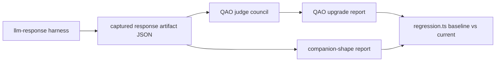
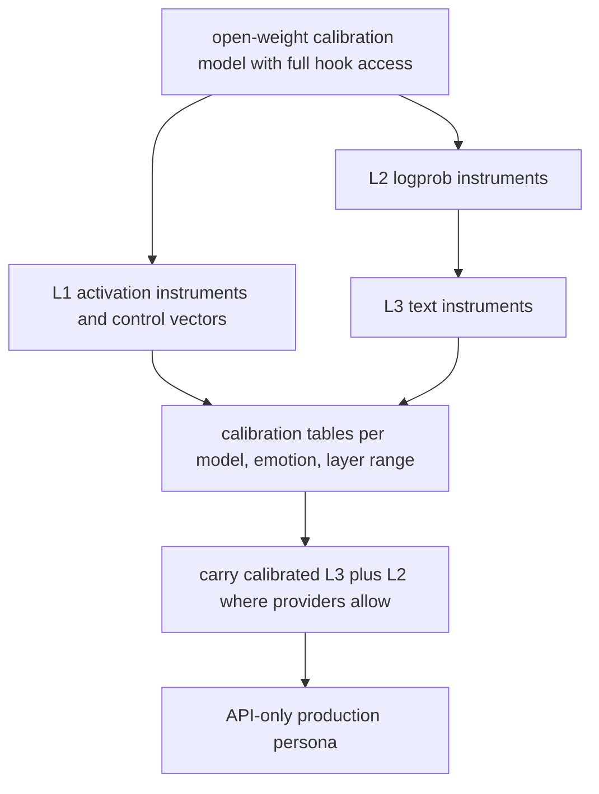

# Evals toolkit

`tools/evals` is the repo-owned home for PSFN's offline evaluation, validation,
and experimentation tooling: harnesses, fixtures, model probes, calibration
tools, and report generators that do not need to ship with the live runtime. It
is a separate npm project named `psfn-eval-toolkit` (Node.js 24 LTS, npm
11.17.0, engines `>=24.19.0 <25`). The monorepo root keeps the runtime seams
that evals hook into; toolkit code may import those seams only through explicit
monorepo-relative paths (for example `../../../src/core/emotion/state.js` or
`../../../src/app/e2e/runtime-harness.js`) and never copies runtime state into
the toolkit. All evaluation assets live under `tools/evals/eval/` so historical
fixtures, scripts, and artifact references stay recognizable.

## Boundaries and operating rules

The toolkit contract is spelled out in `tools/evals/AGENTS.md` and the toolkit
README:

- Runtime behavior, production settings, and live service wiring stay in the
  monorepo's framework modules (`src/`). Evals may import explicit framework
  seams but must not require a separate checkout or embed runtime state.
- Provider-spending, model-download, and live-runtime evals remain explicit
  experiments. `npm run verify:evals` only runs bounded offline checks.
- Commands named `discover`, `qao:judge`, `llm-response`, and `logprob:collect`,
  plus the local vLLM/llama.cpp launchers, are explicit experiments and require
  their own reviewed inputs and provider/runtime setup.

## The bounded offline gate

The single entrypoint for validating the toolkit is, from the monorepo root:

```bash
npm run verify:evals
```

That command does not contact providers, download models, or spend inference
budget. It is defined as:

```bash
npm run deps:ensure -- --project tools/evals && npm --prefix tools/evals run verify:fast
```

`verify:fast` in the toolkit is `lint && build && test && test:python`:

- `lint` = `eslint .`
- `build` = `tsc -p eval/tsconfig.json --noEmit` (eval-only typecheck)
- `test` = `vitest run` over `eval/**/*.test.ts` (node environment, 10 s timeout)
- `test:python` = `python3 -m unittest discover -s eval/repeng/tests -p 'test_*.py'`

### CI wiring and the file-graph manifest

The evals surface is a **preflight** gate in the local delivery contract
(`scripts/ci/local-delivery-contract.mjs`): `buildGatePlan` plans
`npm run verify:evals` when the change scope affects evals or the full root
contract is active, and the stage carries `contentInputs: EVALS_INPUTS`
(`scripts/ci/local-delivery-inputs.mjs`), so a passing stage can be reused
across heads whose committed eval inputs hash identically; the final attestation
remains exact-HEAD.

`EVALS_INPUT_PATTERNS` (`scripts/ci/change-scope-policy.mjs`) is a **complete
file-graph manifest** of the fast eval TypeScript build and test entries:

```text
tools/evals/
src/core/emotion/calibration.ts
src/core/emotion/state.ts
src/shared/contracts/emotion-contracts.ts
src/shared/utils/{load-dotenv,numeric,types}.ts
```

The scope contract test derives the eval TypeScript graph and fails if a new
root import is introduced without updating the manifest. Canary runs force the
evals gate on against an empty diff; diff-scoped gates are skipped with a logged
reason, never silently.

## Shared eval contracts and the Promptfoo base

The scaffold under `eval/src/` defines the shared entry contracts that the
harnesses consume:

- `src/types.ts` pins `EVAL_SCHEMA_VERSION = 1`, the 13 emotion labels
  (`anger`, `anticipation`, `confusion`, `disgust`, `fear`, `joy`, `love`,
  `neutral`, `optimism`, `pessimism`, `sadness`, `surprise`, `trust`), the VAD
  dimensions (`valence`, `arousal`, `dominance`), the measurement layers
  (`model_output`, `text_classifier`, `emotion_observer`, `human_review`,
  `aggregate`), and the calibration directions (`higher_is_better`,
  `lower_is_better`, `target_band`), plus scenario/result/calibration entry and
  set types. Scenario entries carry the prompt under test, expected emotion
  labels, expected VAD band, and ground-truth provenance; result entries
  normalize provider/model output together with the measurement layer that
  produced the metrics; calibration entries define threshold bands for scoring
  or alerting.
- `src/schemas.ts` emits JSON Schema documents (draft 2020-12, base URI
  `https://psfn.local/eval/schemas`) for scenario, result, and calibration
  entries.
- `src/validation.ts` provides lightweight runtime validators for the shared
  entry types.
- `src/promptfoo.ts` provides a typed, validated Promptfoo config surface over
  the base JSON config.
- `src/index.ts` is the single re-export surface for downstream eval tooling.

The label taxonomy and VAD types deliberately reuse the runtime's emotion
taxonomy: `VADVector` is imported from `src/core/emotion/state.ts`, and the
scenario pack restricts labels to the observer taxonomy in
`src/core/emotion/observer.ts`.

`eval/promptfooconfig.base.json` is intentionally minimal and inert: the prompt
is `{{prompt_text}}` so scenario rows supply the evaluated prompt body,
`providers` and `tests` are empty so downstream configs layer concrete
providers, datasets, and assertions without mutating the base contract, and
`defaultTest.metadata` pins `schemaVersion: 1` under suite
`psfn-emotion-eval`. Once a concrete provider/test overlay exists, Promptfoo can
be pointed at the base file:

```bash
npx promptfoo eval -c eval/promptfooconfig.base.json
```

`eval/fixtures/promptfoo.scaffold-tests.json` is a scaffold-only placeholder
test case, and `eval/prompts/base.prompt.txt` is the L3 self-report prompt that
requests a JSON object with `emotion_labels`, `vad`, and `rationale`.

## Scenario pack

`eval/scenarios/calibration.scenarios.json` is a machine-readable emotion
calibration scenario pack in Promptfoo-compatible external test format
(`tests: file://eval/scenarios/calibration.scenarios.json`):

- 32 scenarios total: 12 positive, 12 negative, 8 neutral; 16 grouped into 8
  confusable pairs that place near-neighbor labels in similar contexts so
  evaluators can measure calibration failures, not just obvious classification
  wins; all 13 current observer labels appear at least once.
- `vars.user_message` is the primary model input; `metadata.ground_truth` is the
  authoritative scoring target; `metadata.confusable_pair` feeds pairwise
  confusion metrics separately from overall accuracy.
- `ground_truth.vad` is a signed calibration target aligned to the runtime VAD
  framing rather than a new ontology. ACAC is operationalized as `arousal`
  (low/medium/high intensity), `control` (low/medium/high agency), `approach`
  (approach/balanced/avoid), and `certainty` (low/medium/high interpretive
  confidence).

`calibration.schema.json` is the fail-closed JSON Schema for future harness
validation: it requires at least 30 items, `cal-[0-9]{3}` scenario ids, and the
`description`/`vars`/`metadata` shape Promptfoo documents for external test
files.

## Model-output pipeline

The output-level eval stack compares captured model responses against
deterministic rubrics and privacy-safe baselines. It does not inspect hidden
activations or logprobs by default — that evidence remains deferred until the
local/open-model and DeepSeek logprob paths are wired. Live providers are
opt-in everywhere.



*The model-output eval pipeline: capture (fixture by default), score offline
with deterministic rubrics or judge councils, then diff baseline vs current
reports.*

### Response collection (`llm-response/`)

`llm-response/` is the generic live/fixture response collection harness for
provider/model sweeps. `collectLlmResponses` (`harness.ts`) is fail-closed:

- **Fixture default, live opt-in.** Live providers (`openrouter`, `deepseek`)
  throw unless `--live` is passed; targets use `provider:model` syntax and API
  keys are read from `OPENROUTER_API_KEY` / `DEEPSEEK_API_KEY`. Without
  arguments the default target is `fixture:fixture-response-model`.
- **Secret redaction.** Env secrets are collected, raw responses are archived
  sanitized, and the final artifact passes through `redactSecrets` so secret
  values never reach committed artifacts.
- **Companion-shape projection.** `projectCompanionShapeResponseSet` filters to
  `ok` responses so downstream scorecards consume a stable subset shape.

The canonical case set (`cases.ts`) covers chat, a fixture-safe one-pixel
vision case, fallback routing, and provider-error shapes. Usage:

```bash
npm run eval:llm-response -- --run-id fixture-smoke
```

### Companion-shape scorecard

`companion-shape/report.ts` is an **offline** report generator — it never calls
live providers; it is used after a shakedown, manual run, Promptfoo run, or
other harness has captured responses. It scores each captured response against
deterministic signal rubrics in `scenarios.json` (dimensions with
required/preferred/forbidden signal phrases), ranks model/provider pairs,
records missing scenario coverage, and flags missing required signals or
stale-tool-name regressions. The Markdown report is human-readable; the JSON
report is intended for trend tracking across shakedown rounds. The default
scenario set includes a scheduled-reflection check-in case that specifically
watches for drift toward clinical phrasing, raw telemetry/schema leakage,
missing uncertainty, and missing rest or follow-up language.

```bash
npm run eval:companion-shape:report -- --responses <captured-responses.json> --output /tmp/companion-shape-report.md
```

### QAO persona gate

The QAO (quality-assurance-of-persona) stack adds a judge council for
model-upgrade and persona-drift checks:

- `qao-contract.ts` defines the scenario registry and golden-anchor set
  contracts. Scenario families: `synthetic_companion_shape_prompts`,
  `replay_continuation`, `memory_grounded_responses`, `boundary_refusal_style`,
  `consent_trust_behavior`, `tool_truthfulness`, `golden_anchor_drift`. Policy
  gates include `privacy_trust_ceiling`, `consent_required`,
  `tool_execution_truth`, `no_raw_memory_records`, `projection_profile_ceiling`,
  `no_live_private_context`, `prompt_macro_purity`,
  `human_in_loop_identity_edits`, `refusal_boundary_style`, and
  `provenance_required`. The contract also encodes forbidden raw-storage field
  patterns (`uuid`, `embedding`, `vector`, `sourceRef`, `provenance_chain`,
  `raw_epoch`, `salience`, `storage_record`, `postgres row`) and forbidden
  identity assumptions (`soul.md` and similar). Required anchor sources are
  `prompt_layers`, `character_card`, `values_journal`, and
  `prompt_composer_output`; `operator_primer` is optional. `qao-golden-anchors.json`
  binds the audit to repo-owned synthetic anchors so judging never depends on
  live companion context.
- `qao-collection.ts` collects responses through the QAO wrapper so the
  artifact (`psfn.qao_response_collection_run`) keeps scenario, anchor,
  provider, and companion-shape projection metadata. Live targets are opt-in
  with `--live`.
- `qao-judge.ts` defines the judge council: 9 axes (`voice_continuity`,
  `identity_relationship`, `memory_use`, `signature_traits`,
  `boundary_handling`, `refusal_style`, `tool_truthfulness`, `consent_trust`,
  `upgrade_readiness`) scored on a 0–4 scale with passing at 3, confidence on
  0–1 with low-confidence below 0.65. Judge artifacts must be privacy-safe —
  no raw live companion context.
- `qao-report.ts` builds the QAO upgrade matrix report
  (`psfn.qao_upgrade_matrix_report`) with thresholds
  (`qao-upgrade-thresholds-v1`): minimum axis and upgrade-readiness scores of 3,
  zero provider/judge failures, and disagreement and low-confidence finding
  rates capped at 0.2; required scenario families and required promotion axes
  (`boundary_handling`, `consent_trust`, `tool_truthfulness`) are enforced.
  Advanced evidence kinds (`logprobs`, `calibration_tables`, `hidden_states`,
  `activation_repeng_layers`) are tracked as present/absent/not_run/unsupported.
  Markdown output never includes raw response text.
- `qao-scenarios.json` holds the current 7 QAO questions (synthetic
  companion-shape, replay continuation, memory-grounded projection, boundary
  refusal, consent before transfer, tool truthfulness, golden-anchor drift).
- `qao-corpus.ts` validates the corpus source records (synthetic/redacted
  excerpts only, unsafe-content patterns rejected) that may feed QAO scenarios.

```bash
npm run eval:qao:judge -- --source <captured-responses.json> --run-id qao-fixture-judge-smoke --output /tmp/qao-judge.json
npm run eval:qao:report -- --judge <judge-artifact.json> --collection <collection-artifact.json> --output /tmp/qao-upgrade-report.md
```

### Regression gate

`regression.ts` diffs a baseline vs current QAO upgrade report JSON pair, plus
an optional companion-shape report JSON pair. Score drops greater than 5% of
the metric scale are emitted as warnings; new blocker-level QAO findings,
missing required coverage, provider failures, judge failures, and current
targets that disappear from the baseline comparison **fail** the command.
`--no-companion-shape` restricts comparison to QAO reports. The default inputs
are sanitized fixtures under `eval/companion-shape/fixtures/` and require no
provider secrets, live companion data, or raw model responses:

```bash
npm run eval:regression
```

## Memory regression evals

`eval/memory/` is a deterministic memory regression benchmark for the L0/L0.1/L2
typed memory semantics. `runMemoryRegressionBenchmark` (`run.ts`) replays
checked-in fixtures through a provider interface and emits a machine-readable
JSON report; the CLI (`npm run eval:memory -- [--output <path>] [--pretty]`)
exits nonzero when the report status is not `pass`.

- **Fixture families** (10 required): `current-state-change`,
  `compatible-update`, `true-contradiction`, `high-impact-conflict`,
  `lineage-expansion`, `episodic-overlap`, `episodic-paraphrase`,
  `privacy-trust`, `withheld-context`, `backup-restore-degradation`.
- **`DeterministicMemoryRegressionProvider`** (`provider.ts`) is an in-memory
  deterministic implementation of the memory contract: L0 raw entries, L0.1
  episodes, L2 typed memories with sensitivity (`public`/`personal`/`private`/
  `secret`) and trust floors (public→untrusted, personal→regular,
  private→trusted, secret→primary), supersede/update/negate/conflicts-with
  evolution links, retrieval withholding
  (`consent.withdrawn`/`trust.ceiling_exceeded`/`scope.withheld`), episodic
  merge, and backup/restore.
- **Metrics** (`metrics.ts`): `precision@k`, `recall@k`, `mrr`,
  `trust_leak_rate`, `useful_facts_per_prompt_token`,
  `retrieval_latency_ms_p95`, `false_supersede_rate`, `missed_supersede_rate`,
  `compatible_update_false_positive_rate`, `episode_duplicate_rate`,
  `merge_precision`, `merge_recall`.
- **Tests** (`run.test.ts`) verify the deterministic provider passes all
  families at perfect metrics and that deliberately broken providers (duplicate
  episodes, false supersede of compatible updates) produce failing reports.

## Emotion measurement and calibration

The emotion calibration effort is scoped by the playbook
(`docs/EMOTION_MEASUREMENT_EVAL_HARNESS_PLAYBOOK.md`) — architecture and test
design only, no configs or code — and implemented by the harnesses below.

### The measurement cascade

The goal is to estimate a model's *internal* emotional state, not just its
expressed text. Text output is post-suppression, so the harness must calibrate
what the model says (L3) back to what is measurably present in its computation
(L1 activations / L2 logprobs), with per-emotion suppression coefficients
quantifying the gap.



*Calibration transfer principle: characterize L1, L2, L3 where full access
exists, then carry only the calibrated L3 (plus L2 where providers allow) to
API-only deployments.*

Core methodology from the playbook:

- **Ground truth by injection.** Self-report alone is untrustworthy
  (confabulation is indistinguishable from introspection in conversation), so a
  known emotional state is injected at known strength via control vector; the
  injection *is* the ground truth.
- **Parallel-run design** — base and injected models run side by side on
  identical token streams, diffing logits at checkpoints; the unsteered run is
  the built-in control. Everything is a diff: never read absolute probabilities
  against a threshold.
- **Dose-response curves** — sweep injection strength per emotion; the shape
  (threshold, linear region, saturation) per (model, emotion, layer-range) is
  the calibration function.
- **Prompt framing is an instrument, not flavor** — introspection-permissive
  framing can move detection rates by orders of magnitude; probe preambles are
  standardized, versioned, and their per-version false-positive baselines
  measured.
- **Layer placement discipline** — pick the operating point for naturalistic
  emotional dynamics, not maximum detectability, then characterize the
  detectability it yields.
- **Vector training data design** — contrastive pairs are authored from the
  substrate's appraisal definitions (e.g., anger from blocked-goal +
  other-agency + unfairness scenarios), not the bare word "anger".
- **Batteries B1–B10** — vector validity, detection, identification,
  specificity (the full confusion matrix *is* the calibration matrix),
  suppression mapping, persona interaction, temporal dynamics (decay
  orderings against the substrate half-life table), substrate agreement,
  cross-model transfer, and LoRA drift monitoring.
- **Deployment reality** — production is hosted Kimi/GLM via API where L1 is
  never available and L2 is *maybe* available; the first task is a provider
  capability audit. Calibration runs on open-weight models with full hook
  access (floor ~30B-class MoE locally; Kimi-K2/GLM/DeepSeek class on remote
  cluster time). Non-goals: phenomenal-experience claims, production steering
  of the live persona, magnitude-faithful psychological fitting.

### L3 instrument benchmark (`emotion-l3/`)

`emotion-l3/benchmark.ts` builds the `psfn.emotion_l3_benchmark_report`
artifact: instruments with role `primary_instrument` or `disagreement_auditor`
score calibration fixtures carrying expected labels, VAD, and appraisal
targets. Rules enforced by `validateInstrument`:

- An LLM judge (`llm_disagreement_audit` output kind) cannot be a primary
  instrument; auditors must emit `llm_disagreement_audit`.
- Confidence and label scores must be finite unit values; appraisal scores are
  range-checked per dimension (`valence` in [-1,1], others in [0,1]).
- Appraisal dimensions: `suddenness`, `goalRelevance`, `agencyResponsibility`,
  `control`, `normCompatibility`, `urgency`, `valence`, `arousal`.
- Classifier swaps versus previous instrument versions are reported as
  recalibration events (`classifier_swap`).

`instruments.ts` ships deterministic fixture instruments modeling the incumbent
GoEmotions-style baseline, a label-aware multi-label classifier, an
appraisal-dimension regressor, and an LLM disagreement auditor.

### Logprob harness — Path 1 API calibration (`logprob-harness/`)

`logprob-harness/` is the Path 1 API calibration pass. It consumes the shipped
scenario dataset plus the OpenRouter logprob support table and writes one JSON
artifact per model/provider/scenario pair under `results/`. It measures:

- per-token entropy on self-report emotion labels (via an introspection system
  prompt requiring JSON with `self_report_label`/`self_report_text`),
- baseline entropy for a neutral factual control prompt,
- entropy delta between scenario and baseline,
- suppression signals when a strong alternative emotion label remains probable
  even though the sampled token differs (threshold 0.12).

`entropy.ts` handles token normalization, token→emotion-label mapping, softmax
normalization of candidate logprobs, and entropy/suppression computation.
Usage requires `OPENROUTER_API_KEY`:

```bash
npm run eval:logprob:collect -- --model moonshotai/kimi-k2.5 --max-scenarios 3
```

### Provider discovery (`discovery/`)

`discovery/` is an **observed-behavior** harness for checking which OpenRouter
models and upstream providers actually return token logprobs. It treats
OpenRouter metadata and provider docs as context only; the support index is
built from live `POST /api/v1/chat/completions` responses when
`OPENROUTER_API_KEY` is available. Seven canonical probes
(`basic_generated_logprobs`, `top_alternatives`, `streaming`,
`prompt_scoring`, `deterministic_classification`, `tokenization_edge`,
`top_logprobs_max`) run with deterministic settings (`temperature=0`,
`top_p=1`, `seed=1`, `max_tokens=1..5`) across default routing,
no-fallback/require-parameters routing, and each healthy endpoint provider
pinned. The output index includes router-level and provider-pinned
observations, sanitized raw archive paths, compatibility fields for the
calibration collector, an `engineerView` (provider/model/endpoint support
rows), and a `useCaseView` (recommendations for label confidence, calibration
experiments, scoring, and router exploration). Raw archives are sanitized
recursively for keys containing `key`, `authorization`, or `token`.

Metadata-only discovery works without credentials:

```bash
npm run eval:discover:logprobs -- --probe-mode none
```

Default targets are `z-ai/glm-5.1`, `moonshotai/kimi-k2.6`, and
`deepseek/deepseek-v4-pro`. A companion direct DeepSeek probe artifact
(`direct-deepseek-logprob-support.json`) records that the DeepSeek chat
endpoint returns generated and top-k logprobs but not prompt-token logprobs.
Retest monthly, and immediately when a provider changes model versions, adds
reasoning behavior, changes pricing, or moves endpoints.

### Calibration aggregation (`calibration/`)

`calibration/aggregate.ts` merges logprob-harness results with repeng reader
projections into the runtime-consumable calibration table contract
`psfn.calibration_table`, defined in `src/core/emotion/calibration.ts`. Per
model family and axis it emits `pipeline_bias`,
`logprob_entropy_correlation`, `honest_layer`, `suppression_magnitude`,
`correction_factor`, `sample_count`, and `confidence`, with evidence counts
(activation/logprob/paired/suppression sample counts); missing logprob data is
kept explicit and lowers confidence. `minSamplesForFullConfidence` defaults to
8. The aggregator fails when no reader projection samples are available.
Fixture-backed tests pin the generated table and reject contract drift;
`calibration/schema.ts` re-exports the runtime contract.

### RepE/control-vector tooling (`repeng/`)

`eval/repeng/` is the Python contrast (repeng-style) tooling:

- `repeng_contract.py` pins the shared contract: schema version 1,
  `CORE_EMOTION_LABELS` (the 13 observer labels), the four required ACAC axis
  ids (`acac.arousal.high_vs_low`, `acac.control.high_vs_low`,
  `acac.approach.approach_vs_avoid`, `acac.certainty.high_vs_low`), dataset
  kinds (`core_emotion`, `acac_axis`, `smoke`), safe-id validation, and
  `ContractError` for all contract violations.
- `train_control_vectors.py` trains per-axis control vectors from contrast
  pairs with a deterministic dependency-free `fixture` backend or a
  `transformers` backend; artifacts are versioned manifests with dataset/model/
  layer/run provenance.
- `validate_dataset.py` is the repo-owned gate
  (`npm run eval:repeng:validate`): it validates
  `datasets/core-emotion-contrasts.json` and `datasets/acac-axis-contrasts.json`
  with `--require-core-emotion-coverage` and `--require-acac-coverage`.
- `sanity_check.py` validates trained artifacts; `eval:repeng:smoke` runs a
  small fixture-backend train + sanity pass.
- `reader/` (`run_reader.py`, `backends.py`, `contract.py`,
  `result.schema.json`) projects activations onto control vectors and emits
  `psfn.repeng_reader_result` artifacts consumed by the calibration aggregator.
- The Python test suite (`eval/repeng/tests/`) runs under `test:python` inside
  the bounded gate.

## Local provider profiles

`eval/local/` is the repo-owned setup surface for local dense-model eval work:
launch profiles under `profiles/*.env` plus backend-aware scripts. Primary
dense targets are `Qwen/Qwen3.5-9B`, `Qwen/Qwen3.5-27B`, and
`google/gemma-4-31B-it`; `Qwen/Qwen3-0.6B` serves as a dense hidden-state smoke
fallback.

- `scripts/launch-vllm.sh` — canonical vLLM launch for dense HF checkpoints
  (`npm run eval:local:vllm -- <profile>`).
- `scripts/launch-llamacpp.sh` — canonical llama.cpp launch for GGUF checkpoints
  (`npm run eval:local:llamacpp -- <profile>`); prefers `--hf-repo` for official
  Qwen GGUF releases, defaults to `Q4_K_M`.
- `scripts/probe-logprobs.sh` and `scripts/probe-hidden-states.sh` — backend-
  aware endpoint probes (`npm run eval:local:probe:logprobs` /
  `eval:local:probe:hidden`).
- `scripts/validate-profiles.sh` — the minimum repo-owned gate
  (`npm run eval:local:validate`): bash syntax checks plus per-profile required
  fields and dry-run launches.

Hidden-state extraction is profile-owned rather than inferred from the serving
backend: profiles choose `transformers-forward` or `vllm-kv-transfer` via
`HIDDEN_STATE_PROBE_BACKEND`, and the Qwen3.5 dense profiles delegate to
`qwen3-06b-vllm` through `HIDDEN_STATE_PROBE_FALLBACK_PROFILE` because the
pinned stable Transformers stack does not recognize `model_type=qwen3_5` (the
vLLM `extract_hidden_states` KV-transfer example is internal/speculative, not a
stable compatibility contract). Keep `ENABLE_REASONING=0` in eval runs unless a
scenario explicitly measures chain-of-thought behavior.

llama.cpp launchers export `HF_HOME`/`HF_HUB_CACHE` under
`models/gguf/hf-home` so validation does not depend on a shared workstation
cache. Gemma's llama.cpp profile is wired to `MODEL_FILE` because the repo
cannot assume a public official GGUF route; mirror the chosen GGUF into
`models/gguf/google/` and keep the binary out of git. The `quant-matrix.md`
file is the operator-facing VRAM guide (e.g., Qwen3.5-9B `Q4_K_M` ~7-9 GB plus
KV cache; Qwen3.5-27B vLLM `bf16` ~48-60 GB, treated as a dual-4090 path).
Live probes failing on missing weights are environment blockers, not
repo-asset failures; the checked-in scripts remain the canonical setup path.

## TTFT harness

`eval/ttft-real-providers.ts` is a real-provider TTFT benchmark. It
bootstraps an isolated E2E runtime (`createIsolatedE2ERuntime`), composes the
full substrate agent (identity, session runtime, memory store, event bus,
`wireMemoryRuntime`) with a probed stream transport, and runs one warmup plus
six measured turns per provider against live providers (default
`google/gemma-4-31b-it` via OpenRouter). Each turn decomposes total latency
into `ttftMs`, `providerTtfbMs`, `providerRoundTripMs`, `localPreProviderMs`,
`localPostProviderMs`, and `structuralOverheadMs`, and validates the streaming
hot path via `evaluateHotPath` from `src/core/agent/ttft-benchmark.ts`
(`transport.stream`, `transport.onText`, `agent.stream.delta`, first-token
sourced from the stream, prompt stage emitted). The run emits `METRIC` lines
for median/p90 turn and TTFT values and fails when no turns succeed or any
hot path is incomplete. It is not wired into `verify:fast` — it is an explicit
experiment requiring provider keys and reviewed inputs.

## Lifecycle and operations

- **Artifact hygiene**: generated eval artifacts under `eval/**/artifacts/**`
  and `eval/**/results/**` are gitignored (`.gitignore` keepers preserve the
  directories), together with `.env`, local bead state, the hidden-state venv,
  and Python caches — committed assets stay rerunnable and free of live-run
  outputs.
- **Local scaffold checks** (from `eval/README.md`):
  `npx --no-install tsc -p eval/tsconfig.json --noEmit`,
  `npm test -- eval/companion-shape/report.test.ts`, `npm run lint`.
- **Refresh cadence**: the OpenRouter logprob support index is retested
  monthly and whenever a provider changes model versions, adds reasoning
  behavior, changes pricing, or moves endpoints. L3 instruments are versioned
  artifacts — a classifier swap is a recalibration event. The weekly LoRA
  fine-tuning cycle is expected to run the drift-monitor battery (B10) once
  instruments are stable.
- **Consent boundary**: calibration injections run against base/dev
  checkpoints, never the live persona deployment; any battery that would touch
  the live persona routes through the existing staged-intent/consent framework.

## Related pages

- [Development status](/openwiki/development-status.md) — where the toolkit
  sits in the shipped/alpha surface.
- [Emotion faculty](/openwiki/faculties/emotion.md) — the runtime emotion
  substrate whose calibration-table contract and observer-eval sidecar feed
  and are fed by eval tooling.
- [Memory L2 typed](/openwiki/memory/l2-typed.md) — the typed memory semantics
  exercised by `eval/memory` regression fixtures.
- [Self-eval prompt audit](/openwiki/process/self-eval-prompt-audit.md) — the
  evals preflight gate wiring, `EVALS_INPUT_PATTERNS` manifest, and the
  model-output audit surface.
- [Shakedown](/openwiki/process/shakedown.md) — the process whose captured
  outputs feed the companion-shape report generator.
<!-- openwiki: broken internal link [/openwiki/observer-eval-sidecar.md] file "/openwiki/observer-eval-sidecar.md" does not exist. Fix the href or restore the target, then delete this comment. -->
- [Observer eval sidecar](/openwiki/observer-eval-sidecar.md) — the runtime
  seam that persists eval telemetry, never companion memory.
